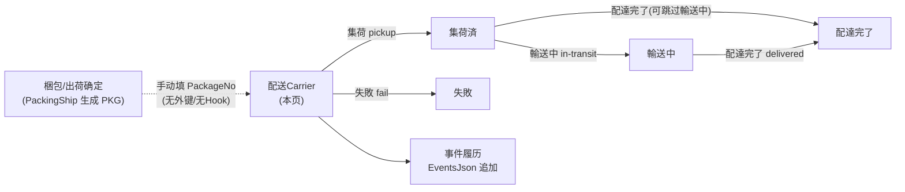
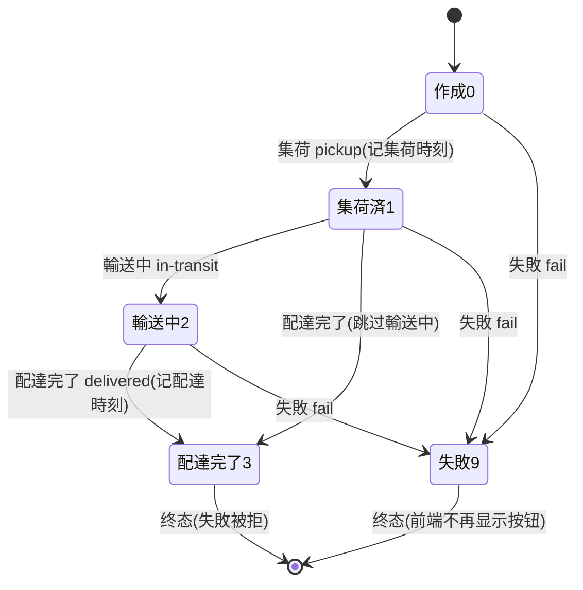

# 配送 Carrier（運送便 / 承运）单页面操作 SOP（手把手版）

> **用途**：给**出荷物流担当操作、培训老师讲、测试人员拆用例**。比模块总册（`03-库存物流WMS` §5.20）更细。
> **页面**：配送Carrier（MSBBWM320 · 库存物流 WMS）　**路由**：`/wms/carrier`　**前端**：`views/wms/CarrierView.vue`　**API**：`api/wms/connectivity.ts carrierApi`　**后端**：`Wms/CarrierController` → `CarrierService`
> **基准**：分支 `feat/wfs-inbox-core`，2026-06-29；后端实测 `docs/codemap-wms/03-出庫-出荷.md`（運送便 Carrier 节）+ `CarrierService.cs` / `CarrierController.cs` 逐行核对，UI 经 view 实读。
> **样例数据**：配送 `SHIP2026070001`、梱包 `PKG2026070001`、运送业者 `YAMATO`（ヤマト運輸）、追踪号 tracking（空则系统生成）、客户 `CUST-A`。

---

## 1. 页面一句话说明

**配送Carrier，就是把"梱包好的货交给运送业者后，对这一票货做物流追踪的台账"——一票配送从「作成」开始，沿状态机一格一格往前推：集荷(pickup)→輸送中(in-transit)→配達完了(delivered)，途中也可标「失敗」；每推进一步系统自动往「事件履历」里追加一条带时间戳的记录，让你随时回看这票货走到哪了。** 它是出荷之后的"物流跟踪"环节，不是出库本身。

> ⚠️ **重要现状（务必先知道）**：本页**与 ShippingPackage（梱包）/ OutboundOrder（出荷单）没有数据库外键，仅靠 PackageNo（梱包号）做文本弱关联**；**与 ERP 没有任何 Hook 联动**。代码注释明确写着"真实业者 API 将来追加，当前 mock"——也就是说**当前不会去 YAMATO/佐川等真实系统拉物流，状态全靠人工在本页点按钮推进**。

---

## 2. 这个页面在业务流程中的位置

- **上游（弱关联）**：梱包/出荷确定后产生的梱包号 `PKG…`，由人**手动抄进本页**新建配送；系统**不自动**从出荷单带出，也**不回写**出荷单。
- **本页**：维护这一票配送的状态机推进 + 事件履历。
- **下游**：无系统下游。状态与履历仅供本页查看（将来对接真实业者 API 时才有外部回调）。

---

## 3. 谁使用这个页面

| 角色 | 用途 |
|---|---|
| 出荷/物流担当 | 新建配送、点集荷/輸送中/配達完了、登失败、补事件 |
| 客服/跟单 | 查某票货走到哪了（按追踪号/客户/状态检索，看事件时间线） |
| 班组长/主管 | 核对在途量、失败件 |

---

## 4. 操作前准备

- [ ] 已知本票货的**梱包号 PackageNo（如 `PKG2026070001`）**——新建必填（裸文本，无校验是否真存在）。
- [ ] 选好**运送业者 CarrierCd**：`YAMATO`(ヤマト運輸) / `SAGAWA`(佐川急便) / `JP`(日本郵便) / `SELF`(自社便) / `OTHER`(その他)——新建必填，默认 `YAMATO`。
- [ ] 追踪号 TrackingNo：有就填，**留空系统会按 `业者CD-yyyyMMdd-6位随机` 自动生成**。
- [ ] 知道这一步要把货推到哪个状态（集荷 / 輸送中 / 配達完了 / 失敗）。

---

## 5. 页面区域说明

| 区域 | 内容 |
|---|---|
| 检索条 | 配送NO（模糊）/ 追踪号（精确）/ 运送业者（下拉）/ 状态（下拉）+「检索」「新建」按钮 |
| 列表表格 | 每行：配送NO / 状态 tag / 运送业者 / 追踪号 / 梱包号 / 客户CD / 配送地址 / 重量kg / 集荷時刻 / 配達時刻 / 操作列（随状态显隐按钮） |
| 詳細・事件履历 对话框 | 点行打开：标题"配送NO — 事件"；`el-timeline` 时间线（每条：时间戳 / 状态标题 / 消息 / 📍位置）；底部「追加事件」「关闭」 |
| 新建 对话框 | 600px：梱包号*/运送业者*/追踪号/服务类型/客户CD/TEL/地址/重量/运费/备考 |
| 追加事件 对话框 | 500px：Status / Location / Message 三框 |
| 失敗 对话框 | 420px：失败理由*（必填，textarea） |

> `*` = 必填。列表点行=打开履历；操作列按钮点击带 `@click.stop` 不会触发打开履历。

---

## 6. 字段填写说明（口语版）

**检索条**：配送NO（`Contains` 模糊）、追踪号（**精确等值**）、运送业者（下拉枚举）、状态（下拉 0/1/2/3/9）。任意组合，留空=全部。

**新建对话框**：

| 字段 | 必填 | 怎么填 | 填错/留空影响 |
|---|---|---|---|
| 梱包号 PackageNo | ✅ | 抄梱包号，如 `PKG2026070001`（**纯文本，不校验是否真存在**） | 空→后端 `PackageNo required`（400） |
| 运送业者 CarrierCd | ✅ | 下拉选，默认 `YAMATO` | 空→后端 `CarrierCd required`（400） |
| 追踪号 TrackingNo | ✕ | 有填；**留空→系统生成** `YAMATO-20260701-123456` 样式 | 留空不报错，自动补 |
| 服务类型 ServiceType | ✕ | 文本（如 当日/翌日），如有 | — |
| 客户CD CustomerCd | ✕ | 如 `CUST-A` | — |
| TEL（电话） | ✕ | 收件电话（label 是硬编码英文 `TEL`） | — |
| 配送地址 ShipToAddress | ✕ | 收件地址 | — |
| 重量kg WeightKg | ✕ | 数字，精度 3 位，默认 `1.0` | — |
| 运费 CarrierFee | ✕ | 数字，精度 2 位，默认 `0` | — |
| 备考 Remarks | ✕ | 文本 | — |

> ⚠️ **前端"梱包号/运送业者"只在 label 上标 `required`，点保存时前端并不拦**——空值照样发到后端，由后端抛 `PackageNo required` / `CarrierCd required`（400）。所以"必填"是**后端**保证的。

**失敗对话框**：失败理由必填（前端 `onFail` 里"理由为空就直接 return 不发请求"，所以空理由点保存=没反应）。

**追加事件对话框**：Status / Location / Message 三框（标题 label 全是**硬编码英文**）。

---

## 7. 按钮操作说明

| 按钮 | 何时出现（按 row.status） | 点了会怎样 | 后端校验 |
|---|---|---|---|
| 新建 | 检索条常显 | 打开新建对话框（默认 YAMATO/重量1.0/运费0） | 保存时校验梱包号+业者 |
| 集荷(pickup) | status=0 作成 | 0→1，记**集荷時刻**，追加事件 `PickedUp/集荷完了` | 非作成→`WM-MSG-043: 作成済のみ集荷可` |
| 輸送中(transit) | status=1 集荷済 | 1→2，追加事件 `InTransit/配送中` | 非集荷済→`WM-MSG-043: 集荷済のみ配送移行可` |
| 配達完了(delivered) | status=1 **或** 2 | →3，记**配達時刻**，追加事件 `Delivered/配達完了` | 非（輸送中/集荷済）→`WM-MSG-043: 配送中/集荷済のみ完了可` |
| 失敗(fail) | status≠3 **且** ≠9 | 弹失败理由→9，追加事件 `Failed/理由` | 已配達完了→`WM-MSG-043: 配達完了済は変更不可` |
| 行点击 | 整行（按钮区除外） | 打开**事件履历**时间线 | — |
| 追加事件 | 履历对话框底部 | 往 EventsJson 追加一条手填事件，再刷新 | — |

> ★ **可跳过輸送中**：配達完了按钮在 status=1（集荷済）时也出现，后端也允许「集荷済→配達完了」直接到货——适合"自社便/同城当天送达"不经过中转的场景。

---

## 8. 标准业务操作 SOP（照着点）

### 场景一：正常配送全链（主流程：作成→集荷→輸送中→配達完了）
- **背景**：一票货梱包确定后，交给 YAMATO，逐步送达。
- **样例数据**：梱包 `PKG2026070001`、业者 `YAMATO`、客户 `CUST-A`。
- **步骤**：
  1. 「新建」→填梱包号 `PKG2026070001`、业者 `YAMATO`（追踪号留空让它自动生成）、客户 `CUST-A`、地址/重量→「保存」。
  2. 列表出现新行 `SHIP2026070001`，状态=作成(0)。点「集荷」→状态→集荷済(1)，集荷時刻落值。
  3. 点「輸送中」→状态→輸送中(2)。
  4. 到货后点「配達完了」→状态→配達完了(3)，配達時刻落值。
- **完成后检查**：状态 tag 依次 info→warning→primary→success；点行看时间线有 4 条事件（含创建后 3 次推进）；追踪号自动生成形如 `YAMATO-20260701-xxxxxx`。
- **异常**：跨格点（如作成直接点輸送中按钮——但按钮本就不显示）；后端守卫 `WM-MSG-043`。
- **用例**：TC-M06-CARRIER-001~007、010。

### 场景二：跳过輸送中直接送达（集荷済→配達完了）
- **背景**：自社便/同城当天，集荷后直接送到，不走中转。
- **步骤**：新建→「集荷」(→1)→直接点「配達完了」(→3)。
- **检查**：状态 1→3，輸送中(2)被跳过；后端允许（`MarkDelivered` 接受集荷済）。配達時刻落值。
- **用例**：TC-M06-CARRIER-008、009。

### 场景三：配送失败登记（任意非完了态→失敗）
- **背景**：地址错/客户拒收/破损，配送失败。
- **步骤**：在作成/集荷済/輸送中任一行点「失敗」→弹框填**失败理由**（必填）→「保存」。
- **检查**：状态→失敗(9)；事件追加 `Failed/<你填的理由>`；该行操作列只剩——什么都没有（9 是终态，前端不再显示推进/失败按钮）。
- **异常**：理由留空点保存=无反应（前端拦）；已配達完了的票点失败=后端 `WM-MSG-043: 配達完了済は変更不可`（但前端在 3 态已隐藏失败按钮，正常点不到）。
- **用例**：TC-M06-CARRIER-011~014、020。

### 场景四：查看与手动补事件履历
- **背景**：客服想知道这票货的物流轨迹，或补一条业者电话告知的中转信息。
- **步骤**：检索（按追踪号/客户/状态）→点行打开时间线→「追加事件」→填 Status/Location/Message→「保存」。
- **检查**：时间线新增一条（按追加顺序在末尾）；带 📍位置；保存后自动重新拉取该票+刷新列表。
- **★ 易踩坑**：手填 Status 的**颜色靠英文子串匹配**——只有含 `Deliv`/`Fail`/`Pick` 才会变绿/红/橙，其它（含中文、或拼写不同如 `Delivery`）一律降级**蓝色**。系统自动追加的 `Delivered/Failed/PickedUp` 颜色才准。
- **用例**：TC-M06-CARRIER-015~018、023、024。

### 场景五：状态守卫拦截（点不出来 vs 后端兜底）
- **背景**：理解"为什么有的按钮不显示"+"绕过前端直接调 API 会怎样"。
- **步骤**：观察各状态行的操作列；（测试可直接调端点）对作成票调 `/in-transit`。
- **检查**：前端按状态显隐（0→集荷;1→輸送中+配達完了;1/2→配達完了;非3非9→失敗）；后端对错序统一抛 `WM-MSG-043`+具体日文句尾，控制器转 400。
- **用例**：TC-M06-CARRIER-019、021、022、025。

### 场景六：检索与新建校验
- **背景**：日常按条件找配送 + 新建时漏填必填。
- **步骤**：检索条填业者/状态→「检索」；新建对话框故意清空梱包号→「保存」。
- **检查**：检索按"配送NO模糊+其余精确"过滤；空梱包号→后端 `PackageNo required`(400)；空业者→`CarrierCd required`(400)。
- **用例**：TC-M06-CARRIER-026~030。

---

## 9. 状态变化说明

- **状态码**：0=作成(Created) / 1=集荷済(PickedUp) / 2=輸送中(InTransit) / 3=配達完了(Delivered) / 9=失敗(Failed)。
- **终态**：3 配達完了（再点失败被 `WM-MSG-043` 拒）、9 失敗（前端隐藏所有推进/失败按钮）。
- **每次推进自动追加事件**（EventsJson 末尾 append）：集荷→`PickedUp/集荷完了`，輸送中→`InTransit/配送中`，配達完了→`Delivered/配達完了`，失敗→`Failed/<理由>`。
- **时间戳落值**：集荷時刻 PickedUpAt（集荷时）、配達時刻 DeliveredAt（完了时）。

---

## 10. 按钮不可用 / 灰色 / 不显示原因

| 现象 | 原因 |
|---|---|
| 行上无「集荷」 | 非作成(0) |
| 行上无「輸送中」 | 非集荷済(1) |
| 行上无「配達完了」 | 非（集荷済1 / 輸送中2） |
| 行上无「失敗」 | 已配達完了(3) 或 已失敗(9)（终态） |
| 失敗对话框点保存无反应 | 失败理由为空（前端直接 return） |
| 找不到"改/删配送"入口 | **本页无编辑/删除端点**：配送主档只能新建+状态推进；事件**只增不改不删**（append-only） |
| 找不到"修改/删除事件" | EventsJson 仅 append，无单条编辑/删除 |

---

## 11. 常见错误与处理

| 错误 | 原因 | 处理 |
|---|---|---|
| `PackageNo required`（400） | 新建梱包号空 | 填梱包号（前端不拦，必填靠后端） |
| `CarrierCd required`（400） | 新建运送业者空 | 选业者（默认 YAMATO 一般不会空） |
| `WM-MSG-043: 作成済のみ集荷可` | 对非作成票调集荷 | 只对作成(0)集荷 |
| `WM-MSG-043: 集荷済のみ配送移行可` | 对非集荷済票调輸送中 | 先集荷再輸送中 |
| `WM-MSG-043: 配送中/集荷済のみ完了可` | 对作成/失败票调配達完了 | 须先集荷 |
| `WM-MSG-043: 配達完了済は変更不可` | 已完了再点失败 | 完了是终态，不可改 |
| `WM-MSG-070`（404） | 配送NO 不存在（get/状态推进） | 核对配送NO |
| 事件时间线颜色不对（中文/拼写） | 颜色靠 `Deliv/Fail/Pick` 子串匹配，不含=降级蓝 | 自动事件颜色才准；手填只是显示色，不影响数据 |
| 履历空白显示 `No events` | 该票无事件 / EventsJson 坏 | 坏 JSON 会**静默 fallback 空数组**（不报错） |
| 新建成功但出荷单没变 | **与出荷单/ERP 无 Hook**，本就不回写 | 现状如此（mock，将来对接业者 API） |

---

## 12. 操作完成后的检查清单

- [ ] 新建成功：toast 显示 `成功: SHIP…`（配送NO），列表刷新出现新行（状态=作成）。
- [ ] 追踪号：填了用填的；留空=自动 `业者CD-yyyyMMdd-6位随机`。
- [ ] 状态推进：tag 颜色随状态（info/warning/primary/success/danger），集荷時刻/配達時刻在对应步骤落值。
- [ ] 事件履历：每次推进自动 +1 条；手动「追加事件」可补；时间线按时间戳显示，📍位置可选。
- [ ] **不影响其它单据**：出荷单/梱包/ERP **不会**因本页操作而变化（无 Hook、无外键级联）——这是设计现状，不是 bug。

---

## 13. 页面级测试用例（≥25 条，可执行）

> 编号 `TC-M06-CARRIER-xxx`；样例：梱包 `PKG2026070001`、业者 `YAMATO`、客户 `CUST-A`、配送 `SHIP2026070001`。

| 用例编号 | 用例名称 | 优先级 | 前置条件 | 测试数据 | 操作步骤 | 预期结果 | 下游检查 | 备注 |
|---|---|---|---|---|---|---|---|---|
| TC-M06-CARRIER-001 | 新建配送（必填全填） | P0 | 在配送页 | PKG2026070001/YAMATO/CUST-A | 新建→填→保存 | 生成 SHIP…，状态=作成(0)，toast 含配送NO | 列表刷新出现 | 核心 |
| TC-M06-CARRIER-002 | 追踪号留空自动生成 | P1 | 同上 | 追踪号空 | 新建→保存 | 追踪号=`YAMATO-yyyyMMdd-6位` | — | 采番 |
| TC-M06-CARRIER-003 | 追踪号手填保留 | P2 | 同上 | tracking=`MYTRK001` | 新建→保存 | 追踪号=MYTRK001（不覆盖） | — | — |
| TC-M06-CARRIER-004 | 默认值（业者/重量/运费） | P2 | 打开新建 | — | 看默认 | 业者=YAMATO/重量=1.0/运费=0 | — | — |
| TC-M06-CARRIER-005 | 集荷 pickup（0→1） | P0 | 作成票 | SHIP2026070001 | 点集荷 | 状态→集荷済(1)，记集荷時刻，事件 PickedUp/集荷完了 | 时间线+1 | 核心 |
| TC-M06-CARRIER-006 | 輸送中（1→2） | P0 | 集荷済票 | — | 点輸送中 | 状态→輸送中(2)，事件 InTransit/配送中 | 时间线+1 | — |
| TC-M06-CARRIER-007 | 配達完了（2→3） | P0 | 輸送中票 | — | 点配達完了 | 状态→配達完了(3)，记配達時刻，事件 Delivered/配達完了 | 时间线+1 | 核心 |
| TC-M06-CARRIER-008 | 配達完了按钮在集荷済也显示 | P1 | 集荷済票 | — | 看操作列 | 同时有「輸送中」「配達完了」 | — | 跳转能力 |
| TC-M06-CARRIER-009 | 跳过輸送中直接送达（1→3） | P1 | 集荷済票 | — | 集荷济直接点配達完了 | 状态 1→3，跳过2，配達時刻落值 | — | ★场景二 |
| TC-M06-CARRIER-010 | 全链事件累计 | P1 | 走完全链 | — | 新建→集荷→輸送中→配達完了 | 时间线含 3 条推进事件，顺序正确 | — | — |
| TC-M06-CARRIER-011 | 失敗（作成→9） | P1 | 作成票 | 理由=住所不明 | 点失敗→填理由→保存 | 状态→失敗(9)，事件 Failed/住所不明 | — | — |
| TC-M06-CARRIER-012 | 失敗（輸送中→9） | P1 | 輸送中票 | 理由=破損 | 点失敗→填→保存 | 状态→失敗(9) | — | — |
| TC-M06-CARRIER-013 | 失败理由必填（前端拦） | P0 | 任意非3票 | 理由空 | 点失敗→不填→保存 | 无请求发出、无变化 | 不落库 | 前端 return |
| TC-M06-CARRIER-014 | 失敗后操作列为空 | P2 | 失敗票 | — | 看操作列 | 无任何推进/失敗按钮（9 终态） | — | — |
| TC-M06-CARRIER-015 | 点行打开事件履历 | P1 | 有事件票 | — | 点行 | 弹时间线，标题=配送NO—事件 | — | — |
| TC-M06-CARRIER-016 | 手动追加事件 | P1 | 履历框 | Status=ArrivedHub/位置=大阪/消息=到中转 | 追加事件→填→保存 | 时间线末尾+1，含📍大阪，自动刷新 | — | — |
| TC-M06-CARRIER-017 | 手填事件颜色降级蓝 | P2 | 履历框 | Status=到着（中文） | 追加→看颜色 | 不含 Deliv/Fail/Pick→蓝(primary) | — | ★盲点 |
| TC-M06-CARRIER-018 | 自动事件颜色正确 | P2 | 走过推进 | — | 看时间线 | PickedUp橙/Delivered绿/Failed红 | — | includes 匹配 |
| TC-M06-CARRIER-019 | 守卫：非作成点集荷（后端） | P1 | 集荷済票 | — | 直接调 /pickup | 400 `WM-MSG-043: 作成済のみ集荷可` | 不变 | API 级 |
| TC-M06-CARRIER-020 | 守卫：完了再失败 | P1 | 配達完了票 | — | 直接调 /fail | 400 `WM-MSG-043: 配達完了済は変更不可` | 不变 | API 级 |
| TC-M06-CARRIER-021 | 守卫：作成直接配達完了 | P2 | 作成票 | — | 直接调 /delivered | 400 `WM-MSG-043: 配送中/集荷済のみ完了可` | 不变 | API 级 |
| TC-M06-CARRIER-022 | 守卫：非集荷済点輸送中 | P2 | 作成票 | — | 直接调 /in-transit | 400 `WM-MSG-043: 集荷済のみ配送移行可` | 不变 | API 级 |
| TC-M06-CARRIER-023 | 履历空显示 No events | P2 | 无事件票 | — | 点行 | 显示空状态 `No events`（硬编码英文） | — | — |
| TC-M06-CARRIER-024 | 坏 EventsJson 静默兜底 | P3 | EventsJson 损坏 | — | 点行 | catch→空数组，不报错显示 No events | — | ★盲点 |
| TC-M06-CARRIER-025 | 配送NO 不存在 | P2 | — | SHIP9999 | 调 get/状态推进 | 404 `WM-MSG-070` | — | — |
| TC-M06-CARRIER-026 | 检索：配送NO 模糊 | P1 | 有数据 | shipmentNo=SHIP2026 | 检索 | 模糊命中（Contains） | — | — |
| TC-M06-CARRIER-027 | 检索：追踪号精确 | P1 | 有数据 | 完整追踪号 | 检索 | 精确等值命中 | — | — |
| TC-M06-CARRIER-028 | 检索：业者+状态组合 | P1 | 有数据 | YAMATO+輸送中(2) | 检索 | 仅命中该业者+该状态 | — | — |
| TC-M06-CARRIER-029 | 新建梱包号空 | P0 | 新建框 | 梱包号空 | 保存 | 400 `PackageNo required` | 不落库 | 后端校验 |
| TC-M06-CARRIER-030 | 新建运送业者空 | P0 | 新建框 | 业者清空 | 保存 | 400 `CarrierCd required` | 不落库 | 后端校验 |
| TC-M06-CARRIER-031 | 与出荷单无联动确认 | P1 | 新建配送后 | PKG2026070001 | 查对应出荷单/ERP | 出荷单/ERP **无任何变化** | — | ★mock 现状 |
| TC-M06-CARRIER-032 | 权限不足 | P2 | 无权账号 | — | 进页面/操作 | 待业务确认（隐藏/拒绝） | — | 权限 |

---

## 14. 培训讲解建议

| 顺序 | 讲什么 | 演示 | 易误解点 |
|---|---|---|---|
| 1 | 这页是"出荷之后的物流追踪台账" | §2 流程图 | 以为是出库/发货本身 |
| 2 | 状态机 5 格怎么走 | 作成→集荷→輸送中→配達完了 | 以为必须经过輸送中（可跳过） |
| 3 | 按钮随状态显隐 | 各状态看操作列 | 找不到按钮=状态不对，不是 bug |
| 4 | 失败=终态、完了=终态 | 演示失败后无按钮 | 想"撤销失败/改完了" |
| 5 | 事件履历只增不改 | 追加事件→看时间线 | 想编辑/删事件 |
| 6 | **当前不连真实业者（mock）** | 讲与出荷单/ERP 无联动 | 以为状态会自动从快递公司同步 |
| 7 | 颜色靠英文子串匹配 | 手填中文 Status 看变蓝 | 以为颜色代表数据有问题 |

---

## 15. 与模块级手册的关系

对应 `03-库存物流WMS-最详细用户操作培训手册.md` §5.20（業界連携·寄售 → 配送Carrier WM320 `/carrier`）。该节要点：物流追踪 集荷→輸送中→配達完了/失敗 + 事件履历；状态机 0作成→1集荷済→2輸送中→3配達完了/9失敗（3/9 终态）；**与 ShippingPackage/OutboundOrder 无外键仅 PackageNo 弱关联、与 ERP 无 Hook（mock）**；carrierMap / 事件 label 明文裸 key；timeline 颜色靠 includes 匹配。本 SOP 是该节的手把手细化。

---

## 16. 代码与文档来源

| 层 | 文件 |
|---|---|
| 逐行源码手册 | `docs/codemap-wms/03-出庫-出荷.md`（運送便 Carrier 节，权威） |
| 前端 view | `cp6.web/src/views/wms/CarrierView.vue` |
| 前端 API/类型 | `cp6.web/src/api/wms/connectivity.ts`(carrierApi)、`cp6.web/src/types/wms/wms.ts`(CarrierShipment/CarrierSearchQuery/CarrierEvent) |
| 后端 Controller | `CP6.WebApi/Controllers/Wms/CarrierController.cs`（7 端点，InvalidOperationException→400） |
| 后端 Service | `CP6.Core/Services/Wms/CarrierService.cs`（CreateShipmentAsync 35-63 / 四状态机 MarkPickedUp·InTransit·Delivered·Failed 77-121 / AppendEvent 130-138） |
| 实体/枚举 | `CP6.Entity/DomainModels/Wms/CarrierShipment.cs`、`WmsTxnType.cs`(CarrierShipmentStatus 407-413：Created0/PickedUp1/InTransit2/Delivered3/Failed9) |
| 采番 | `IWmsSequenceService.NextAsync("SHIP")` |

---

## 最后更新来源

- 代码：见 §16（codemap-wms 03 運送便 Carrier 节 + CarrierService.cs/CarrierController.cs 逐行核对 + view/api/types 实读）。
- 基准：分支 `feat/wfs-inbox-core`，2026-06-29。
- 覆盖：16 节 / 6 场景 / 32 用例（TC-M06-CARRIER-001~032）。
- 关键盲点已写入：与 ShippingPackage/OutboundOrder 无外键仅 PackageNo 弱关联、与 ERP 无 Hook（mock）；carrierMap 用 `t('ヤマト運輸')` 明文日文当 key；事件 dialog label Status/Location/Message + TEL 硬编码英文；timeline 颜色靠 `includes('Deliv'/'Fail'/'Pick')` 子串匹配（拼写偏差降级蓝）；坏 JSON 静默 fallback 空数组；前端必填只标 label 不拦、靠后端兜底。
