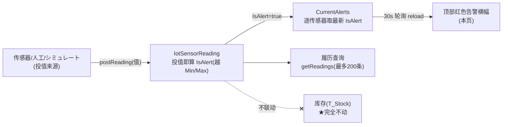

# IoT監視（传感器监控）单页面操作 SOP（手把手版）

> **用途**：给**质量/仓储担当看温湿度·告警、培训老师讲、测试人员拆用例**。比模块总册（`03-库存物流WMS` §5.20）更细。
> **页面**：IoT監視（WM330 · 業界連携）　**路由**：`/wms/iot-monitor`　**前端**：`views/wms/IotMonitorView.vue`　**API**：`api/wms/connectivity.ts iotApi`（基址 `/wms/iot/*`）　**后端**：`Wms/IotMonitorController` → `IotService`
> **基准**：分支 `feat/wfs-inbox-core`，2026-06-29；后端实测 `docs/codemap-wms/06-業界連携-报表.md` §6（2026-06-22 权威），UI 经实读 view。
> **样例数据**：传感器 `TEMP-01`、类型 `TEMP`（温度）、倉庫 `W01`、库位 `RES-C-01`、min `2℃` / max `8℃`。

---

## 1. 页面一句话说明

**IoT監視，就是质量/仓储担当盯"冷藏库温湿度、货架冲击、货架占位"这类传感器的地方——给传感器投入一条读数（值），系统当场算出"是不是越限(超出 min/max)"，把越限的最新读数汇成顶部红色告警横幅；页面每 30 秒自动整页重拉一次。** 它只看读数与告警、**完全不动库存**，也没有单据状态机。

---

## 2. 这个页面在业务流程中的位置

- **上游**：传感器/外部系统/人工投值，或「シミュレート」演示造值。
- **本页**：投读数 → 算告警 → 看告警横幅 + 传感器表 + 历史读数。
- **下游**：**无**。不动库存、不建单据、无 ERP/WMS 接缝；只是只读看板 + 读数录入。

---

## 3. 谁使用这个页面

| 角色 | 用途 |
|---|---|
| 质量担当 | 盯冷藏/恒温库温湿度越限告警 |
| 仓储担当 | 看货架冲击(SHOCK)/货架占位(SHELF)传感器状态 |
| 设备/运维 | 新建传感器、对接外部投值、演示シミュレート |

---

## 4. 操作前准备

- [ ] 想清要看哪个**倉庫CD**（如 `W01`）、哪个**库位**（如 `RES-C-01`）。
- [ ] 新建传感器前定好**类型**（TEMP/HUMID/SHOCK/SHELF）和**阈值 min/max**——默认值是硬编码的（见 §6 盲点），多半要手改。
- [ ] 知道**实时机制**：本页**不是实时推送**，是**固定 30 秒整页轮询**；外部投值后，告警横幅**最长 30 秒后**才刷出来。
- [ ] 投值用「投入読数」对话框，**值即时算告警**（越 min/max 落 `IsAlert`）。

---

## 5. 页面区域说明

| 区域 | 内容 |
|---|---|
| 告警卡（顶部） | 标题 `IoT監視` + 副标 `N alerts · M sensors`（**英文 alerts/sensors 为硬编码明文**）；右侧「シミュレート」按钮 + 刷新圆按钮；下方逐条红色 `el-alert`：`[类型] 传感器名/ID @ 倉庫/库位 · value: 值 · 告警消息`；无告警时显示空状态「暂无告警」 |
| 传感器表卡 | 表头「センサ一覧」+「新規センサ」按钮；表列：传感器ID / 类型 / 名称 / 倉庫 / 库位 / min·max(带单位) / 最新値(tag,越限红/正常绿) / 最終取得日時 / 操作(投入読数·履历) |
| 履历 Dialog（800px） | 标题 `传感器ID — 履歴`；表列：`ReadAt`(明文) / 値 / 告警(⚠ tag) / `Message`(明文,即 alertMessage)；最多 200 条 |
| 新规 Dialog（560px） | 类型(下拉,切换触发默认阈值) / 名称 / 倉庫(必填) / 库位 / 单位 / min / max / 有効(开关) / 備考 |
| 投入 Dialog（400px） | 値(el-input-number,必填) + `Range`(明文,只读显示 min〜max 单位) |

---

## 6. 字段填写说明（口语版）

**新規センサ对话框**（无 sensorID 输入框——sensorID 由后端採番、`onCreate` 成功后 toast 回显）：

| 字段 | 怎么填 | 填错/盲点 |
|---|---|---|
| 类型（必填，下拉） | TEMP/HUMID/SHOCK/SHELF | **切换类型会重置单位+min+max 为硬编码默认**（onTypeChange） |
| 名称 | 可空，如 `冷蔵庫A温度` | 空则表里显 ID |
| 倉庫（必填） | 如 `W01` | 必填标记；空→后端校验 |
| 库位 | 如 `RES-C-01`，可空 | — |
| 单位 | 如 `℃` | 新建默认硬编码 `℃` |
| min / max | 如 `2` / `8` | 新建默认硬编码 `2` / `8`（TEMP）；判越限的依据 |
| 有効 | 开关，默认开 | — |
| 備考 | 可空 | — |

**投入読数对话框**：

| 字段 | 怎么填 | 填错影响 |
|---|---|---|
| 値（必填） | 数值，如 `10`（越 max 8） | el-input-number 默认带入"最新値 ?? 0"；投 `0` 也算一条读数 |
| Range（只读） | 自动显示 `min 〜 max 单位` | `Range` label 为硬编码英文 |

> **类型默认阈值表（硬编码在 `onTypeChange`）**：TEMP `℃ / 2~8`、HUMID `% / 30~70`、SHOCK `G / 0~3`、SHELF `ON-OFF / 0~1`。

---

## 7. 按钮操作说明

| 按钮 | 位置 / 何时出现 | 点了会怎样 |
|---|---|---|
| シミュレート | 告警卡右上，常显 | `simulate(3)` 后端 demo 随机造值→toast「已模拟: N」→`reload`；**演示性质，生产语义弱** |
| 刷新（圆图标） | 告警卡右上，常显 | 手动 `reload`（并行重拉 sensors+alerts），不必等 30s 轮询 |
| 新規センサ | 传感器表头 | 打开新建对话框（默认 TEMP/℃/2/8） |
| 投入読数 | 每行操作列 | 打开投值对话框（带入该行最新値），`onPost`→`postReading`→toast 成功→`reload` |
| 履历 | 每行操作列 | `getReadings(id,,,200)` 拉最多 200 条→打开履历对话框（点行任意处也触发） |
| 保存（对话框） | 新建/投入对话框底部 | 新建→`createSensor`；投入→`postReading`；成功 toast 后 `reload` |
| キャンセル（对话框） | 对话框底部 | 关闭不提交 |

> **无"修改/删除"按钮**：API 有 `updateSensor`/`deleteSensor`，但本页 UI **未提供入口**（现状只读+新建+投值+看历史）。

---

## 8. 标准业务操作 SOP（照着点）

### 场景一：新建温度传感器（主流程·主数据）
- **背景**：给冷藏库 `W01`/`RES-C-01` 建一个 2~8℃ 温度传感器。
- **样例数据**：类型 `TEMP`、倉庫 `W01`、库位 `RES-C-01`、单位 `℃`、min `2`、max `8`、名称 `冷蔵庫A温度`。
- **步骤**：1) 点「新規センサ」；2) 类型选 TEMP（单位/min/max 自动带默认 ℃/2/8）；3) 填倉庫 `W01`、库位 `RES-C-01`、名称；4) 确认 min/max；5)「保存」。
- **完成后检查**：toast「成功: 传感器ID」（ID 后端採番）；表中新增一行，最新値显「—」（未投读数前）。
- **异常**：倉庫空→必填校验；类型切换会重置阈值（先选类型再改 min/max）。
- **用例**：TC-M06-IOT-001~004。

### 场景二：投入正常读数（不告警）
- **背景**：给 `TEMP-01` 投一条在范围内的温度。
- **样例数据**：值 `5`（在 2~8 内）。
- **步骤**：该行「投入読数」→填値 `5`→「保存」。
- **检查**：toast 成功；自动 reload；该行最新値显**绿色** tag `5 ℃`；不进顶部告警；履历新增一条 `isAlert=false`。
- **用例**：TC-M06-IOT-005、006。

### 场景三：投入越限读数触发告警
- **背景**：温度升到 10℃（越 max 8）。
- **样例数据**：值 `10`。
- **步骤**：`TEMP-01`「投入読数」→填 `10`→「保存」。
- **检查**：后端投值即算 `IsAlert=true` 落 `IotSensorReading`；reload 后该行最新値显**红色** tag；顶部红色告警横幅出现 `[TEMP] 冷蔵庫A温度 @ W01/RES-C-01 · value: 10 · 告警消息`；副标 alerts 计数+1。
- **检查（低值同理）**：投 `1`（低于 min 2）同样告警。
- **用例**：TC-M06-IOT-007、008、009。

### 场景四：查看传感器历史读数
- **背景**：回看 `TEMP-01` 近期读数曲线/越限记录。
- **步骤**：点该行「履历」（或点行任意处）。
- **检查**：弹 800px 履历对话框，列 ReadAt/値/告警(⚠)/Message，最多 200 条；越限行带 ⚠ 红 tag。
- **用例**：TC-M06-IOT-010、011。

### 场景五：シミュレート演示造值
- **背景**：培训/演示时没有真实传感器，造点数据。
- **步骤**：点「シミュレート」。
- **检查**：toast「已模拟: N」（N=后端 generated 计数）；reload 后随机出现若干新读数，可能造出告警；**生产环境慎用**（语义弱、值随机）。
- **用例**：TC-M06-IOT-012、013。

### 场景六：30 秒自动轮询 / 告警延迟核对
- **背景**：验证页面是轮询不是实时推送。
- **步骤**：A 浏览器开页停留；B 用 API/另一端给 `TEMP-01` 投越限值。
- **检查**：A 页面**不会立刻**弹告警；**最长 30 秒**后整页 reload 才刷出告警横幅（`setInterval(reload,30000)`）；这与 WMS Dashboard 的 SignalR 实时推送本质不同。
- **用例**：TC-M06-IOT-014、015。

### 场景七：切换类型默认阈值变化
- **背景**：新建湿度/冲击/货架传感器。
- **步骤**：新建对话框类型依次切 HUMID/SHOCK/SHELF。
- **检查**：单位+min+max 随之变 `%/30~70`、`G/0~3`、`ON-OFF/0~1`（硬编码默认）；切换后已手改的阈值会被覆盖。
- **用例**：TC-M06-IOT-016、017。

### 场景八：告警自动消除
- **背景**：温度回正常后告警应消失。
- **步骤**：对已告警的 `TEMP-01` 再投一条范围内值（如 `6`）。
- **检查**：最新读数 `IsAlert=false`；`CurrentAlerts` 取最新读数→该传感器不再入告警集；下次 reload（手动刷新或 30s 后）顶部横幅移除该条，最新値 tag 转绿。
- **用例**：TC-M06-IOT-018、019。

---

## 9. 状态变化说明

> **本页无单据状态机**。下图是"传感器告警态"的**派生表现**（告警=该传感器**最新读数 IsAlert=true**），非持久状态机。

```mermaid
stateDiagram-v2
  [*] --> 正常: 新建/投入范围内读数
  正常 --> 告警: 投入越 Min/Max 读数(IsAlert=true)
  告警 --> 正常: 投入回到范围内读数(下次刷新移除横幅)
  正常 --> 正常: 投入范围内读数
  告警 --> 告警: 持续越限
  note right of 告警: 派生态;CurrentAlerts 逐传感器取最新读数 IsAlert=true;刷新最长延迟 30s(轮询)
```

---

## 10. 按钮不可用 / 灰色 / 找不到入口原因

| 现象 | 原因 |
|---|---|
| 找不到"修改传感器"按钮 | UI 未提供（API `updateSensor` 存在，本页无入口） |
| 找不到"删除传感器"按钮 | UI 未提供（API `deleteSensor` 存在，本页无入口） |
| 最新値显「—」 | 该传感器**从未投过读数**（lastValue 为空） |
| 最新値 tag 红色 | 前端 `isAlert(row)` 按 row 的 min/max 重算判越限（见盲点） |
| 顶部告警横幅空 | 当前无传感器最新读数越限（显示空状态） |
| 投值后告警没马上变 | 别人投的值要等 30s 轮询；本人投值 onPost 内已 reload 会即时刷 |

---

## 11. 常见错误与处理

| 错误 | 原因 | 处理 |
|---|---|---|
| `WM-MSG-070` | 投读数/查履历的传感器ID不存在 | 核对 sensorId（可能已被删或拼错） |
| 倉庫必填校验 | 新建时倉庫CD 空 | 填 `warehouseCd`（如 W01） |
| 投了值不告警但应越限 | 该传感器 min/max 未设或设错 | 检查阈值；空阈值不判越限 |
| 切类型后阈值被改回 | `onTypeChange` 重置硬编码默认 | **先选类型再改 min/max** |
| 横幅文案/Range/ReadAt/Message 是英文 | label 硬编码未走 i18n | 现状（盲点），按值理解即可 |
| 前端 tag 红、横幅却没列 | `isAlert` 前端重算 vs 后端 `alertMessage` 口径可能不同 | 以后端落库 `IsAlert`/`CurrentAlerts` 为准 |

---

## 12. 操作完成后的检查清单

- [ ] 新建：toast「成功: 传感器ID」，表中新增行，最新値「—」。
- [ ] 投读数：toast 成功，自动 reload，该行最新値 tag 更新（绿/红），履历 +1 条。
- [ ] 越限：后端 `IotSensorReading.IsAlert=true`；`CurrentAlerts` 收录；顶部横幅出现；alerts 计数 +1。
- [ ] 回正常：再投范围内值后，下次刷新横幅移除、tag 转绿。
- [ ] **不动库存**：投任何读数都**不**改 T_Stock、**不**建单据、**无**ERP/WMS 接缝。
- [ ] 实时机制：确认为 30s 整页轮询（非 SignalR 推送），外部投值最长 30s 延迟。

---

## 13. 页面级测试用例（≥25 条，可执行）

> 编号 `TC-M06-IOT-xxx`；数据用样例（TEMP-01 / TEMP / W01 / RES-C-01 / 2~8℃）。

| 用例编号 | 用例名称 | 优先级 | 前置条件 | 测试数据 | 操作步骤 | 预期结果 | 下游检查 | 备注 |
|---|---|---|---|---|---|---|---|---|
| TC-M06-IOT-001 | 新建温度传感器 | P0 | 进入页面 | TEMP/W01/RES-C-01/2~8℃ | 新規→选TEMP→填倉庫·库位→保存 | toast 成功(回显ID)，表新增行 | 最新値「—」 | 主数据 |
| TC-M06-IOT-002 | 新建倉庫空 | P0 | 新建对话框 | 倉庫空 | 不填倉庫→保存 | 必填校验拦截 | 不落库 | 必填 |
| TC-M06-IOT-003 | sensorID 后端採番 | P1 | 新建成功 | — | 看 toast/表 | ID 由后端生成回显 | — | 无ID输入框 |
| TC-M06-IOT-004 | 新建默认阈值硬编码 | P2 | 新建对话框 | 类型 TEMP | 打开对话框 | 单位℃/min2/max8 预填 | — | 盲点 |
| TC-M06-IOT-005 | 投正常读数 | P0 | TEMP-01 存在 | 值5 | 投入読数→5→保存 | toast成功,最新値绿tag 5℃ | 履历+1,isAlert=false | 核心 |
| TC-M06-IOT-006 | 投值后自动reload | P1 | 同上 | 值5 | 保存 | 表/告警即时刷新 | — | onPost内reload |
| TC-M06-IOT-007 | 投越上限告警 | P0 | TEMP-01 | 值10(>8) | 投入読数→10→保存 | 最新値红tag,顶部告警横幅出现 | IsAlert=true落库 | 核心 |
| TC-M06-IOT-008 | 投越下限告警 | P0 | TEMP-01 | 值1(<2) | 投入読数→1→保存 | 同样告警 | IsAlert=true | 双向越限 |
| TC-M06-IOT-009 | 告警横幅内容 | P1 | 已告警 | — | 看横幅 | [类型]名称@倉庫/库位·value·消息 | — | 展示 |
| TC-M06-IOT-010 | 查看履历 | P1 | 有读数 | — | 点履历/点行 | 弹对话框列读数(最多200) | — | getReadings |
| TC-M06-IOT-011 | 履历越限标记 | P2 | 有越限读数 | — | 看履历 | 越限行带⚠红tag | — | — |
| TC-M06-IOT-012 | シミュレート造值 | P1 | 有传感器 | — | 点シミュレート | toast「已模拟:N」,reload出新值 | 可能造告警 | 演示性 |
| TC-M06-IOT-013 | シミュレート生产慎用 | P3 | — | — | 评估 | 值随机·语义弱 | — | 提示 |
| TC-M06-IOT-014 | 30s 轮询刷新 | P0 | 页面停留 | — | 等30s/外部投值 | 整页自动reload | — | setInterval |
| TC-M06-IOT-015 | 告警延迟≤30s | P1 | 外部投越限值 | 值10 | 别端投值后看本页 | 最长30s后才弹告警 | 非实时推送 | 与Dashboard区别 |
| TC-M06-IOT-016 | 切类型重置阈值 | P1 | 新建对话框 | HUMID | 切到HUMID | 单位%/min30/max70 | — | onTypeChange |
| TC-M06-IOT-017 | SHOCK/SHELF默认 | P2 | 新建对话框 | SHOCK/SHELF | 分别切换 | G/0~3、ON-OFF/0~1 | — | 硬编码表 |
| TC-M06-IOT-018 | 告警自动消除 | P1 | TEMP-01已告警 | 值6 | 投6→刷新 | 横幅移除,tag转绿 | CurrentAlerts取最新 | — |
| TC-M06-IOT-019 | 最新读数决定告警 | P2 | 多条读数 | 末条正常 | 投正常后看 | 以最新读数IsAlert判 | — | 逐传感器最新 |
| TC-M06-IOT-020 | 投不存在传感器 | P1 | — | 错sensorId | API投读数 | WM-MSG-070 | 不落库 | 错误码 |
| TC-M06-IOT-021 | 未投读数显「—」 | P2 | 新建未投值 | — | 看最新値列 | 显「—」 | — | 空态 |
| TC-M06-IOT-022 | 空阈值不判越限 | P2 | min/max空传感器 | 任意值 | 投值 | 不告警(无阈值) | — | 边界 |
| TC-M06-IOT-023 | 投值默认带入最新値 | P3 | 有最新値 | — | 打开投入对话框 | 値预填 lastValue?? 0 | — | UX |
| TC-M06-IOT-024 | 投0也成读数 | P3 | TEMP-01 | 值0 | 投0→保存 | 落一条读数(0<2→告警) | 履历+1 | 边界 |
| TC-M06-IOT-025 | 不动库存 | P0 | 任意投值 | — | 投值后查库存 | T_Stock无变化 | 无单据/接缝 | 铁律 |
| TC-M06-IOT-026 | 无改/删入口 | P2 | 传感器表 | — | 找修改/删除 | UI无入口(API有) | — | 现状 |
| TC-M06-IOT-027 | 手动刷新 | P2 | 页面 | — | 点刷新圆按钮 | 立即reload不等30s | — | — |
| TC-M06-IOT-028 | 前端isAlert重算 | P2 | 有越限行 | — | 看最新値tag | 前端按min/max判色 | 可能与后端口径异 | 盲点 |
| TC-M06-IOT-029 | label硬编码英文 | P3 | — | — | 看ReadAt/Message/Range/alerts | 明文英文非i18n | — | 盲点 |
| TC-M06-IOT-030 | 权限/网络异常 | P2 | 无权/断网 | — | 进页面/保存 | 待业务确认/友好错误可重试 | — | 通用 |

---

## 14. 培训讲解建议

| 顺序 | 讲什么 | 演示 | 易误解点 |
|---|---|---|---|
| 1 | 这页只看读数+告警，不动库存 | §2 流程图 | 以为会联动库存/建单 |
| 2 | 投一条值就当场算越限 | 投 5(正常)→10(告警) | 以为要外部设备才有值 |
| 3 | 告警=最新读数越限的汇总 | 横幅 + 红/绿 tag | 以为历史每条都进横幅 |
| 4 | **30s 轮询非实时推送** | 外部投值看延迟 | 当成 Dashboard 那样实时 |
| 5 | 类型默认阈值会覆盖 | 切 HUMID/SHOCK | 先改阈值后切类型被重置 |
| 6 | シミュレート是演示 | 点一次看随机值 | 生产当真实数据用 |

---

## 15. 与模块级手册的关系

对应 `03-库存物流WMS-最详细用户操作培训手册.md` §5.20「業界連携・寄售类」表格行 **IoT監視 WM330(/iot-monitor)**（动作 シミュレート/投入読数/新規センサ；不动库存；30 秒轮询非 SignalR；盲点：默认阈值硬编码 ℃/2/8、ReadAt/Message/Range label 硬编码、isAlert 前端重算、`WM-MSG-070`）。模块测试矩阵 §7 M06-024（IoT 30s 轮询）、验收 AC-M06-13（IoT 30s 轮询 vs Dashboard SignalR）、待确认 C-M06-13（是否接真实设备/SignalR）。

---

## 16. 代码与文档来源

| 层 | 文件 |
|---|---|
| 逐行源码手册 | `docs/codemap-wms/06-業界連携-报表.md` §6（权威，2026-06-22 实测） |
| 前端 view | `cp6.web/src/views/wms/IotMonitorView.vue`（轮询 `:231-235`、isAlert `:152-157`、onTypeChange `:185-196`） |
| API | `cp6.web/src/api/wms/connectivity.ts`（`iotApi`，基址 `/wms/iot/*`） |
| 类型 | `cp6.web/src/types/wms/wms.ts`（`IotSensor`/`IotSensorReading`/`IotAlert`，sensorType TEMP/HUMID/SHOCK/SHELF） |
| 路由 | `cp6.web/src/router/index.ts`（`/wms/iot-monitor`） |
| 后端 | `Wms/IotMonitorController`、`Services/.../IotService`（`PostReadingAsync` 投值算 IsAlert、`CurrentAlertsAsync` 逐传感器最新、`SimulateAsync` demo 造值；错误码 `WM-MSG-070`） |
| 实体 | `IotSensor.cs`、`IotSensorReading.cs` |

---

## 最后更新来源

- 代码：见 §16（codemap-wms 06 §6 + IotMonitorView.vue 实读 + connectivity.ts/wms.ts + router）。
- 基准：分支 `feat/wfs-inbox-core`，2026-06-29（codemap 2026-06-22）。
- 关键事实：30 秒 setInterval 轮询（非 SignalR，告警最长 30s 延迟）；投值即算 IsAlert 落库，CurrentAlerts 逐传感器取最新；不动库存、无单据状态机；新建默认阈值硬编码（℃/2/8）、onTypeChange 默认表硬编码、ReadAt/Message/Range/alerts label 硬编码英文、isAlert 前端重算、シミュレート演示性质、`WM-MSG-070`。
- 覆盖：16 节 / 8 场景 / 30 用例（TC-M06-IOT-001~030）。
</content>
</invoke>
