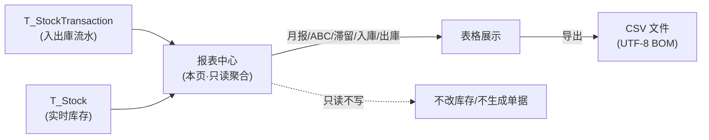
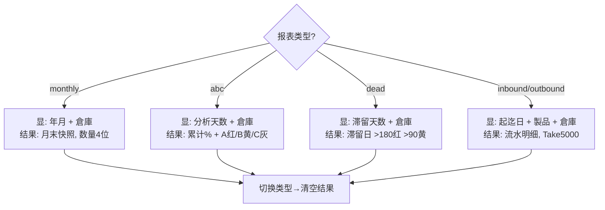

# 报表中心（帳票センター）单页面操作 SOP（手把手版）

> **用途**：给**仓管/财务出统计报表的操作人、培训老师讲、测试人员拆用例**。比模块总册（`03-库存物流WMS` §5.21）更细。
> **页面**：报表中心（MSBBWM900 · 帳票センター）　**路由**：`/wms/report-center`　**前端**：`views/wms/ReportCenterView.vue`　**API**：`api/wms/reportCenter.ts reportApi`　**后端**：`Wms/ReportCenterController` → `ReportCenterService`
> **基准**：分支 `feat/wfs-inbox-core`，2026-06-29；后端实读 `docs/codemap-wms/06-業界連携-报表.md` §8 + `ReportCenterService.cs`/`ReportCenterController.cs`，UI 经 view 实读。
> **样例数据**：年月 `2026-07`、倉庫 `W01`、製品 `PRD2026070001`、ABC/滞留分析天数 `90`。

---

## 1. 页面一句话说明

**报表中心，就是仓管/财务"出统计报表"的地方——从一个下拉里单选 5 种报表类型（月报/ABC 分析/滞留品/入庫履歴/出庫履歴），下面的检索条件会跟着报表类型自动换字段，填好条件点「查询」就把结果列在表格里，需要时一键导出 CSV。** 它**纯只读，只汇总既有数据、不动任何库存**，是把"现在/这段时间库存与进出怎么样"看清楚的窗口。

---

## 2. 这个页面在业务流程中的位置

- **上游数据源**：库存流水 `T_StockTransaction`（月报/ABC/入庫/出庫）+ 实时库存 `T_Stock`（滞留品、月报的引当/单价）。
- **本页**：选类型 → 填条件 → 查询 → 看表格 → 导 CSV。
- **下游**：**没有**。本页不写库、不发单据、不触发任何接缝；CSV 是落地的离线文件。

---

## 3. 谁使用这个页面

| 角色 | 用途 |
|---|---|
| 仓库管理员 | 月末出在庫月報、看滞留品、查某段时间入庫/出庫履歴 |
| 仓库主管/运营 | ABC 分析定重点品、滞留品盘活 |
| 财务 | 月报估值（EstimatedValue）、导 CSV 进表/对账 |

---

## 4. 操作前准备

- [ ] 想清楚要出哪种报表（月报 / ABC / 滞留 / 入庫 / 出庫）——**报表类型决定下面要填哪些条件**。
- [ ] 月报：准备好年月（`2026-07`，**支持 `YYYY-MM` 或 `YYYYMM` 两种写法**）。
- [ ] ABC / 滞留：想好分析/滞留天数（默认 `90`）。
- [ ] 入庫 / 出庫：准备好起迄日期（默认本月 1 日～今天），可选製品CD（`PRD2026070001`）。
- [ ] 倉庫CD（`W01`）可填可空——**所有报表通用、留空=全仓**。

---

## 5. 页面区域说明

| 区域 | 内容 |
|---|---|
| 検索カード（上） | 报表类型下拉（5 选 1）+ **随类型动态显隐**的条件字段 + 倉庫CD（常显）+「查询」「CSV」按钮 + 行数 tag |
| 结果カード（下） | 无数据时显 `el-empty` 占位；有数据按报表类型渲染对应列的表格（max-height 650 滚动）；行数 ≥5000 时底部追加 warning 告警条 |

> 检索区字段**动态**：选 `monthly` 显年月；`abc` 显分析天数；`dead` 显滞留天数；`inbound`/`outbound` 显起迄日期+製品CD。倉庫CD 五种都显。

---

## 6. 字段填写说明（口语版）

| 字段 | 哪些报表显示 | 怎么填 | 填错/留空影响 |
|---|---|---|---|
| 报表类型 | 全部 | 下拉单选：月次在庫/ABC分析/滞留品/入庫履歴/出庫履歴 | **切换会清空当前结果**（见 §10） |
| 年月（yearMonth） | monthly | `2026-07` 或 `202607` | 格式不符→查询报错（见 §11） |
| 分析日数（analysisDays） | abc | 数字，1～3650，默认 90 | 后端 ≤0 自动回落 90 |
| 滞留日数（idleDays） | dead | 数字，1～3650，默认 90 | 后端 ≤0 自动回落 90 |
| 開始日（fromDate） | inbound/outbound | 日期选择，`YYYY-MM-DD` | 与迄日组成区间（含迄日全天） |
| 終了日（toDate） | inbound/outbound | 日期选择，`YYYY-MM-DD` | 后端 `toDate+1天` 含当日 |
| 製品CD（productCd） | inbound/outbound | 可空，`PRD2026070001` | 空=不按品过滤 |
| 倉庫CD（warehouseCd） | 全部 | 可空，`W01` | 空=全仓 |

> **数量列精度=4 位小数**（`fmtQty=formatQty(n,4)`）。⚠️ 与 WMS Dashboard（取整 0 位）、VMI（2 位）**不一致**，培训时要说明这是各页各自实现，非笔误。金额列 `fmtMoney=formatCurrency`（货币格式）。

---

## 7. 按钮操作说明

| 按钮 | 何时可点 | 点了会怎样 |
|---|---|---|
| 查询（run，primary） | 常显 | 按当前类型 switch 调对应端点，结果填进表格；按钮显 loading；查询前先清空旧结果 |
| CSV（downloadCsv） | **`rows.length>0` 才可点**（无结果时灰） | 拼对应 `/csv` 端点 URL + 参数，`blob+anchor` 下载（带 Bearer），文件名随类型/条件命名 |
| 行数 tag | 常显 | 实时显示当前结果条数 `rows.length` |

> CSV 不弹框、不二次确认，直接触发浏览器下载；文件名例：`monthly-stock-2026-07.csv` / `abc-analysis-90d.csv` / `dead-stock-90d.csv` / `inbound-2026-07-01-2026-07-29.csv`。

---

## 8. 标准业务操作 SOP（照着点）

### 场景一：出月次在庫報（月报）
- **背景**：月末出某月在庫快照供财务估值。
- **样例数据**：报表类型=月次在庫、年月 `2026-07`、倉庫 `W01`。
- **步骤**：1) 类型选「月次在庫」；2) 年月填 `2026-07`（或 `202607`）；3) 倉庫填 `W01`（或留空全仓）；4) 点「查询」。
- **完成后检查**：表格列出 倉庫/製品/実物数/引当数/利用可能数/Lot数/估值；行按 倉庫→製品 排序；只列 `PhysicalQty≠0`。**实物数=该月末前 IN/ADJ 加、OUT 减的快照**；引当数/单价取**当前** `T_Stock`（非历史，培训需强调）。
- **异常**：年月格式错（如 `2026/7/1`）→`yearMonth format must be 'YYYY-MM' or 'YYYYMM'`（见 §11）。
- **用例**：TC-M06-REPORT-001~004。

### 场景二：ABC 分析定重点品
- **背景**：用近 N 天出庫量做帕累托，分 A/B/C 等级。
- **样例数据**：报表类型=ABC分析、分析天数 `90`、倉庫 `W01`。
- **步骤**：1) 类型选「ABC分析」；2) 分析天数填 `90`；3) 倉庫可填 `W01`；4) 「查询」。
- **完成后检查**：行按出庫量降序、附累计占比%与 A/B/C tag；**累计占比 ≤0.80→A（红 tag）、≤0.95→B（黄 tag）、其余 C（灰 tag）**；近 90 天无 OUT 流水则空表。
- **用例**：TC-M06-REPORT-005~009。

### 场景三：洗滞留品（滞留品）
- **背景**：找出长期不动的库存盘活。
- **样例数据**：报表类型=滞留品、滞留天数 `90`、倉庫 `W01`。
- **步骤**：1) 类型选「滞留品」；2) 滞留天数填 `90`；3) 倉庫可填 `W01`；4) 「查询」。
- **完成后检查**：列出 倉庫/库位/製品/Lot/実物/最終移動日/滞留日数/估值；**基准日=该 Lot 最新 OUT/MOVE 日，没动过则取 受入日/作成日**；只列基准日早于阈值（≥滞留天数）的；按滞留日数降序。**滞留日数 >180 红 tag、>90 黄 tag、其余灰**。
- **用例**：TC-M06-REPORT-010~013。

### 场景四：查入庫/出庫履歴
- **背景**：查某段时间某品的进/出明细。
- **样例数据**：报表类型=出庫履歴、開始 `2026-07-01`、終了 `2026-07-29`、製品 `PRD2026070001`、倉庫 `W01`。
- **步骤**：1) 类型选「入庫履歴」或「出庫履歴」；2) 填起迄日期；3) 可填製品/倉庫；4) 「查询」。
- **完成后检查**：列出 流水NO/日時/倉庫/库位/製品/Lot/数量/関連NO/関連種別/担当；按日時降序；終了日**含当天全天**（后端 `toDate+1天`）。
- **异常**：⚠️ **结果上限 5000**（见场景六）。
- **用例**：TC-M06-REPORT-014~018。

### 场景五：导出 CSV
- **背景**：把任一报表结果落成离线文件给财务/进表。
- **前置**：先「查询」出结果（`rows.length>0`，否则 CSV 按钮灰）。
- **步骤**：查询出结果后点「CSV」。
- **完成后检查**：浏览器下载对应文件（如 `outbound-2026-07-01-2026-07-29.csv`）；**表头=DTO 属性名（反射读取）**；内容**带 UTF-8 BOM**（Excel 直开不乱码）；含 `,"`/换行的字段被双引号转义；日時格式 `yyyy-MM-dd HH:mm:ss`。
- **★盲点**：CSV 走**独立的 `/csv` 端点重新查后端**，并非导出页面当前那批内存数据——条件不变内容一致，但若并发有新流水可能略有差。
- **用例**：TC-M06-REPORT-019~022。

### 场景六：★ 数据超 5000 行的上限告警（盲点必练）
- **背景**：入庫/出庫履歴区间太大、命中海量流水。
- **步骤**：选「出庫履歴」、拉大日期区间使命中 ≥5000 条→「查询」。
- **完成后检查**：表格只显前 5000 条（后端 `Take(5000)`）；结果卡**底部弹黄色 warning 告警条**（`rows.length>=5000` 触发）。
- **★坑（务必让学员知道）**：**告警只说"达到上限"，绝不告诉你究竟丢了多少、被截断了哪些**——必须**缩小日期区间或加製品/倉庫条件**重查，否则数据不全还误以为查全了。月报/ABC/滞留**无此 5000 上限**，只有入庫/出庫履歴有。
- **用例**：TC-M06-REPORT-023、024。

### 场景七：切换报表类型清空结果 + 倉庫通用过滤
- **背景**：查完一种再换另一种。
- **步骤**：先出月报有结果→把类型切到「ABC分析」。
- **完成后检查**：**一切换结果立即清空、表格回 `el-empty` 占位、CSV 按钮变灰**（防止把月报数据误当 ABC 导出）；需重新「查询」。倉庫CD 不随类型清空，五种报表都生效。
- **用例**：TC-M06-REPORT-025、026。

---

## 9. 报表类型与显隐/着色映射（本页无库存状态机）

> 本页**纯只读不改库存**，没有业务状态机；下图是"选什么类型→显哪些条件字段→结果怎么着色"的映射。

| 着色规则 | 阈值 | 颜色 |
|---|---|---|
| ABC 等级 | 累计占比 ≤0.80 / ≤0.95 / 其余 | A=红 / B=黄 / C=灰 |
| 滞留日数 | >180 / >90 / 其余 | 红 / 黄 / 灰 |

---

## 10. 按钮不可用 / 灰色 / 字段不显原因

| 现象 | 原因 |
|---|---|
| CSV 按钮灰 | 当前无结果（`rows.length===0`）——先「查询」 |
| 切类型后表格空了 | `onTypeChange` 主动清空结果，设计如此，重查即可 |
| 看不到年月/天数/日期字段 | 这些字段**随报表类型显隐**，选对类型才出现 |
| 找不到"改/删/审批"按钮 | **本页纯只读**，无写操作、无单据、无审批入口 |
| 倉庫填了却像没过滤 | 倉庫CD 留空=全仓；填了是精确等值匹配，CD 写错=查不到 |

---

## 11. 常见错误与处理

| 错误/现象 | 原因 | 处理 |
|---|---|---|
| `yearMonth format must be 'YYYY-MM' or 'YYYYMM'` | 月报年月格式错（如 `2026/7`、`2026-7-1`、`abc`） | 改成 `2026-07` 或 `202607` |
| 月报查询红字报错 | **仅月报**端点校验年月并返 400 | 仅月报有此校验；ABC/滞留/入出庫无年月概念 |
| 月报 CSV 偶发 500 而非友好提示 | 月报**CSV 端点未 try/catch**，非法年月直抛 500（现状） | 先用「查询」确认年月合法再导 CSV |
| 结果明显比预期少且有黄色告警 | 命中 ≥5000 被 `Take(5000)` 截断 | 缩小日期区间/加製品/倉庫条件重查（告警不报丢量） |
| ABC/滞留填了 0 或负数仍出 90 天结果 | 后端 ≤0 自动回落默认 90 | 想要别的天数请填 ≥1 |
| 表格空（el-empty） | 条件下确实无数据（如近 N 天无 OUT、无滞留品） | 放宽条件/换年月 |
| 数量小数位和别的页对不上 | 本页 4 位、Dashboard 0 位、VMI 2 位 | 各页实现不同，非错误（待业务确认统一） |
| 下载失败 toast | blob/网络/鉴权异常 | 重试；确认登录态（CSV 带 Bearer） |

---

## 12. 操作完成后的检查清单

- [ ] 报表类型与下面显出的条件字段一致（月报=年月、ABC/滞留=天数、入出庫=起迄+製品）。
- [ ] 查询后行数 tag = 表格条数；无数据时是 `el-empty` 而非报错。
- [ ] 月报：只列 `PhysicalQty≠0`，按 倉庫→製品 排序；引当/单价来自当前库存（非历史）。
- [ ] ABC：累计占比单调递增、A 红/B 黄/C 灰按 0.80/0.95 切分。
- [ ] 滞留：按滞留日降序、>180 红/>90 黄。
- [ ] 入庫/出庫：按日時降序、終了日含当天；**若 ≥5000 看到黄色告警→需缩条件重查**。
- [ ] CSV：表头=属性名、UTF-8 BOM、Excel 直开不乱码、文件名含条件。
- [ ] 全程**未产生任何库存变动/单据**（纯只读）。

---

## 13. 页面级测试用例（≥25 条，可执行）

> 编号 `TC-M06-REPORT-xxx`；数据用样例（年月 `2026-07`、倉庫 `W01`、製品 `PRD2026070001`、天数 `90`）。

| 用例编号 | 用例名称 | 优先级 | 前置条件 | 测试数据 | 操作步骤 | 预期结果 | 下游检查 | 备注 |
|---|---|---|---|---|---|---|---|---|
| TC-M06-REPORT-001 | 月报基本查询 | P0 | 该月有流水 | monthly/2026-07/W01 | 选类型→填年月→查询 | 列出月末快照、行数 tag 一致 | 库存不变 | 只读 |
| TC-M06-REPORT-002 | 年月 YYYYMM 写法 | P1 | 同上 | monthly/202607 | 填 `202607`→查询 | 与 `2026-07` 同结果 | — | 两写法等价 |
| TC-M06-REPORT-003 | 年月格式错 | P0 | — | monthly/`2026/7/1` | 查询 | 报错 `yearMonth format...` | 不出表 | 仅月报校验 |
| TC-M06-REPORT-004 | 月报只列非零 | P1 | 有零库存品 | monthly/2026-07 | 查询 | PhysicalQty=0 行不出现 | — | 过滤 |
| TC-M06-REPORT-005 | ABC 默认 90 天 | P0 | 近90天有OUT | abc/90/W01 | 选ABC→查询 | 按出庫量降序+累计%+ABC tag | — | 帕累托 |
| TC-M06-REPORT-006 | ABC 等级着色 | P1 | 有A/B/C品 | abc/90 | 查询 | ≤0.80红A/≤0.95黄B/其余灰C | — | 0.80/0.95 |
| TC-M06-REPORT-007 | ABC 累计单调 | P2 | 同上 | abc/90 | 查询 | cumulativeRatio 递增、末行≈100 | — | — |
| TC-M06-REPORT-008 | ABC 天数≤0回落 | P2 | — | abc/0 | 填0→查询 | 按90天出（不报错） | — | 后端兜底 |
| TC-M06-REPORT-009 | ABC 无OUT空表 | P2 | 近N天无OUT | abc/90 | 查询 | el-empty 空结果 | — | — |
| TC-M06-REPORT-010 | 滞留默认90 | P0 | 有滞留品 | dead/90/W01 | 选滞留→查询 | 列滞留品按滞留日降序 | — | — |
| TC-M06-REPORT-011 | 滞留日着色 | P1 | 有>180品 | dead/90 | 查询 | >180红/>90黄/其余灰 | — | 阈值 |
| TC-M06-REPORT-012 | 滞留基准日逻辑 | P2 | 某Lot未动过 | dead/90 | 查询 | 基准取受入/作成日 | — | 无OUT/MOVE时 |
| TC-M06-REPORT-013 | 滞留只列实物>0 | P2 | 有零库存 | dead/90 | 查询 | PhysicalQty=0 不列 | — | — |
| TC-M06-REPORT-014 | 入庫履歴查询 | P0 | 区间内有IN | inbound/2026-07-01~29 | 查询 | 列IN流水按日時降序 | — | — |
| TC-M06-REPORT-015 | 出庫履歴查询 | P0 | 区间内有OUT | outbound/2026-07-01~29 | 查询 | 列OUT流水 | — | — |
| TC-M06-REPORT-016 | 製品过滤 | P1 | 多品流水 | outbound+PRD2026070001 | 填製品→查询 | 仅该製品流水 | — | — |
| TC-M06-REPORT-017 | 終了日含当天 | P1 | 当天有流水 | inbound/同日起迄 | 查询 | 当天流水被包含 | — | toDate+1天 |
| TC-M06-REPORT-018 | 倉庫过滤（通用） | P1 | 多仓流水 | outbound+W01 | 填倉庫→查询 | 仅W01流水 | — | 五类通用 |
| TC-M06-REPORT-019 | 月报CSV导出 | P0 | 有结果 | monthly/2026-07 | 查询→CSV | 下载 `monthly-stock-2026-07.csv` | 表头=属性名 | BOM |
| TC-M06-REPORT-020 | CSV BOM不乱码 | P1 | 有结果 | 任一类型 | CSV→Excel开 | 中文/日文不乱码 | — | UTF-8 BOM |
| TC-M06-REPORT-021 | CSV 转义 | P2 | 字段含逗号 | 含 `,` 的数据 | CSV | 该字段双引号包裹 | — | EscapeCsv |
| TC-M06-REPORT-022 | 无结果CSV禁用 | P0 | rows为空 | 未查询/空表 | 看CSV按钮 | 按钮灰不可点 | — | rows.length===0 |
| TC-M06-REPORT-023 | ★超5000上限告警 | P0 | 命中≥5000 | outbound大区间 | 查询 | 仅前5000+底部黄告警 | — | Take(5000) |
| TC-M06-REPORT-024 | ★告警不报丢量 | P1 | 同上 | outbound大区间 | 看告警文案 | 仅"达上限"、不提示丢多少 | — | 盲点 |
| TC-M06-REPORT-025 | 切类型清空结果 | P0 | 已有结果 | monthly→abc | 切换类型 | 结果清空、回el-empty、CSV灰 | — | onTypeChange |
| TC-M06-REPORT-026 | 字段随类型显隐 | P1 | — | 逐个切类型 | 看条件区 | 各类型只显对应字段 | — | 动态 |
| TC-M06-REPORT-027 | 数量4位精度 | P2 | 有小数库存 | monthly | 查询 | 数量列4位小数 | — | 与Dashboard0位不一 |
| TC-M06-REPORT-028 | 行数tag实时 | P2 | 有结果 | 任一类型 | 查询 | tag=表格条数 | — | — |
| TC-M06-REPORT-029 | 全程只读 | P0 | — | 任一类型+CSV | 查询/导出后查库存 | 库存/流水/单据零变化 | 在庫照会 | 关键 |
| TC-M06-REPORT-030 | 月报CSV非法年月 | P2 | — | monthly-csv/`abc` | 直点CSV(年月非法) | 500（CSV端点未catch，现状） | — | 诚实标注 |

---

## 14. 培训讲解建议

| 顺序 | 讲什么 | 演示 | 易误解点 |
|---|---|---|---|
| 1 | 这页只看不改、纯出报表 | §2 流程图 | 以为能在这里改库存/发单 |
| 2 | 先选类型，条件字段会跟着变 | 切 5 种类型看字段变 | 找不到日期字段=没选对类型 |
| 3 | 月报是"月末快照"、引当/单价取当前 | 出 2026-07 月报 | 以为引当也是历史值 |
| 4 | ABC 红黄灰=0.80/0.95 帕累托 | 看 A/B/C tag | 以为按金额非出庫量 |
| 5 | 滞留红黄=180/90 天 | 看滞留日 tag | 把"最近未动"当"快过期" |
| 6 | ★5000 上限只在入出庫、告警不报丢量 | 拉大区间触发告警 | 以为查全了→缩条件重查 |
| 7 | CSV 走独立端点、带 BOM、按钮空灰 | 导一次看文件名 | 以为导的是屏幕这批内存数据 |
| 8 | 数量精度各页不一（本页4位） | 对比 Dashboard | 当成 bug |

---

## 15. 与模块级手册的关系

对应 `03-库存物流WMS-最详细用户操作培训手册.md` **§5.21 看板与报表类**（报表中心 WM900/`/report-center` 行）。模块级盲点同源：**Take5000 上限告警（超出不提示丢量）**、ABC 帕累托 0.80/0.95、数量精度 4 位（与 Dashboard 0 位/VMI 2 位不一致）、CSV 反射读属性+UTF-8 BOM。模块场景见 §6（只读聚合类）。

---

## 16. 代码与文档来源

| 层 | 文件 |
|---|---|
| 逐行源码手册 | `docs/codemap-wms/06-業界連携-报表.md` §8（ReportCenter，权威） |
| 前端 view | `cp6.web/src/views/wms/ReportCenterView.vue`（类型 switch / 动态字段 / fmtQty 4位 / CSV 禁用 / 5000 告警 / onTypeChange 清空） |
| API/类型 | `cp6.web/src/api/wms/reportCenter.ts`（5 查询端点 + downloadCsv blob+anchor+Bearer）、`cp6.web/src/types/wms/wms.ts`（5 个 Row 接口） |
| 后端 Controller | `CP6.WebApi/Controllers/Wms/ReportCenterController.cs`（每报表 JSON+`/csv` 一对；仅月报 JSON try/catch 400；月报 CSV 未 catch） |
| 后端 Service | `CP6.Core/Services/Wms/ReportCenterService.cs`（月报快照 17 / ABC 78 / 滞留 119 / 入出庫 Take5000 171·193 / ExportCsv 反射+BOM 217 / TryParseYearMonth 251） |
| 实体/DTO | `CP6.Entity/DomainModels/Wms/*`（MonthlyStockReportRow / AbcAnalysisRow / DeadStockRow / Inbound·OutboundHistoryRow） |

---

## 最后更新来源

- 代码：见 §16（codemap-wms 06 §8 + ReportCenterService/Controller 实读 + view 实读 + types 5 接口）。
- 基准：分支 `feat/wfs-inbox-core`，2026-06-29。
- 关键事实校准：年月支持 `YYYY-MM`/`YYYYMM` 两写法（`TryParseYearMonth` 去 `-`/`/`）；仅月报 JSON 端点 try/catch 返 400，月报 CSV 端点未 catch（非法年月直 500，诚实标注）；ABC/滞留 ≤0 天回落 90；入庫/出庫 `Take(5000)`+前端 `>=5000` 告警（不报丢量）；CSV 反射读 DTO 属性名为表头+UTF-8 BOM+EscapeCsv；数量列 4 位精度（与 Dashboard 0 位/VMI 2 位不一致）；纯只读不动库存。
- 覆盖：16 节 / 7 场景 / 30 用例（TC-M06-REPORT-001~030）。
