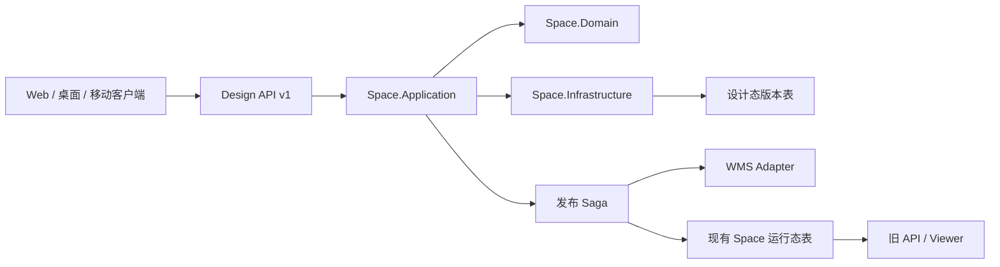
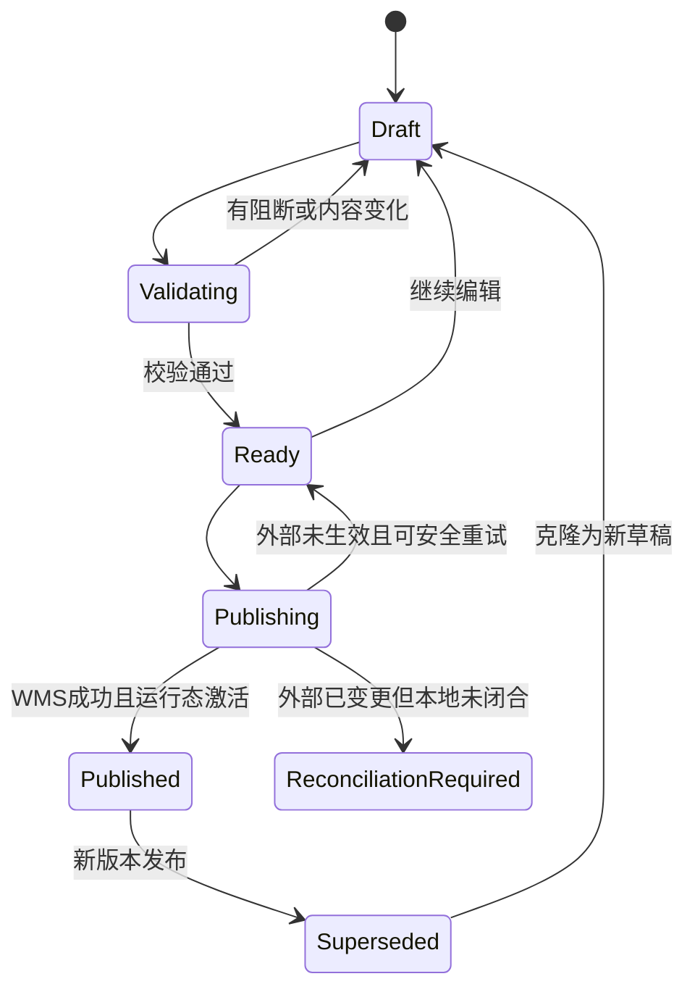

# CP6 Space 详细设计卷一：版本、逻辑身份、数据模型与迁移

版本：v1.0  
日期：2026-07-23  
状态：D1～D15 评审结论已锁定，可进入数据库设计与技术拆分  
覆盖决策：D1、D2、D4、D5、D6、D8、D9

关联入口：

- [低成本 3D 建模 Spec](../requirements/04-low-cost-3d-modeling-spec.md)
- [卷四：发布与恢复](./04-validation-publish-wms-recovery.md)
- [当前 Space_Location](../../../CP6.Entity/DomainModels/Space/Space_Location.cs)
- [当前 SceneService](../../../CP6.Core/Services/Space/SceneService.cs)

## 1. 本卷结论

CP6 Space 采用“双模型、单向发布”：

- **设计态模型**：新增独立、可版本化的设计工作区，保存 Draft、来源、修订、校验和发布证据。
- **运行态模型**：保留现有 `Space_Site/Floor/Zone/Aisle/Rack/Location/Marker` 表，继续服务现有 Viewer、WMS 关联和旧 API。
- **唯一写入方向**：设计态经过校验和发布 Saga 后物化到运行态；禁止长期双写。
- **稳定身份**：所有可发布对象都有跨版本 `LogicalId`；运行态对象 `Id = LogicalId`。尤其必须保持 `Space_Location.Id` 与 `T_WmsBin.Id` 的现有稳定关联。
- **版本形态**：每个 `Space_ModelVersion` 是一个完整仓库快照；版本内使用强类型修订表，不把所有业务对象塞进一个 JSON。
- **并发模型**：每仓一个活动发布草稿，不同楼层可并行；同楼层使用短租约和乐观修订号。

这解决当前实现中“编辑器直接修改运行态、库位身份同时承担 WMS 关联、缺少仓库快照”的根本冲突。

## 2. 当前实现基线

| 能力 | 当前代码事实 | 处理 |
|---|---|---|
| 运行态层级 | 已有 Site/Floor/Zone/Aisle/Rack/Location/Marker | 保留为 Published 物化模型 |
| 库位稳定身份 | `Space_Location.Id` 被发布为 LocationId；`WmsBin.Id == Space_Location.Id` | 不迁移、不重建、不换 Id |
| 编辑保存 | `SceneService.SaveSceneAsync` 直接增删改运行态表 | 新设计模式启用后改走版本命令 |
| 并发 | 仅 Rack DTO 回传 RowVersion | 提升为 Floor Revision + RowVersion |
| 唯一约束 | 现有表按租户、父级和编码唯一 | 不能在现有表复制多版本行 |
| 查询 | `GET /api/space/floor/{id}/scene` 一次返回整层 | 保留旧运行态 API；新增设计 API |
| 发布 | 以楼层草稿库位为单位修改状态并触发 Bridge | 被仓库级发布 Saga 包装并逐步替换 |
| 真库测试 | 已有 SQL Server 唯一索引、换码、RowVersion 测试 | 扩展为版本与发布集成测试 |

当前实现不是废弃物。它是目标架构的运行态投影、WMS 兼容层和迁移输入。

## 3. 架构边界



### 3.1 解决方案项目

目标解决方案增加以下项目：

| 项目 | 职责 | 禁止依赖 |
|---|---|---|
| `CP6.Space.Contracts` | HTTP DTO、错误码、事件契约、SDK 生成源 | Entity、EF、WebApi |
| `CP6.Space.Domain` | 聚合、值对象、状态机、领域规则、端口 | EF、ASP.NET、WMS 实现 |
| `CP6.Space.Application` | 用例、命令、查询、事务边界、权限调用 | Controller、具体文件/CAD/WMS 实现 |
| `CP6.Space.Infrastructure` | EF 映射、文件存储、Job Ledger、WMS/CAD 适配器 | Web UI |

`CP6.WebApi` 只承载认证、Controller、Problem Details 映射和组合根。第一阶段仍是同进程模块化单体，不引入分布式调用；端口边界保证未来 Worker 或服务抽取时不改领域协议。

### 3.2 真相边界

| 数据 | 权威 |
|---|---|
| Draft 几何、来源、映射、校正、版本差异 | 设计态版本表 |
| 当前已发布几何和旧 Viewer 读取 | 现有 Space 运行态表 |
| 库位稳定身份、编码契约 | Space；由设计态发布到运行态和 WMS |
| 库存、批次、容器、任务、业务锁定 | WMS |
| 发布是否完成 | `Space_PublishAttempt` 与 WMS 回执共同判定 |

设计态和运行态出现差异时，不进行反向自动合并。应阻断下一次发布并进入对账；只有迁移或明确的管理员恢复流程可以从运行态重新生成一个新草稿。

## 4. 聚合和状态机

### 4.1 `SpaceModel` 聚合

一个租户内的一个 Site 对应一个 `SpaceModel`：

- 负责当前设计模式、活动草稿和当前已发布版本指针。
- 约束一个 Site 最多一个活动发布草稿。
- 不拥有 WMS 库存。
- 不把 P4 规划方案混入活动发布草稿；未来规划分支使用独立 `Scenario` 聚合。

### 4.2 版本状态



约束：

1. `Published`、`Superseded` 不可原地修改。
2. `Ready` 绑定 `ContentHash + RuleSetVersion + WmsCapabilityHash`。
3. 任意设计内容、映射、编码规则或发布目标能力变化，版本回到 `Draft`。
4. 回退不是修改指针，而是从历史版克隆并发起新的发布 Attempt。
5. `ReconciliationRequired` 阻断该 Site 的后续发布，直到对账闭合。

## 5. 数据模型

所有新表继承 CP6 的租户、创建、修改和软删除约定。下表省略基类已有字段；时间统一存 UTC。字符串枚举落库时使用受控短码，C# 侧使用 enum/value object。

### 5.1 模型头 `Space_Model`

| 字段 | 类型/约束 | 说明 |
|---|---|---|
| `Id` | GUID PK | 模型聚合 ID |
| `TenantId` | GUID | 租户 |
| `SiteId` | GUID | 现有 `Space_Site.Id` |
| `Mode` | smallint | Legacy / DesignV1 |
| `ActiveDraftVersionId` | GUID? | 唯一活动发布草稿 |
| `CurrentPublishedVersionId` | GUID? | 当前运行态来源版本 |
| `LastMaterializedHash` | char(64)? | 运行态投影哈希 |
| `RowVersion` | rowversion | 聚合并发 |

索引：

- `UNIQUE (TenantId, SiteId) WHERE IsDeleted = 0`
- `UNIQUE (TenantId, ActiveDraftVersionId) WHERE ActiveDraftVersionId IS NOT NULL`

### 5.2 版本头 `Space_ModelVersion`

| 字段 | 类型/约束 | 说明 |
|---|---|---|
| `Id` | GUID PK | 版本 ID |
| `ModelId` | GUID FK | 所属模型 |
| `VersionNo` | bigint | Site 内单调递增 |
| `Name` | nvarchar(200) | 用户名称 |
| `Status` | smallint | 状态机 |
| `BasedOnVersionId` | GUID? | 克隆来源 |
| `ContentRevision` | bigint | 任一内容写入时递增 |
| `ContentHash` | char(64)? | 规范快照 SHA-256 |
| `RuleSetVersion` | nvarchar(50)? | 最近校验规则集 |
| `ValidatedHash` | char(64)? | Ready 对应哈希 |
| `PublishedAtUtc/By` | nullable | 发布审计 |
| `RowVersion` | rowversion | 并发 |

索引：

- `UNIQUE (TenantId, ModelId, VersionNo)`
- `INDEX (TenantId, ModelId, Status)`

数据库不依赖“Status=Draft 的过滤唯一索引”表达唯一草稿；`Space_Model.ActiveDraftVersionId` 是唯一入口，并在串行化事务中修改。

### 5.3 强类型修订表

每张修订表统一包含：

| 字段 | 说明 |
|---|---|
| `Id` | 本版本内修订行 ID，不对外发布 |
| `ModelVersionId` | 所属完整快照 |
| `LogicalId` | 跨版本稳定身份 |
| `SourceId/SourceRef` | 可选来源血缘 |
| `LifecycleState` | Active / Disabled / RemoveRequested |
| `RowVersion` | 行并发；主要用于后台批量修复 |

强类型表：

| 表 | 关键字段 |
|---|---|
| `Space_FloorRevision` | SiteLogicalId、Level、FloorCode、Name、Elevation、Height、Boundary、坐标系、UnderlaySourceId、Revision |
| `Space_ZoneRevision` | FloorLogicalId、ZoneCode、Type、Polygon、Color、业务能力标记 |
| `Space_AisleRevision` | ZoneLogicalId、AisleCode、Polygon、Centerline、Direction |
| `Space_RackRevision` | Floor/Zone/AisleLogicalId、RackCode、TemplateVersionId、X/Y/Z、RotationZ、总体包围尺寸 |
| `Space_RackLevelRevision` | RackLogicalId、LevelNo、BottomZ、ClearHeight、BinCount、DepthCount、CellWidth/Depth、MaxLoad |
| `Space_LocationRevision` | Rack/FloorLogicalId、LocationCode、Col/Level/Depth、尺寸、容量、CodeOrigin、外部绑定状态 |
| `Space_ElementRevision` | Floor/ParentLogicalId、ElementType、Geometry、Transform、AssetVersionId、LinkedLogicalId |
| `Space_ElementAttribute` | ElementRevisionId、Namespace、Key、ValueType、Value、Unit |

通用约束：

- `UNIQUE (TenantId, ModelVersionId, LogicalId)`
- 业务编码按版本和父级唯一，例如 Rack 为 `(TenantId, ModelVersionId, ZoneLogicalId, RackCode)`。
- Location 编码为 `(TenantId, ModelVersionId, LocationCode) WHERE LocationCode IS NOT NULL`。
- 父级引用必须与子级处于同一租户和同一版本。EF 可使用组合 FK；无法表达的多态关联由写入服务和发布校验双重保证。
- 所有坐标和尺寸持久化为整数毫米；`RotationZ` 规范到 `[0, 360)`。

### 5.4 为什么不是 JSON 快照

版本级 JSON 可作为导出物和哈希输入，但不作为业务写入权威，原因是：

- 无法可靠建立租户、编码、父子关系和 LogicalId 唯一约束。
- 局部编辑会放大并发冲突。
- 难以按问题、元素、楼层分页和审计。
- 迁移与发布差异无法使用 SQL 有效查询。

规范快照 JSON 由强类型表按固定字段顺序生成，保存为不可变 Artifact，供验收、下载和哈希复现。

## 6. 逻辑身份规则

### 6.1 ID 类型

| ID | 生命周期 | 用途 |
|---|---|---|
| `Revision.Id` | 单版本 | 数据库行和内部 FK |
| `LogicalId` | 跨版本永久 | 差异、引用、客户端对象、发布 |
| `Runtime.Id` | 当前及历史运行 | 必须等于 `LogicalId` |
| `LocationCode` | 可读业务契约 | WMS 查询、显示；发布后受控变更 |
| `ExternalLocationId` | 外部系统 | 保存在 Adapter Binding，不替代 LogicalId |

### 6.2 分配

1. 客户端新建对象时提交 `clientObjectId`，不能指定永久 GUID。
2. 服务端在第一个成功保存事务中分配 `LogicalId`。
3. 响应返回 `clientObjectId → LogicalId` 映射；Web、桌面和移动客户端使用同一规则。
4. 克隆版本保留 LogicalId；复制为另一个 Site 时重新分配 LogicalId。
5. 同码删除重建不会自动复用身份。若历史 WMS 位置仍存在，必须走“恢复原 LogicalId”命令。

### 6.3 库位身份

`Space_Location.Id` 已经是 WMS 关联键，因此目标物化必须使用：

```text
Space_LocationRevision.LogicalId
    = Space_Location.Id
    = T_WmsBin.Id
```

禁止：

- 把 `LocationRevision.Id` 发布到 WMS。
- 因改名、移动、换货架而生成新 LogicalId。
- 通过删除并新建同码位置绕开库存和任务检查。

坐标 `AbsX/AbsY/AbsZ` 是从楼层、货架和逐层规格计算出的缓存，不是编辑权威。发布或几何变化时统一重算。

## 7. 编辑并发

### 7.1 楼层编辑租约 `Space_EditLease`

| 字段 | 说明 |
|---|---|
| `ModelVersionId + FloorLogicalId` | 唯一编辑槽 |
| `LeaseId` | 客户端会话标识 |
| `OwnerUserId` | 持有者 |
| `ClientInstanceId` | Web/桌面/移动安装实例 |
| `ExpiresAtUtc` | 到期时间 |
| `LastRenewedAtUtc` | 续租时间 |
| `RowVersion` | 抢占并发 |

规则：

- 默认租约 90 秒，每 30 秒续租。
- 租约用于减少同层冲突，不作为安全边界。
- 只有具有 `space:model:edit` 和 Site 数据权限者可以申请。
- 断线后等待到期；管理员“接管”必须填写原因并写审计。

### 7.2 乐观保存

设计保存请求必须包含：

```json
{
  "expectedFloorRevision": 18,
  "leaseId": "guid",
  "commandBatchId": "guid",
  "commands": []
}
```

成功后原子地：

1. 验证租户、Site、Version、Floor 和租约。
2. 验证 `expectedFloorRevision`。
3. 应用命令并分配新 LogicalId。
4. `FloorRevision.Revision += 1`。
5. `ModelVersion.ContentRevision += 1`，清空 `ValidatedHash`，状态回到 Draft。
6. 记录审计和幂等结果。

冲突返回 HTTP 409、错误码 `SPACE_FLOOR_REVISION_CONFLICT`，并附当前 revision 与获取差异的链接。服务器不自动合并几何。

## 8. 运行态物化

### 8.1 映射

| 设计态 | 运行态 |
|---|---|
| FloorRevision | `Space_Floor` |
| ZoneRevision | `Space_Zone` |
| AisleRevision | `Space_Aisle` |
| RackRevision + RackLevelRevision | `Space_Rack` + 兼容摘要；逐层数据保留在设计态 |
| LocationRevision | `Space_Location` |
| Annotation Element | `Space_Marker` |
| 其他 Element | 新运行态 `Space_RuntimeElement`，不进入旧 Location 事实 |

物化规则：

- `Runtime.Id = Revision.LogicalId`。
- 只物化成功发布版本。
- Upsert、Disable、Delete 由不可变 PublishPlan 决定。
- 有库存、活动任务或历史约束的位置只允许 Disable，不物理删除。
- 运行态物化与 `Space_Model.CurrentPublishedVersionId`、Outbox 在同一 SQL 事务提交。
- 物化完成计算 `LastMaterializedHash`；对账任务定期重算。

### 8.2 兼容策略

- 旧 GET API 和现有 Viewer 继续读取运行态。
- 旧写 API 在 `Mode=Legacy` 时保持行为。
- `Mode=DesignV1` 后，旧写 API 返回 409 `SPACE_LEGACY_WRITE_DISABLED`，携带新 API 链接；不静默改写到未知 Draft。
- 新 Viewer 可选择读取 Scene Manifest，但正式运行态仍由 Published 物化数据生成。

## 9. Design API v1

基础路径：`/api/space/design/v1`

| Method | Route | 作用 |
|---|---|---|
| GET | `/sites/{siteId}/model` | 模型头、活动草稿、生产版 |
| POST | `/sites/{siteId}/versions` | 创建活动草稿 |
| GET | `/sites/{siteId}/versions` | 版本列表 |
| GET | `/versions/{versionId}` | 版本详情 |
| POST | `/versions/{versionId}/floors/{floorId}/lease` | 申请/续租 |
| POST | `/versions/{versionId}/floors/{floorId}/commands` | 保存命令批 |
| GET | `/versions/{versionId}/floors/{floorId}/changes` | 按 revision 取差异 |
| POST | `/versions/{versionId}/abandon` | 放弃活动草稿 |
| POST | `/versions/{versionId}/clone` | 从历史版创建新草稿 |

契约要求：

- OpenAPI 是唯一客户端契约源。
- 生成 TypeScript 和 C# SDK；未来桌面/移动客户端不复制手写路由和错误码。
- HTTP API 是权威通道；SignalR 只推送“有新状态可拉取”。
- 分页使用不透明 cursor，cursor 必须绑定 TenantId、主体和过滤条件。
- 新 API 全部返回 RFC 9457 Problem Details；旧 API 保持 `{code,message,data}`。

## 10. 迁移与切换

### 10.1 迁移原则

- 按 Site 切换，不做全租户一次性大爆炸。
- 一个 Site 在短暂维护窗口内冻结 Space 写入。
- 不做长期双写。
- 任一步失败，运行态和旧 API 仍可继续读；开关保持 Legacy。

### 10.2 步骤


1. 创建 `Space_Model`，`Mode=Legacy`。
2. 分批读取当前 Site 的所有运行态对象。
3. 创建 `V1-bootstrap` Published 版本：
   - `LogicalId = 当前运行态 Id`。
   - Location 保持 `LogicalId = Space_Location.Id = WmsBin.Id`。
   - 旧 Rack 统一层规格转换为逐层 Profile。
   - Marker 转为 Annotation Element，同时保留运行态 Marker。
4. 生成规范快照、数量和哈希。
5. 校验：
   - 层级无断裂。
   - 业务编码唯一。
   - Location 与 WmsBin 身份、编码、状态一致。
   - 设计快照重新物化到临时影子表后与运行态等价。
6. 在事务中设置 `CurrentPublishedVersionId` 和 `Mode=DesignV1`。
7. 解除维护窗口，旧读接口继续可用，新写入口生效。

### 10.3 迁移证据

每个 Site 保存：

- 迁移批次、应用提交 SHA、数据库迁移版本。
- 运行态输入数量和哈希。
- Bootstrap 版本数量和哈希。
- Location/WMS 对账结果。
- 执行者、批准者、开始/结束时间。
- 失败报告和恢复动作。

### 10.4 回退

切换前失败：删除未激活的 bootstrap 草稿数据或标记 Failed，保持 Legacy。  
切换后发现应用兼容问题：只切回 `Mode=Legacy` 允许旧写前，必须确认新设计 API 尚未接受写入；一旦已有新写入，不允许简单回切，需通过运维修复或重新迁移，防止丢失设计事实。

## 11. 实现工作包

| 顺序 | 工作包 | 主要产物 | 验收 |
|---|---|---|---|
| 1 | 项目边界与 Contracts | 4 个项目、依赖测试、OpenAPI 骨架 | 禁止反向依赖 |
| 2 | 模型头与版本状态机 | Model/Version 实体、迁移、单元测试 | 非法转换全拒绝 |
| 3 | 强类型修订表 | 7 类修订、索引、组合范围校验 | SQL 唯一约束通过 |
| 4 | LogicalId 服务 | 分配、克隆、恢复、映射 | 跨版本身份稳定 |
| 5 | 楼层租约与命令保存 | Lease、Revision、幂等命令批 | 并发冲突可复现 |
| 6 | Bootstrap 工具 | Site 冻结、复制、校验、报告 | 标准仓零差异 |
| 7 | 运行态物化器 | PublishPlan 到旧表投影 | 旧 Viewer/WMS 不回归 |
| 8 | 租户开关与兼容护栏 | Legacy/DesignV1 路由行为 | 无长期双写 |

## 12. 测试与验收

必须至少覆盖：

1. 两个租户同 SiteCode、LocationCode、LogicalId 猜测互不影响。
2. 同 Site 不能创建两个活动发布草稿。
3. 不同 Floor 可同时保存；同 Floor 旧 revision 返回 409。
4. 客户端自带永久 ID 被忽略，服务端返回映射。
5. 克隆版本后所有既有对象 LogicalId 不变，新对象 ID 唯一。
6. Bootstrap 后 Location.Id、WmsBin.Id、编码和状态逐项一致。
7. DesignV1 模式下旧写 API 被阻断，旧读 API 正常。
8. 物化重复执行不产生重复行。
9. SQL Server 真库验证过滤唯一索引、rowversion、并发发布槽。
10. 数据库迁移可在标准 10,000 库位仓规定窗口内完成并可生成恢复报告。

## 13. 完成定义

本卷完成不是“表已经建好”，而是：

- 标准仓可以从现有运行态无损生成 Bootstrap Published 版本。
- 设计 API 可以创建草稿、跨楼层编辑、检测同层冲突。
- 新版本可确定性物化回现有运行态，并保持所有 WMS 库位身份。
- 租户按 Site 开关切换，无双写窗口、无旧 Viewer 回归。
- 所有关键约束由 SQL Server 集成测试证明，不只由 EF InMemory 单测证明。
