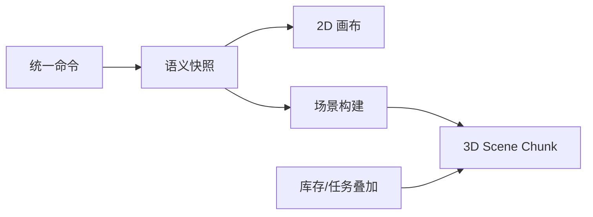

# CP6 Space 详细设计卷三：编辑器、通用元素与 2D/3D 同源

版本：v1.0  
日期：2026-07-23  
状态：详细设计已锁定，可进入编辑器协议和 Scene Manifest 实现  
覆盖决策：D4、D5、D6、D7、D8、D14

关联入口：

- [低成本 3D 建模 Spec](../requirements/04-low-cost-3d-modeling-spec.md)
- [卷一：版本与身份](./01-version-identity-data-migration.md)
- [当前 SceneStage](../../../cp6.web/src/space-editor/SceneStage.ts)
- [当前 SpaceViewer](../../../cp6.web/src/space-viewer/SpaceViewer.ts)

## 1. 本卷结论

编辑器不是另一套数据模型。CAD、Excel、底图、模板和手工编辑都产生统一的空间命令，写入卷一的强类型修订表；2D 编辑和 3D 预览从同一语义快照生成。

场景交付拆成三层：

1. **Semantic Source**：可编辑、可校验、可发布的业务语义。
2. **Render Artifact**：可重建的网格、实例桶、LOD、纹理和 Scene Chunk。
3. **Runtime Overlay**：库存、任务、人员、设备等带来源和时间的增量状态。

Render Artifact 和 Runtime Overlay 都不能反向修改 Semantic Source。



## 2. 当前代码复用

| 当前能力 | 复用方式 | 缺口 |
|---|---|---|
| Konva `SceneStage` | 继续作为 2D 画布内核 | 底图绘制、通用元素、版本会话 |
| Command/CommandStack | 扩展为统一领域命令和本地撤销栈 | 目前主要覆盖 Rack/Zone/Marker |
| Snap/Collision/Lasso/Rotate | 保留交互算法 | 统一支持所有可编辑元素 |
| Template + `genRack` | 保留参数化生成 | 增加逐层规格和资产版本 |
| Three.js Viewer | 保留渲染器、相机、拾取 | 当前整层一次加载 |
| InstancedMesh/LOD/Frustum/LabelVirtualizer | 直接复用 | 增加 Chunk 生命周期与 Manifest |
| `sceneApi.get/save` | Legacy 运行态兼容 | Design API v1 + 生成 SDK |
| `EditorScene` | 作为兼容 DTO | 不再作为新设计模型的唯一契约 |

## 3. 前端模块

目标目录建议：

```text
cp6.web/src/modules/space-design/
├─ api/                 # 生成 SDK 的薄封装
├─ model/               # 语义对象、值对象、schema
├─ commands/            # 命令、逆命令、验证
├─ session/             # 租约、revision、保存、冲突
├─ canvas2d/            # Konva 适配
├─ preview3d/           # Scene Manifest/Chunk 适配
├─ import/              # 来源、预览、问题定位
├─ panels/              # 属性、树、问题、历史
└─ workers/             # 哈希、几何计算、Chunk 解码
```

现有 `space-editor` 和 `space-viewer` 不立即移动。第一阶段通过 Adapter 接入新模块，确认新链路稳定后再做机械迁移，避免同时重写交互和后端模型。

### 3.1 客户端策略

未来 Web、桌面和移动客户端遵循同一边界：

| 事项 | 规则 |
|---|---|
| 权威协议 | HTTP `/api/space/design/v1` |
| 契约 | OpenAPI 生成 TypeScript/C# SDK |
| 实时提示 | SignalR，只通知状态变化 |
| 离线 | MVP 不支持离线多人编辑 |
| 本地缓存 | 只缓存带 ETag/ContentHash 的只读 Chunk 和未提交命令 |
| 永久 ID | 服务端分配 LogicalId |
| 认证 | 浏览器现有安全会话；原生客户端 OIDC Authorization Code + PKCE |

桌面客户端可以提供更强的文件选择、GPU 和大屏体验，但不能绕过服务端文件扫描、权限、租约和发布校验。

## 4. 编辑会话

### 4.1 打开楼层

1. 读取 Version 和 Floor 摘要。
2. 申请编辑租约。
3. 获取 `floorRevision`、语义 Chunk 清单和问题摘要。
4. 按视区加载 Semantic Chunk。
5. 本地构建 2D 节点和低成本 3D 预览。
6. 每 30 秒续租；失败时切为只读并保留未提交命令。

### 4.2 会话状态

| 状态 | 行为 |
|---|---|
| Loading | 不允许编辑 |
| Editable | 租约有效，revision 最新 |
| Dirty | 有未提交命令 |
| Saving | 命令批提交中 |
| Conflict | revision 冲突，禁止继续提交 |
| LeaseLost | 只读，可导出本地命令 |
| ReadOnly | 无编辑权限或版本不可编辑 |

关闭页面时如果 Dirty，提示保存或导出本地命令；浏览器 `beforeunload` 只作辅助，不作为数据保证。

## 5. 命令协议

### 5.1 Command Batch

```json
{
  "schemaVersion": 1,
  "commandBatchId": "guid",
  "leaseId": "guid",
  "expectedFloorRevision": 18,
  "clientInstanceId": "guid",
  "commands": [
    {
      "commandId": "guid",
      "type": "MoveObject",
      "targetLogicalId": "guid",
      "payload": { "x": 12000, "y": 8300, "rotationZ": 90 }
    }
  ]
}
```

规则：

- `commandBatchId` 和 `commandId` 在租户内幂等。
- Command 是意图，不是 EF Entity 全量回传。
- Payload 按命令类型使用强类型 schema。
- 服务端重新校验数值、父级、版本、权限和不变量。
- 命令批要么全部应用，要么全部不应用。
- 响应包含新 FloorRevision、VersionContentRevision、ID 映射和受影响对象。

### 5.2 MVP 命令

| 命令 | 作用 |
|---|---|
| `CreateObject` | 创建 Floor/Zone/Aisle/Rack/Element |
| `MoveObject` | 平移 |
| `RotateObject` | 绕规范锚点旋转 |
| `ResizeObject` | 修改尺寸/几何 |
| `UpdateProperties` | 更新允许属性 |
| `ChangeParent` | 变更 Zone/Aisle 等归属 |
| `DeleteObject` | 标记移除或停用意图 |
| `RestoreLogicalObject` | 恢复历史身份 |
| `GenerateRackArray` | 参数化批量生成 |
| `UpdateRackLevels` | 修改逐层规格 |
| `ApplyImportPreview` | 确认 CAD/Excel 预览 |
| `SetUnderlayCalibration` | 设置底图标定 |
| `BindExistingLocation` | 存量 WMS 库位几何绑定 |

`ApplyImportPreview` 内部可以展开为大量命令，但审计保留父 CommandBatch 和来源哈希。

### 5.3 撤销与重做

- 未保存命令：客户端 CommandStack 直接应用逆操作。
- 已保存命令：生成新的补偿命令批，不做数据库时间倒流。
- 已发布版本：不可编辑；从该版本克隆草稿后再变更。
- 删除库位的逆命令必须恢复原 LogicalId，不能创建新身份。
- 补偿仍校验当前 revision；他人已修改时进入 Conflict。

服务端保存命令摘要、前后规范值和操作者，不能只记录“整段 JSON 已变化”。

## 6. 语义对象

### 6.1 业务对象与通用元素

| 类别 | 对象 | 说明 |
|---|---|---|
| 强业务层级 | Floor、Zone、Aisle、Rack、RackLevel、Location | 有编码、父级、WMS 语义 |
| 建筑元素 | Wall、Column、Door、Dock、Stair、Elevator | 参与碰撞、导航或展示 |
| 仓储元素 | PalletPosition、Workstation、Conveyor、StaticEquipment | MVP 静态；P2 可绑定设备 |
| 辅助元素 | Annotation、Dimension、Guide、RestrictedArea | 编辑和说明 |
| 装饰元素 | Decoration、ImportedReference | 不参与业务校验或可配置参与 |

禁止用 `Space_ElementAttribute` 复制库存、批次、容器余额或任务状态。元素属性只保存设计参数和外部引用。

### 6.2 Geometry Schema

每个 Element 的 Geometry 都包含 `schemaVersion` 和一种形态：

| kind | 必要字段 | 用例 |
|---|---|---|
| `point` | x/y/z | 标注、设备锚点 |
| `path` | points、width | 墙、巷道中心线 |
| `polygon` | outer、holes、height | 区域、柱、月台 |
| `box` | width/height/depth | 参数化设备 |
| `asset` | assetVersionId、transform | 模型资产 |

规范化：

- 整数毫米。
- 多边形固定顺逆时针和起始点。
- 去除相邻重复点和零长度边。
- RotationZ 规范化。
- 写入前计算 GeometryHash。

未知 `schemaVersion` 时拒绝编辑，不做静默降级。

## 7. 逐层货架

`RackRevision` 保存位置、方向和总体边界；`RackLevelRevision` 保存每层：

- `LevelNo`
- `BottomZ`
- `ClearHeight`
- `BinCount`
- `DepthCount`
- `CellWidth/CellDepth`
- `BeamHeight`
- `MaxLoad`

Location 位置由：

```text
Rack Transform
+ Level BottomZ
+ Col/Depth Offset
+ Cell Dimensions
```

确定性生成。Location 的 `AbsX/Y/Z` 和尺寸是缓存。相同输入、生成器版本和 LogicalId 种子必须产生相同规范结果。

当减少格口：

1. 计算受影响 LocationLogicalId。
2. 未发布且无绑定的位置可从目标快照移除。
3. 已发布位置进入 `RemoveRequested`。
4. 发布预检查询 WMS 库存和活动任务。
5. 有引用则 Blocking；无引用则发布为 Disabled。

## 8. 资产与模板

### 8.1 数据模型

| 表 | 说明 |
|---|---|
| `Space_Asset` | 资产逻辑头，System 或 Tenant 作用域 |
| `Space_AssetVersion` | 不可变版本、参数 schema、预览、渲染 Artifact |
| `Space_TemplateDefinition` | 参数化生成规则 |
| `Space_TemplateVersion` | 不可变模板版本 |

作用域规则：

- System 资产全租户只读。
- Tenant 资产仅本租户可读写。
- 草稿引用具体 Version，不引用“最新”浮动版本。
- 复制公共模板后形成租户私有模板和新 ID。
- 首版不做跨租户市场，也不允许租户资产公开给其他租户。

### 8.2 参数化优先

通用货架仓优先使用参数化几何：

- 货架、横梁、立柱、托盘、月台、墙柱使用尺寸生成。
- 复杂 GLB/GLTF 仅用于必要设备或展示。
- 所有模型资产经过格式、纹理、三角面、尺寸和脚本安全检查。
- 不执行模型中的任意脚本、外部 URL 或扩展加载器。

## 9. 2D 画布

图层顺序固定：

1. Underlay
2. Building
3. Zone
4. Aisle
5. Rack/Storage
6. Equipment
7. Annotation
8. Selection/Issue/Guide

每层支持显隐、锁定和可选性。Underlay 默认锁定；CAD 原始参考层默认只读，用户编辑的是语义对象。

### 9.1 交互

- 平移、缩放、框选、多选。
- 网格、端点、边、中线和角度吸附。
- 对齐、等间距分布、镜像、阵列。
- 几何碰撞实时提示，但服务端校验是发布权威。
- 问题列表点击定位 SourceRef 或 LogicalId。
- 所有批量操作先预览数量、边界和编码影响。

大规模编辑把碰撞、空间索引、哈希和预览生成放到 Web Worker；DOM 主线程只处理交互和绘制。

## 10. 3D 场景交付

### 10.1 Scene Manifest

```json
{
  "schemaVersion": 1,
  "modelVersionId": "guid",
  "contentHash": "sha256",
  "coordinateSystem": "RH_Z_UP_MM",
  "floors": [
    {
      "floorLogicalId": "guid",
      "bounds": [0, 0, 0, 120000, 80000, 12000],
      "chunks": []
    }
  ],
  "overlayEndpoint": "/api/space/runtime/v1/..."
}
```

每个 Chunk 描述：

- ChunkId、Floor、空间边界。
- SemanticHash、RenderArtifactHash。
- 对象类型和数量。
- LOD、压缩、字节数。
- 下载 URL 或 API 引用。

Manifest 和 Chunk 使用 ETag/ContentHash。Published 版本可长缓存；Draft 按 FloorRevision 失效。

### 10.2 Chunk 策略

- 首先按 Floor 分区，再按固定空间网格或对象数量拆分。
- Manifest 首屏只返回边界、楼层和 Chunk 索引。
- Viewer 优先加载相机附近、搜索命中和问题对象所在 Chunk。
- 离开工作集的 Chunk 可释放 GPU 资源。
- 同一 Rack 的 Location 实例尽量落在同一 Chunk。
- Chunk 边界算法版本化，保证相同输入稳定输出。

MVP 不要求无限大场景流式漫游，但 10,000 库位不能再依赖单个整层 JSON 一次加载。

### 10.3 Render Artifact

Render Artifact 可以包含：

- InstancedMesh 桶和实例变换。
- 参数化网格缓存。
- LOD 和简化网格。
- 材质、纹理引用。
- Pick Map：`meshId + instanceId → LogicalId`。
- 逻辑对象包围盒。

Artifact 是缓存，可随渲染器版本重建。它不参与业务差异，不保存库存真相。

## 11. Runtime Overlay

Overlay DTO：

```json
{
  "dataSource": "CP6_WMS",
  "observedAtUtc": "2026-07-23T12:00:00Z",
  "freshnessSeconds": 8,
  "isSimulated": false,
  "sequence": 1281,
  "items": [
    {
      "locationLogicalId": "guid",
      "state": "Occupied",
      "quantity": 12
    }
  ]
}
```

规则：

- Overlay 只引用 Published 的 LogicalId。
- 库存、任务、人员和设备使用不同 Overlay Channel。
- 全量快照与增量事件都有单调 sequence。
- sequence 缺口时客户端丢弃本地增量并重新拉全量。
- 数据源、观察时间、延迟和模拟标识始终可见。
- Draft 预览默认不叠加生产库存；需要影响预览时使用单独只读模式并明确标识。

SignalR 只通知 `overlay-version-changed`，客户端再按权限拉取；禁止把全租户明细广播给 `Clients.All`。

## 12. 2D/3D 一致性

构建流水线从同一规范快照生成：

1. 语义对象按 LogicalId 排序。
2. 坐标、尺寸、RotationZ、逐层规格规范化。
3. 生成 `SemanticHash`。
4. 2D 测试导出对象清单。
5. 3D 构建输出 Pick Map、变换和尺寸清单。
6. 两侧以 LogicalId 对齐并逐项比较。

一致性门槛：

- 对象数量、LogicalId、父级和编码 100%。
- 规范尺寸、位置、RotationZ 100%。
- 不允许只比较截图。
- Render Artifact 可以因 LOD 少三角面，但逻辑包围和 Pick Map 必须一致。

## 13. API

基础路径：`/api/space/design/v1`

| Method | Route | 作用 |
|---|---|---|
| GET | `/versions/{versionId}/floors/{floorId}/manifest` | Draft 场景清单 |
| GET | `/versions/{versionId}/semantic-chunks/{chunkId}` | 语义 Chunk |
| GET | `/versions/{versionId}/render-chunks/{chunkId}` | 渲染 Artifact |
| POST | `/versions/{versionId}/floors/{floorId}/commands` | 命令批保存 |
| GET | `/versions/{versionId}/floors/{floorId}/history` | 命令摘要 |
| GET | `/assets` | 资产列表 |
| POST | `/assets` | 创建租户资产 |
| GET | `/templates` | 模板列表 |
| POST | `/templates/{id}/instantiate` | 生成命令预览 |

运行态建议新路径：

| Method | Route | 作用 |
|---|---|---|
| GET | `/api/space/runtime/v1/sites/{siteId}/manifest` | Published Manifest |
| GET | `/api/space/runtime/v1/chunks/{chunkId}` | Published Chunk |
| GET | `/api/space/runtime/v1/sites/{siteId}/overlays/stock` | 库存快照 |
| GET | `/api/space/runtime/v1/sites/{siteId}/overlays/tasks` | 任务快照 |

旧 `/api/space/floor/{id}/scene` 继续兼容，直到所有客户端完成迁移。

## 14. 错误和恢复

| 错误码 | HTTP | 恢复 |
|---|---:|---|
| `SPACE_EDIT_LEASE_HELD` | 409 | 只读打开或等待 |
| `SPACE_EDIT_LEASE_LOST` | 409 | 重新申请并重放本地命令 |
| `SPACE_FLOOR_REVISION_CONFLICT` | 409 | 拉差异、人工重放 |
| `SPACE_COMMAND_SCHEMA_UNSUPPORTED` | 422 | 升级客户端 |
| `SPACE_OBJECT_PARENT_INVALID` | 422 | 修复归属 |
| `SPACE_LOGICAL_ID_NOT_FOUND` | 404 | 刷新版本 |
| `SPACE_ASSET_SCOPE_DENIED` | 403/404 | 选择授权资产 |
| `SPACE_SCENE_CHUNK_STALE` | 409 | 重取 Manifest |
| `SPACE_OVERLAY_SEQUENCE_GAP` | 409 | 重拉全量 Overlay |

客户端对 409 不自动无限重试写操作；必须进入可解释恢复 UI。

## 15. 性能门槛

验收终端和 500 货架/10,000 库位数据包沿用主 Spec。

| 指标 | MVP 门槛 |
|---|---:|
| Manifest 首响应 P95 | ≤1 秒 |
| 冷缓存首个可见 Chunk | ≤15 秒 |
| 可拾取和搜索 | ≤20 秒 |
| 平移/缩放中位帧率 | ≥30 FPS |
| 单对象拾取 P95 | ≤150ms |
| Overlay 着色完成 P95 | ≤3 秒 |
| 同层 1,000 对象命令批服务端保存 P95 | ≤2 秒 |

测量必须记录浏览器、GPU、应用 SHA、数据包版本、冷/热缓存和网络条件。

## 16. 测试

### 16.1 前端单元

- Command execute/inverse、批量命令原子性。
- 坐标、旋转、吸附、碰撞和空间索引。
- 逐层货架生成与 Location 稳定映射。
- Scene Manifest、Chunk 缓存和 ETag。
- Overlay sequence 缺口恢复。

### 16.2 契约与集成

- OpenAPI 生成 SDK 在 Web 和 C# 样例客户端编译。
- FloorRevision 冲突与租约丢失。
- 客户端临时 ID 到 LogicalId 映射。
- 资产跨租户引用拒绝。
- 同一规范快照的 2D/3D 清单一致。

### 16.3 端到端

- 底图标定 → 模板阵列 → 保存 → 3D 预览。
- CAD Preview → 问题定位 → 校正锁定 → 保存。
- Excel 逐层规格 → 库位生成 → 编码。
- 页面断线、租约过期、重连和命令导出/重放。
- 10,000 库位按 Chunk 加载、拾取、定位和 Overlay。

## 17. 完成定义

- 三条建模入口都只通过统一命令写设计版本。
- 2D 和 3D 不维护第二份业务对象，机器清单逐项一致。
- Published 场景可按 Manifest/Chunk 加载，运行 Overlay 独立增量刷新。
- 现有 Viewer 的实例化、LOD、裁剪和标签能力得到复用。
- Web、未来桌面和移动客户端使用同一版本化契约、LogicalId 和错误恢复语义。
