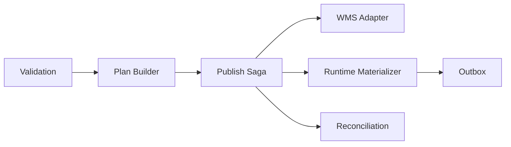
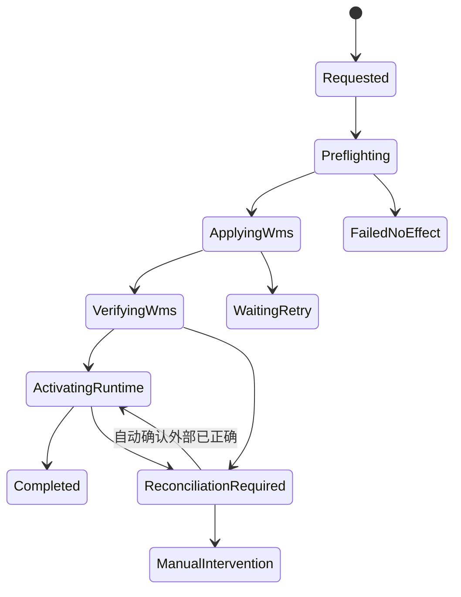

# CP6 Space 详细设计卷四：校验、发布、WMS 适配与恢复

版本：v1.0  
日期：2026-07-23  
状态：详细设计已锁定，可进入发布 Saga 与 WMS 模拟器实现  
覆盖决策：D3、D5、D10、D13、D15

关联入口：

- [低成本 3D 建模 Spec](../requirements/04-low-cost-3d-modeling-spec.md)
- [卷一：版本与运行态物化](./01-version-identity-data-migration.md)
- [当前 LocationPublishService](../../../CP6.Core/Services/Space/LocationPublishService.cs)
- [当前漂移扫描](../../../CP6.Core/Services/Space/SpaceBinDriftScanner.cs)

## 1. 本卷结论

Space 发布不是一次数据库 `SaveChanges`，而是一个可恢复 Saga：

1. 对目标完整版本做确定性校验和差异计划。
2. 锁定 Site 发布槽。
3. 先让 WMS 按幂等键应用并回读验证。
4. WMS 确认成功后，才在本地事务物化运行态并激活版本。
5. 任意超时、部分成功或本地激活失败都有持久步骤、回执和对账状态。

不能向用户承诺跨外部 WMS 的数据库级原子事务。产品保证的是：

- 旧 Published 运行态在 WMS 未确认成功前不切换。
- 每次外部写都有稳定幂等键和逐项回执。
- 部分状态不会被伪装为成功。
- 系统能自动恢复、明确转人工，并保留完整证据。

## 2. 当前实现与改造边界

| 当前能力 | 复用 | 风险/改造 |
|---|---|---|
| 编码 Precheck | 规则和部分校验逻辑 | 扩展为版本级 ValidationRun |
| LocationPublishService | CP6 WMS 位置 DTO、停用护栏 | 当前按楼层直接改运行态 |
| SpaceBridgeHook/Consumer | 集成事件和 WMS 消费基础 | 不能吞掉失败后仍报告发布成功 |
| WmsStockQuery | 库存/引用检查 | 纳入 Adapter Preflight |
| WmsBinDeactivator | CP6 WMS 停用语义 | 纳入确定性 PublishPlan |
| DriftScanner | Location.Id 等值对账 | 扩展为发布回执和整仓对账 |
| IntegrationEvent/Outbox | 事务后事件基础 | 只在本地激活事务中写 |

现有运行态发布服务在 Legacy 模式保留；DesignV1 只能通过新 Saga 调用适配器和物化器。

## 3. 发布组件



| 组件 | 职责 |
|---|---|
| `ISpaceValidationService` | 构建可复现 ValidationRun |
| `IPublishPlanBuilder` | 比较目标版和当前生产版 |
| `ISpacePublishOrchestrator` | Saga 状态机和任务编排 |
| `ISpaceWmsAdapter` | WMS 能力、预检、应用、状态、回读 |
| `IRuntimeMaterializer` | 将目标设计版物化到现有 Space 表 |
| `ISpaceReconciliationService` | Plan、WMS、运行态三方对账 |
| `ISpacePublishPolicy` | 适配器认证、审批、变更窗口 |

## 4. 版本校验

### 4.1 ValidationRun

`Space_ValidationRun`：

| 字段 | 说明 |
|---|---|
| `Id/TenantId/ModelVersionId` | 校验身份 |
| `ContentHash` | 输入快照哈希 |
| `RuleSetVersion` | 规则集 |
| `AdapterId/CapabilityHash` | 发布目标能力 |
| `Status` | Queued/Running/Passed/Blocked/Failed |
| `BlockingCount/WarningCount/InfoCount` | 结果 |
| `Started/Finished/RequestedBy` | 审计 |
| `JobId/CorrelationId` | 后台任务 |

Issue 使用卷二的 `Space_ModelIssue`。相同 `ContentHash + RuleSetVersion + CapabilityHash` 可复用结果；任一输入变化必须重跑。

### 4.2 校验阶段

| 阶段 | 示例 |
|---|---|
| Schema | 必填、类型、几何 schema |
| Hierarchy | Floor/Zone/Aisle/Rack/Location 父子闭合 |
| Identity | LogicalId 唯一、历史身份合法 |
| Geometry | 边界、碰撞、越界、尺寸 |
| Coding | 空码、重复、长度、字符、冻结码 |
| Source | 单位、低置信、未处理 Mapping 问题 |
| WMS | 能力、冲突、库存、任务、停用引用 |
| Security | 租户、Site、审批和来源权限 |
| Performance | 对象数、Chunk 预计大小、适配器批量限制 |

### 4.3 阻断规则

至少包括：

- 版本不是 Ready 候选或 ContentHash 不一致。
- 层级断裂、跨版本/跨租户父级。
- 重复 LogicalId、LocationCode 或业务编码。
- Location 的历史身份与 WMS Binding 冲突。
- 已发布 Location 被换身份、绕过恢复流程重建。
- 有库存或活动任务的位置要求删除/禁用。
- CAD 单位、底图标定或 Blocking Issue 未解决。
- WMS 能力不足、健康检查失败或适配器未认证。
- 发布预期生产版本与当前指针不一致。
- 运行态已有未闭合对账问题。

Warning 可由具备发布权限者确认，确认绑定具体 ValidationRun；内容变化后失效。

## 5. 确定性 PublishPlan

### 5.1 Plan 生成

输入：

- Target ModelVersion 完整快照。
- `CurrentPublishedVersionId` 完整快照；首次发布为空。
- 当前 WMS 能力和绑定快照。
- 规范化规则版本。

按 LogicalId 比较，生成：

| Action | 含义 |
|---|---|
| `Create` | 新 LogicalId |
| `UpdateMaster` | 编码、层级、容量或 WMS 关心属性变化 |
| `UpdateGeometryOnly` | 仅几何变化，WMS 可为 NoOp |
| `Disable` | 目标版停用/移除已发布位置 |
| `Restore` | 合法恢复历史 LogicalId |
| `NoOp` | 规范内容一致 |

Plan 项按 `ObjectType + LogicalId + Action` 固定排序，规范序列化后计算 `PlanHash`。

### 5.2 数据模型

`Space_PublishPlan`：

- Id、TenantId、SiteId、TargetVersionId、BaseVersionId。
- ContentHash、ValidationRunId、AdapterId、CapabilityHash。
- PlanHash、ItemCount、CreatedAt/By。
- ArtifactId：不可变完整计划。

`Space_PublishPlanItem`：

- PlanId、SequenceNo、ObjectType、LogicalId、Action。
- BeforeHash、AfterHash。
- LocationCode、ExternalBindingId。
- PayloadHash、ImpactCode。

Plan 创建后不可修改。重试复用原 Plan；目标内容变化必须创建新 Plan 和新 PublishAttempt。

### 5.3 库位变更规则

- 移动/旋转：LogicalId 和 LocationCode 不变，通常为 GeometryOnly。
- 改父级：LogicalId 不变；WMS 是否需要路径更新由能力决定。
- 改编码：需要显式 Rename 能力或“建新+停旧”认证流程；默认 Blocking。
- 减少格口：已发布位置生成 Disable，不物理删除。
- 同码恢复：必须引用历史 LogicalId。
- 存量采纳：计划使用现有 WMS 外部 ID 和编码，不能 Create 同码位置。

## 6. WMS 适配器契约

### 6.1 接口

```csharp
public interface ISpaceWmsAdapter
{
    Task<WmsCapabilities> GetCapabilitiesAsync(WmsContext context, CancellationToken ct);
    Task<WmsPreflightResult> PreflightAsync(PublishPlan plan, CancellationToken ct);
    Task<WmsBatchResult> ApplyBatchAsync(WmsBatch batch, CancellationToken ct);
    Task<WmsOperationStatus> GetOperationStatusAsync(string operationKey, CancellationToken ct);
    Task<WmsReadBack> ReadBackAsync(WmsReadBackRequest request, CancellationToken ct);
    Task<WmsBlockingReferences> GetBlockingReferencesAsync(
        IReadOnlyList<Guid> locationLogicalIds, CancellationToken ct);
}
```

可选能力通过 `WmsCapabilities` 声明，不扩展为随意下转具体适配器：

- AtomicStaging
- IdempotentUpsert
- IdempotentDisable
- RenameLocation
- QueryByLogicalId
- QueryBlockingReferences
- BatchMaxSize
- AllowedCodePattern/MaxLength
- ReadBackHash

### 6.2 幂等

外部 operation key：

```text
space:{tenantId}:{siteId}:{publishAttemptId}:{batchNo}
```

同 key、同 PayloadHash 必须返回同结果；同 key、不同 PayloadHash 必须拒绝为 `WMS_IDEMPOTENCY_CONFLICT`。

逐项回执至少包含：

- LogicalId
- LocationCode
- ExternalLocationId
- Action
- Outcome
- ExternalVersion/ETag
- ErrorCode

只返回 HTTP 200 而无逐项或哈希证据，不能视为批次成功。

### 6.3 适配器等级

| 等级 | 能力 | 正式发布 |
|---|---|---|
| CertifiedAtomic | 暂存/验证/激活或等价原子批次 | 允许 |
| CertifiedIdempotent | 逐项幂等、可靠查询、已认证补偿 | 允许，Saga 必须处理部分结果 |
| PreviewOnly | 只能查询或不可可靠恢复 | 不允许生产发布 |

CP6 WMS 适配器和模拟器必须通过同一契约测试。第三方 WMS 不能靠品牌或人工说明跳过认证。

## 7. PublishAttempt 与 Saga

### 7.1 数据模型

`Space_PublishAttempt`：

| 字段 | 说明 |
|---|---|
| `Id/TenantId/SiteId` | 发布身份 |
| `PublishPlanId/TargetVersionId/BaseVersionId` | 输入 |
| `AdapterId` | 目标 |
| `Status` | Saga 状态 |
| `CurrentStep` | 当前步骤 |
| `BusinessIdempotencyKey` | 用户请求幂等 |
| `Started/Finished/RequestedBy/ApprovedBy` | 审计 |
| `WmsCommittedAtUtc` | 外部确认时刻 |
| `RuntimeActivatedAtUtc` | 本地激活时刻 |
| `LastErrorCode/Summary` | 状态 |
| `JobId/CorrelationId/RowVersion` | 执行与并发 |

`Space_PublishBatch`：

- AttemptId、BatchNo、OperationKey、PayloadHash。
- Status、AttemptCount、ExternalOperationId。

`Space_WmsReceipt`：

- BatchId、LogicalId、Action、Outcome。
- ExternalLocationId、ExternalVersion、ResponseHash。
- ReceivedAtUtc、RawArtifactId。

`Space_ReconciliationIssue`：

- AttemptId、LogicalId、ExpectedStateHash。
- WmsStateHash、RuntimeStateHash。
- Classification、Status、Resolution。

### 7.2 状态



### 7.3 固定顺序

```text
1. 验证调用者、审批和 expectedPublishedVersionId
2. 获取 Site 发布租约
3. 再确认 ValidationRun、ContentHash、PlanHash
4. Adapter Preflight
5. 按确定批次 ApplyBatch
6. 对超时批次先 GetOperationStatus，禁止盲重发
7. ReadBack 并逐项/哈希验证 WMS
8. SQL 事务：
   - 物化运行态
   - 设置 CurrentPublishedVersionId
   - 旧版本置 Superseded，目标置 Published
   - 写 Outbox 和审计
9. 提交后推送 Site 范围通知
10. 完成 Attempt，释放发布租约
```

步骤 5～7 未确认全部预期结果前，不执行步骤 8。

## 8. 失败与恢复

| 场景 | 状态 | 自动动作 |
|---|---|---|
| Preflight 失败 | FailedNoEffect | 不写 WMS/运行态 |
| WMS 请求超时 | WaitingRetry | 先查 OperationStatus |
| 一批全部失败且证实未生效 | WaitingRetry | 按退避重试 |
| 部分项成功 | ReconciliationRequired | 停止后续批，逐项回读 |
| WMS 全成功、本地物化失败 | ReconciliationRequired | 只重试本地物化 |
| 本地提交成功、响应丢失 | 恢复扫描 | 根据 Attempt/指针/Outbox 判定 Completed |
| Worker 崩溃 | 租约过期 | 新 Worker 从持久步骤恢复 |
| 适配器返回矛盾结果 | ManualIntervention | 隔离适配器，阻断 Site 发布 |
| 回退发布失败 | 原生产版或已确认外部状态 | 同样进入 Saga，不改历史版 |

### 8.1 自动恢复判定

恢复 Worker 对非终态 Attempt 执行：

1. 检查 Site 发布租约和 Attempt RowVersion。
2. 读取每个 Batch 的 OperationStatus。
3. 读取 WMS 当前状态并计算哈希。
4. 若 WMS 与 Plan 完全一致，进入本地 ActivatingRuntime。
5. 若 WMS 明确无任何效果，回到 WaitingRetry。
6. 若部分一致或无法证明，进入 ReconciliationRequired。

绝不根据“上次请求抛了异常”推断 WMS 未写入。

### 8.2 人工处理

人工界面必须展示：

- Target/Base Version 和 PlanHash。
- 每批请求、回执、回读和差异。
- WMS、运行态、设计态三方状态。
- 可用动作及风险：
  - 重查
  - 重试未应用项
  - 执行已认证补偿
  - 仅完成本地激活
  - 终止并升级事故

每个动作需要权限、原因、二次确认和审计。禁止直接在数据库改 Attempt 为 Completed。

## 9. 运行态物化事务

本地事务执行：

1. 再锁定 `Space_Model` RowVersion。
2. 验证 CurrentPublishedVersionId 仍等于 BaseVersionId。
3. 依 Plan 以 LogicalId Upsert 现有 Space 表。
4. 重算 Location 坐标缓存。
5. Disable 不可删除的位置。
6. 写 `Space_RuntimeElement`。
7. 计算运行态规范哈希，与目标可物化哈希比较。
8. 更新版本指针和状态。
9. 写 Outbox、审计和物化证据。

任一步失败整笔 SQL 回滚。重试相同 Plan 时 Upsert 必须幂等。

对于同库 CP6 WMS，也保持 Saga 步骤语义。可以由 CP6 Adapter 在内部利用同库事务优化，但 Orchestrator 不依赖该事实，测试仍覆盖外部调用边界。

## 10. WMS 模拟器

模拟器是正式验收适配器，不是页面假数据：

- 支持能力协商、Preflight、幂等 Apply、状态查询和 ReadBack。
- 保存 Location、库存、批次、容器、任务和外部版本。
- 支持 10,000 库位标准仓一键 seed。
- 数据带 `DataSourceId` 和 `IsSimulated=true`。
- 与真实 CP6 WMS 使用同一 Contracts。

故障注入：

| 故障 | 行为 |
|---|---|
| BeforeApplyTimeout | 未写入即超时 |
| AfterApplyTimeout | 已写入但客户端超时 |
| PartialBatch | 指定序号成功，其余失败 |
| DuplicateResponse | 重复返回同回执 |
| ReorderedReceipt | 回执乱序 |
| HashMismatch | 回读数据被篡改 |
| SlowReadBack | 对账超时 |
| LocalActivationFailure | WMS 成功后注入 SQL 失败 |

每种故障都必须有自动化恢复断言。

## 11. API

基础路径：`/api/space/design/v1`

| Method | Route | 作用 |
|---|---|---|
| POST | `/versions/{versionId}/validations` | 发起校验 |
| GET | `/validations/{validationId}` | 校验结果 |
| GET | `/versions/{versionId}/publish-preview` | 差异和 WMS 影响 |
| POST | `/versions/{versionId}/publish-attempts` | 发起发布 |
| GET | `/publish-attempts/{attemptId}` | 状态和步骤 |
| GET | `/publish-attempts/{attemptId}/items` | 分页逐项结果 |
| POST | `/publish-attempts/{attemptId}/retry` | 安全重试 |
| POST | `/publish-attempts/{attemptId}/reconcile` | 发起对账 |
| POST | `/versions/{versionId}/republish` | 历史版克隆并发布 |
| GET | `/sites/{siteId}/reconciliation-issues` | 未闭合问题 |

发起发布必须携带：

- `expectedPublishedVersionId`
- `validationRunId`
- `planHash`
- `idempotencyKey`
- `approvalReference`（启用审批时）

## 12. Problem Details

| 错误码 | HTTP | 恢复 |
|---|---:|---|
| `SPACE_VALIDATION_STALE` | 409 | 重新校验 |
| `SPACE_VALIDATION_BLOCKED` | 422 | 处理 Blocking |
| `SPACE_PUBLISHED_VERSION_CHANGED` | 409 | 重新生成差异 |
| `SPACE_PUBLISH_SLOT_BUSY` | 409 | 查看现有 Attempt |
| `SPACE_WMS_CAPABILITY_MISSING` | 422 | 更换/升级适配器 |
| `SPACE_WMS_RETRYABLE` | 503 | 由 Job 自动重试 |
| `SPACE_WMS_PARTIAL_RESULT` | 409 | 进入对账 |
| `SPACE_WMS_RESULT_UNCERTAIN` | 409 | 禁止盲重发 |
| `SPACE_RUNTIME_ACTIVATION_FAILED` | 500 | 只重试本地激活 |
| `SPACE_RECONCILIATION_REQUIRED` | 409 | 打开对账工作台 |
| `SPACE_LOCATION_IN_USE` | 422 | 取消停用或先清业务引用 |

新 API 使用 RFC Problem Details；旧发布 API 保持旧 Envelope，不能混用。

## 13. 权限与审批

| 权限 | 作用 |
|---|---|
| `space:model:validate` | 校验 |
| `space:model:publish` | 发起发布 |
| `space:model:approve` | 批准高风险发布 |
| `space:model:rollback` | 重新发布历史版 |
| `space:integration:operate` | 重试和对账 |
| `space:integration:admin` | 适配器认证/隔离 |

发布人不能仅靠 URL 猜测发布其他 Site；每一步都调用 `ISpaceAccessEvaluator`。外部组织用户永远不能访问发布、重试、来源或对账接口。

高风险动作由同一 `DeliveryOwner` 执行显式二次确认并保存前后快照、原因、结果和恢复点，不要求第二人审批：

- Location 编码变更。
- 大量 Disable。
- 存量采纳冲突覆盖。
- 人工补偿。
- 从 ReconciliationRequired 强制结束。

## 14. 可观测性

日志字段：

- TenantId、SiteId、Target/BaseVersionId。
- ValidationRunId、PlanId、PlanHash、AttemptId。
- AdapterId、CapabilityHash、Batch OperationKey。
- Job/Attempt、CorrelationId、操作者/确认者（允许同一人）。
- 逐阶段数量、耗时和错误分类。

指标：

- Validation 和 Publish 成功率/P95。
- WMS 超时、部分结果和不确定结果数量。
- WaitingRetry 与 ReconciliationRequired 年龄。
- WMS 成功到 Runtime 激活延迟。
- 自动恢复率和人工处理时长。
- Drift 数量和最长未闭合时间。

报警：

- 任何 `ReconciliationRequired` 立即告警。
- `ApplyingWms/ActivatingRuntime` 超过 SLA。
- 同 Site 连续失败。
- Adapter 回读哈希不一致。
- Published 运行态和版本哈希漂移。

## 15. 测试

### 15.1 单元

- 规则集和严重级别。
- LogicalId 差异和 Plan 排序。
- PlanHash 确定性。
- Saga 合法状态转换。
- 超时/回执分类。
- 库位删除、停用、恢复和改码规则。

### 15.2 SQL Server 集成

- Site 发布槽多 Worker 竞争。
- ValidationRun 与 ContentHash 失效。
- 运行态物化事务回滚。
- 相同 Plan 重复物化无重复行。
- CurrentPublishedVersionId 乐观并发。
- Outbox 与版本激活同事务。

### 15.3 Adapter 契约

所有适配器运行同一测试套件：

- 同 OperationKey 同 Payload 返回同结果。
- 同 key 不同 Payload 被拒绝。
- 10,000 Location Create/Update/Disable。
- 超时后 GetOperationStatus 能判定真实状态。
- ReadBack 可按 LogicalId 对齐。
- BlockingReferences 准确。
- 批量上限、字符和编码能力严格执行。

### 15.4 故障注入

- Apply 前/后超时。
- 部分成功、重复、乱序和丢失回执。
- Worker 在每个 Saga 步骤崩溃。
- WMS 成功后 SQL 死锁/连接失败。
- 本地成功后 HTTP 响应丢失。
- 对账期间权限变化、适配器被隔离。

断言不只看最终成功，还要验证没有重复位置、没有错误激活、错误状态可解释、审计完整。

## 16. 发布门禁

MVP GA 前必须：

1. 标准仓 500 货架/10,000 库位完整发布。
2. CP6 WMS 和模拟器通过 Adapter 契约测试。
3. 所有故障注入场景有确定终态。
4. SQL Server 真库证明运行态物化和指针事务。
5. 外部适配器只有达到 Certified 等级才能被生产选择。
6. 任一部分成功都展示为 ReconciliationRequired，不出现绿色成功。
7. 历史版重新发布走新的 Plan/Attempt，原审计不可改。

## 17. 完成定义

- 发布每一步都能从数据库重建，不依赖内存状态。
- WMS 未确认前 Published 运行态不切换。
- WMS 已成功而本地失败时，只重试本地激活，不重复写 WMS。
- 部分和不确定结果被显式隔离、对账和审计。
- CP6 WMS、模拟器和未来第三方 WMS 使用同一适配器契约与认证门禁。
