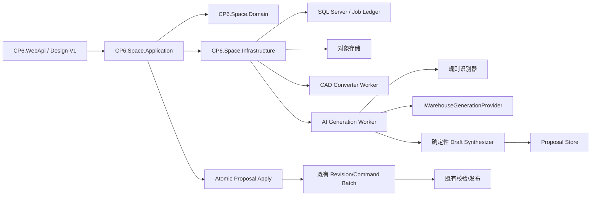

# CP6 Space 详细设计卷六：AI 生成、审查与来源追踪

版本：v1.0  
基线日期：2026-07-25  
状态：T1～T3 已锁定，可进入实现  
对应 Epic：E13 AI 仓库生成与人工审查  

上位文档：

- [AI 自动生成完整仓库 Spec](../requirements/05-ai-warehouse-generation-spec.md)
- [低成本 3D 建模详细 Spec](../requirements/04-low-cost-3d-modeling-spec.md)
- [卷一：版本、身份、数据与迁移](./01-version-identity-data-migration.md)
- [卷二：CAD/Excel、文件安全与后台任务](./02-modeling-import-files-jobs.md)
- [卷三：编辑器、元素与渲染](./03-editor-elements-rendering.md)
- [卷四：校验、发布与恢复](./04-validation-publish-wms-recovery.md)
- [卷五：访问、审计、测试与性能](./05-access-audit-testing-performance.md)

## 1. 设计目标

本卷定义从安全 CAD 来源到可审查仓库提案，再原子应用到 Space Design V1 Draft 的实现契约。实现必须满足：

1. Provider 中立，可替换本地模型、外部服务或 Mock。
2. AI 只输出语义建议，不输出生产模型和最终库位事实。
3. 确定性代码拥有单位、坐标、几何、拓扑、碰撞和编码规则。
4. 所有提案可解释、可审查、可追溯、可重放。
5. 人工确认后的 Apply 是单版本、单事务、全成全败。
6. AI、Worker 或 Apply 失败都不能改变 Published。
7. 既有校验和发布 Saga 保持权威。

## 2. 模块边界



建议代码归属：

| 项目 | 职责 |
|---|---|
| `CP6.Space.Contracts` | Run/Proposal/Decision DTO、枚举、分页契约和错误码 |
| `CP6.Space.Domain` | 状态机、提案规则、来源与决策实体、领域端口 |
| `CP6.Space.Application` | 创建任务、查询、审查、Apply、配额和权限用例 |
| `CP6.Space.Infrastructure` | EF 映射、Provider 适配、对象存储、Worker 处理器、指标 |
| `CP6.WebApi` | Design V1 Controller、认证、Problem Details 和组合根 |
| `cp6.web` | 任务进度、提案审查、差异预览和费用提示 |

不允许 Controller、前端或 Provider 直接写 Revision 表。

### 2.1 已核验实现基线

核验日期：2026-07-25。Space V1 当前位于尚未合入主工作区的 `tmp/worktrees/space-volume1` 工作树，实施 E13 前先把该工作树以独立分支评审合入。以下是当前事实，不是目标文件已经存在于主分支的声明：

| 证据 | 当前事实 |
|---|---|
| `tmp/worktrees/space-volume1/CP6.Space.Domain/SpaceEnums.cs:57` | `BuildScene = 4`、`Import = 5` 已声明 |
| `tmp/worktrees/space-volume1/CP6.Space.Infrastructure/SpaceJobRunner.cs:214` | 未识别 JobType 进入 `no processor` 异常；两类处理器尚未接线 |
| `tmp/worktrees/space-volume1/CP6.Space.Domain/Revisions.cs:26` | Floor Revision 已有 `UnderlaySourceId`，但没有来源/文件聚合 |
| `tmp/worktrees/space-volume1/CP6.Space.Domain/Operations.cs:3` | 已有租户化 Job、Attempt、Step 基础 |
| `tmp/worktrees/space-volume1/CP6.Space.Infrastructure/SpaceContext.cs:26` | 已有版本、Revision、Job、校验、审计和运行态 DbSet；没有 AI Run/Proposal/Usage |
| `tmp/worktrees/space-volume1/CP6.WebApi/Controllers/Space/SpaceDesignV1Controller.cs:22` | 已有 Design V1 版本、编辑、校验和发布 Controller 基础 |
| `CP6.Core/Services/Pub/AttachmentService.cs:37` | 通用附件使用整文件 MD5；不满足 CAD 流式 SHA-256 和隔离扫描 |

迁移基线以 Space V1 合入后生成的首个 Design V1 数据库迁移为准。E13 只在该迁移之后新增表、索引和权限种子，不直接修改旧 `Space_*` Published 表。

## 3. 领域类型

### 3.1 枚举

```csharp
public enum SpaceAiPolicy
{
    Disabled = 0,
    MetadataOnly = 1,
    StructuredFeatures = 2
}

public enum SpaceGenerationRunStatus
{
    Queued = 0,
    Preparing = 1,
    Inferring = 2,
    Validating = 3,
    AwaitingReview = 4,
    Applying = 5,
    Succeeded = 6,
    Failed = 7,
    Cancelled = 8,
    Stale = 9
}

public enum SpaceGenerationProposalStatus
{
    Proposed = 0,
    Accepted = 1,
    Rejected = 2,
    Modified = 3,
    Applied = 4,
    Obsolete = 5
}

public enum SpaceProposalDecisionType
{
    Accept = 1,
    Reject = 2,
    Modify = 3
}

public enum SpaceConfidenceBand
{
    Low = 0,
    Medium = 1,
    High = 2
}
```

默认分桶：

- High：`score >= 0.90`
- Medium：`0.70 <= score < 0.90`
- Low：`score < 0.70`

分桶阈值通过版本化校准配置读取。阈值变化只影响新 Run，不重写旧提案。

### 3.2 Provider 端口

```csharp
public interface IWarehouseGenerationProvider
{
    string ProviderCode { get; }

    Task<WarehouseGenerationResult> GenerateAsync(
        WarehouseGenerationInput input,
        CancellationToken cancellationToken);
}

public sealed record WarehouseGenerationInput(
    Guid TenantId,
    Guid SiteId,
    Guid ModelVersionId,
    string RunId,
    string SchemaVersion,
    SpaceAiPolicy Policy,
    CadFeaturePackage Features,
    IReadOnlyList<MappingHint> MappingHints,
    IReadOnlyList<LockedSemanticFact> LockedFacts,
    GenerationLimits Limits);

public sealed record WarehouseGenerationResult(
    string ProviderRequestId,
    string ProviderModel,
    string OutputSchemaVersion,
    IReadOnlyList<SemanticSuggestion> Suggestions,
    ProviderUsage Usage,
    IReadOnlyList<ProviderDiagnostic> Diagnostics);
```

约束：

- `CadFeaturePackage` 不含文件字节、对象存储地址、预签名 URL 或用户密钥。
- Provider 不返回最终 `LogicalId`、最终坐标、库位编码或发布命令。
- `SemanticSuggestion` 只引用输入中的稳定 `SourceKey`。
- 每个 Provider 适配器声明支持的策略、最大输入、超时和结构化输出能力。
- Provider 返回对象数不得超过请求 `GenerationLimits.MaxSuggestions`。

Provider 序列化的权威实物契约：

- [输入 JSON Schema v1](../contracts/ai/v1/warehouse-generation-input.schema.json)
- [输出 JSON Schema v1](../contracts/ai/v1/warehouse-generation-output.schema.json)

内部 `WarehouseGenerationInput` 可以携带 TenantId 做授权和审计，但适配器对外序列化时必须使用输入 Schema：真实 TenantId/SiteId 被服务端 HMAC 生成的 `runCorrelationKey` 替代。

输出 Schema 是 Provider 适配器完成厂商响应映射后的 CP6 Canonical Envelope，不要求外部厂商原生返回相同 JSON。`providerRequestId`、`providerModel` 和 `usage` 必须从厂商 SDK/HTTP 元数据与结构化正文合并进入 Canonical Envelope，再执行 Schema 校验。

### 3.3 确定性端口

```csharp
public interface IWarehouseGenerationOutputValidator
{
    ValidatedSemanticResult Validate(
        WarehouseGenerationInput input,
        WarehouseGenerationResult output);
}

public interface IWarehouseDraftSynthesizer
{
    Task<DraftProposalSet> SynthesizeAsync(
        CadIntermediateRepresentation cad,
        RuleRecognitionResult rules,
        ValidatedSemanticResult ai,
        IReadOnlyList<LockedSemanticFact> lockedFacts,
        CancellationToken cancellationToken);
}

public interface IGenerationProposalApplyService
{
    Task<ApplyGenerationResult> ApplyAsync(
        ApplyGenerationCommand command,
        CancellationToken cancellationToken);
}
```

`IWarehouseDraftSynthesizer` 是最终提案的唯一生产者。它使用统一整数毫米坐标，执行几何构造、关系绑定、越界、碰撞和编码预检。

## 4. 持久化模型

所有表继承租户审计基类或显式包含：

- `Id uniqueidentifier`
- `TenantId uniqueidentifier`
- `CreatedAt datetime2`
- `CreatedBy uniqueidentifier`
- `UpdatedAt datetime2`
- `UpdatedBy uniqueidentifier`
- `RowVersion rowversion`

所有外键查询同时带 `TenantId`；仅凭全局 GUID 不构成授权。

### 4.1 `Space_ModelSource`

| 字段 | 类型 | 规则 |
|---|---|---|
| `ModelVersionId` | uniqueidentifier | 目标 Draft |
| `SourceType` | tinyint | Dwg/Dxf/Pdf/Png/Jpg/Excel/Editor/Template |
| `FileId` | uniqueidentifier null | 文件来源必填 |
| `SourceHash` | char(64) | SHA-256，小写十六进制 |
| `Status` | tinyint | Uploaded/Scanning/Safe/Converting/Parsed/Rejected/Failed |
| `CoordinateMetadataJson` | nvarchar(max) | 原单位、比例、原点、旋转和仿射变换 |
| `ParserVersion` | nvarchar(64) | 解析器/转换器版本 |
| `MappingProfileVersionId` | uniqueidentifier null | 固定映射方案版本 |

唯一索引：

`UX_SpaceModelSource_Tenant_Version_Hash_Type(TenantId, ModelVersionId, SourceHash, SourceType)`

### 4.2 `Space_File`

| 字段 | 类型 | 规则 |
|---|---|---|
| `StorageProvider` | nvarchar(32) | Local/S3/AzureBlob/MinIO 等适配器代码 |
| `StorageKey` | nvarchar(512) | 不暴露给外部用户 |
| `OriginalFileName` | nvarchar(260) | UI 展示前编码 |
| `DeclaredContentType` | nvarchar(128) | 客户端声明，仅供诊断 |
| `DetectedContentType` | nvarchar(128) | 服务端检测结果 |
| `Extension` | nvarchar(16) | 规范化小写 |
| `Length` | bigint | 平台硬上限 200MB |
| `Sha256` | char(64) | 内容地址与幂等 |
| `ScanStatus` | tinyint | Pending/Safe/Rejected/Error |
| `ScanEngineVersion` | nvarchar(64) | 扫描证据 |
| `RetentionUntil` | datetime2 null | 清理门槛 |

不得把 CAD 文件读成单个 `byte[]` 后再哈希；上传、扫描和 SHA-256 使用流式处理。

### 4.3 `Space_Artifact`

| 字段 | 类型 | 规则 |
|---|---|---|
| `SourceId` | uniqueidentifier | 来源 |
| `RunId` | uniqueidentifier null | AI Run 产物可关联 |
| `ArtifactType` | tinyint | CadIr/Preview/LayerSummary/ErrorReport/MinimizedFeatures/Evaluation |
| `StorageKey` | nvarchar(512) | 对象存储引用 |
| `Sha256` | char(64) | 产物哈希 |
| `SchemaVersion` | nvarchar(32) | 可重放 |
| `ProducerVersion` | nvarchar(64) | Converter/Parser/Minimizer 版本 |
| `Length` | bigint | 产物大小 |

### 4.4 `Space_GenerationRun`

| 字段 | 类型 | 规则 |
|---|---|---|
| `SiteId` | uniqueidentifier | 数据范围 |
| `ModelVersionId` | uniqueidentifier | 目标 Draft |
| `SourceId` | uniqueidentifier | 安全且已解析来源 |
| `SourceHash` | char(64) | 创建时固定 |
| `BaseContentRevision` | bigint | Apply 冲突检查 |
| `Status` | tinyint | Run 状态 |
| `Progress` | int | 0～100，只增不减 |
| `IdempotencyKeyHash` | char(64) | 请求幂等 |
| `BusinessKeyHash` | char(64) | 固定输入组合的业务去重键 |
| `BasedOnRunId` | uniqueidentifier null | Stale/重跑时继承审查和锁定事实 |
| `IsCurrent` | bit | 同一业务键只有一个当前 Run |
| `MappingProfileVersionId` | uniqueidentifier null | 创建时固定 |
| `RackGenerationProfileVersionId` | uniqueidentifier null | 显式货架层/格口/尺寸方案；缺失可产生 Blocking |
| `RuleVersion` | nvarchar(64) | 创建时固定 |
| `PolicySnapshot` | tinyint | 创建时固定 |
| `ProviderConfigVersionId` | uniqueidentifier null | Disabled 时为空 |
| `ProviderCode` | nvarchar(64) null | 实际使用 |
| `ProviderModel` | nvarchar(128) null | 实际使用 |
| `InputSchemaVersion` | nvarchar(32) | 输入契约 |
| `OutputSchemaVersion` | nvarchar(32) null | 响应契约 |
| `JobId` | uniqueidentifier | Job Ledger |
| `FailureCode` | nvarchar(64) null | 稳定码 |
| `FailureSummary` | nvarchar(1024) null | 已脱敏 |
| `DegradedReason` | nvarchar(64) null | 例如 AI_PROVIDER_UNAVAILABLE |
| `CancelRequestedAt` | datetime2 null | 用户请求取消 |
| `CancelPending` | bit | Provider 不可取消但响应尚未返回 |
| `CancelledAt` | datetime2 null | 进入 Cancelled |
| `ReviewCompletedAt` | datetime2 null | 必要审查完成 |
| `AppliedContentRevision` | bigint null | 成功 Apply 后值 |

索引：

- 请求幂等由现有 `SpaceIdempotencyRecord` 的 `(TenantId, Operation, IdempotencyKeyHash)` 唯一约束负责，Run 字段只作审计。
- 唯一过滤索引 `UX_GenerationRun_Tenant_Business_Current(TenantId, BusinessKeyHash) WHERE IsCurrent = 1`。
- 查询 `IX_GenerationRun_Tenant_Site_Status_Created(TenantId, SiteId, Status, CreatedAt DESC)`。
- Worker `IX_GenerationRun_Tenant_Job(TenantId, JobId)`。

### 4.5 `Space_GenerationProposal`

| 字段 | 类型 | 规则 |
|---|---|---|
| `RunId` | uniqueidentifier | 所属 Run |
| `ModelVersionId` | uniqueidentifier | 冗余固定，便于租户/版本查询 |
| `BaseContentRevision` | bigint | 与 Run 一致 |
| `SourceHash` | char(64) | 与 Run 一致 |
| `SourceKey` | nvarchar(256) | Layer/Block/Handle 组合稳定键 |
| `ProposalType` | nvarchar(64) | Floor/Zone/Aisle/Rack/Wall 等 |
| `SuggestedGeometryJson` | nvarchar(max) | 确定性生成后的规范几何 |
| `SuggestedAttributesJson` | nvarchar(max) | 类型化属性 |
| `SuggestedRelationsJson` | nvarchar(max) | 父子和业务关系 |
| `SourceRefsJson` | nvarchar(max) | 图层、块、Handle、IR Artifact |
| `EvidenceJson` | nvarchar(max) | 规则和 AI 证据，不含 Prompt 原文 |
| `FieldProvenanceJson` | nvarchar(max) | 每字段 Rule/AI/Human/Default 来源 |
| `ConfidenceScore` | decimal(6,5) | 0～1 |
| `ConfidenceBand` | tinyint | 创建时固定 |
| `Status` | tinyint | Proposal 状态 |
| `HasBlockingIssue` | bit | 为 true 不可接受 |
| `HumanPatchJson` | nvarchar(max) null | 修改后的 RFC 6902 子集或类型化 Patch |
| `LockedFieldsJson` | nvarchar(max) null | 人工锁定字段路径 |
| `AppliedLogicalId` | uniqueidentifier null | Apply 后生成/匹配身份 |

唯一：

`UX_Proposal_Tenant_Run_Source_Type(TenantId, RunId, SourceKey, ProposalType)`

列表索引：

`IX_Proposal_Tenant_Run_Status_Band_Type(TenantId, RunId, Status, ConfidenceBand, ProposalType, Id)`

### 4.6 `Space_ProposalDecision`

决策记录不可更新或删除：

| 字段 | 类型 | 规则 |
|---|---|---|
| `RunId` | uniqueidentifier | Run |
| `ProposalId` | uniqueidentifier | Proposal |
| `DecisionType` | tinyint | Accept/Reject/Modify |
| `BeforeJson` | nvarchar(max) | 决策前规范值 |
| `AfterJson` | nvarchar(max) null | Modify/Accept 最终值 |
| `LockedFieldsJson` | nvarchar(max) null | 用户锁定字段 |
| `ReasonCode` | nvarchar(64) null | 批量或拒绝原因 |
| `Comment` | nvarchar(512) null | 受长度和敏感信息检查 |
| `DecisionBatchId` | uniqueidentifier | 批量审计 |

同一 Proposal 的当前状态由 Proposal 行保存；历史由 Decision 追加记录恢复。

### 4.7 `Space_ModelIssue`

复用卷二的问题模型并增加：

- `RunId`
- `ProposalId`
- `IssueCode`
- `Severity`
- `SourceKey`
- `FieldPath`
- `EvidenceJson`
- `ResolutionStatus`

AI 专属稳定问题码包括：

- `AI_OUTPUT_SCHEMA_INVALID`
- `AI_SOURCE_REFERENCE_UNKNOWN`
- `AI_SUGGESTION_LIMIT_EXCEEDED`
- `AI_GEOMETRY_SYNTHESIS_FAILED`
- `AI_RELATION_AMBIGUOUS`
- `AI_LOW_CONFIDENCE`
- `AI_LOCKED_VALUE_CONFLICT`

### 4.8 `Space_MappingProfileVersion`

映射方案不可原地覆盖：

- `MappingProfileId`
- `Version`
- `Scope`：Platform/Tenant
- `Name`
- `RulesJson`
- `SchemaVersion`
- `ContentHash`
- `Status`：Draft/Active/Retired

Run 固定引用版本 ID，保证可重放。

### 4.9 `Space_AiProviderConfig`

| 字段 | 类型 | 规则 |
|---|---|---|
| `ProviderCode` | nvarchar(64) | 适配器键 |
| `ConfigVersion` | int | 只增 |
| `Policy` | tinyint | Disabled/MetadataOnly/StructuredFeatures |
| `AllowedSiteIdsJson` | nvarchar(max) | 空表示租户策略允许的全部 Site |
| `ModelName` | nvarchar(128) | 显式固定 |
| `EndpointAlias` | nvarchar(128) | 非真实 URL，映射到环境配置 |
| `SecretReference` | nvarchar(256) | 密钥存储引用 |
| `TimeoutSeconds` | int | 默认 300，最大 900 |
| `MaxInputUnits` | bigint | Provider 适配器解释 |
| `MaxOutputSuggestions` | int | 不得超过平台上限 |
| `DailyBudgetMinor` | bigint null | 最小货币单位 |
| `MonthlyBudgetMinor` | bigint null | 最小货币单位 |
| `Currency` | char(3) null | ISO 4217 |
| `IsActive` | bit | 同一租户仅一个活动版本 |

凭据不进入数据库；`SecretReference` 由部署环境解析。

### 4.10 `Space_AiUsageRecord`

- `RunId`
- `ProviderCode`
- `ProviderModel`
- `ProviderRequestIdHash`
- `InputUnits`
- `OutputUnits`
- `EstimatedCostMinor`
- `ActualCostMinor`
- `Currency`
- `LatencyMs`
- `Outcome`
- `RecordedAt`

Usage 记录与 Run 同事务落账或通过 Outbox 最终补齐；重复 Provider 请求 ID 不能重复计费。

### 4.11 内部 staging

`Space_GenerationStagingElement` 是 Apply 内部表，不对 API 暴露：

- `RunId`
- `ProposalId`
- `Sequence`
- `ElementType`
- `NormalizedPayloadJson`
- `ValidationStatus`
- `ValidationHash`

唯一 `(TenantId, RunId, ProposalId)`。失败事务回滚后由清理任务删除残留；staging 永不被 Viewer、校验查询或发布读取。

### 4.12 并发槽与预算预留

`Space_TenantAiWorkSlot`：

- `TenantId`
- `SlotNo`：1～3
- `RunId`
- `LeaseOwner`
- `LeaseExpiresAtUtc`
- `RowVersion`

唯一 `(TenantId, SlotNo)`。创建任务在一个短事务中用 `UPDLOCK, READPAST` 获取最小可用槽；没有槽时返回 `SPACE_AI_QUOTA_EXCEEDED`。Worker 每 20 秒续租，60 秒过期回收。

`Space_AiBudgetReservation`：

- `TenantId`
- `RunId`
- `ProviderRequestKey`
- `PeriodDay/PeriodMonth`
- `ReservedCostMinor`
- `ActualCostMinor`
- `Currency`
- `Status`：Reserved/Submitted/Reported/Released/Reconciled
- `ExpiresAtUtc`
- `RowVersion`

创建外部请求前在租户预算账本上以 `UPDLOCK, HOLDLOCK` 原子检查并预留；请求未发送则 Release，已发送但结果未知则保持 Submitted 并进入对账。`ProviderRequestKey` 唯一，Outbox 补账只推进状态，不能新增第二笔收费。

## 5. Worker 与 Job Ledger

现有 `SpaceJobType.Import` 和 `SpaceJobType.BuildScene` 必须有显式处理器。

### 5.1 Import 处理器

步骤：

1. `VerifySourceSafe`
2. `ConvertCad`
3. `ParseCadIr`
4. `BuildLayerAndBlockSummary`
5. `RunRuleRecognition`
6. `PersistArtifacts`

输出是版本化 CAD IR Artifact 和规则识别 Artifact，不写 Draft。

### 5.2 BuildScene 处理器

步骤：

1. `LoadPinnedInputs`
2. `LoadLockedFacts`
3. `EnforceTenantPolicyAndQuota`
4. `MinimizeStructuredFeatures`
5. `InvokeProvider`，Disabled 时跳过
6. `ValidateProviderOutput`
7. `FuseRulesAndAi`
8. `SynthesizeDeterministicGeometry`
9. `ValidateProposalSet`
10. `PersistProposalsAndIssues`
11. `RecordUsage`
12. `AwaitReview`

每一步写 `SpaceJobStep`；可重试步骤必须依据 Artifact Hash 或 Provider Request 幂等键跳过已成功结果。

默认超时：

- Import：30 分钟。
- 单次 Provider：5 分钟，配置最大 15 分钟。
- BuildScene 总任务：15 分钟目标、30 分钟硬超时。
- Apply：10 分钟。

Worker 每 20 秒续租，租约 60 秒。租约丢失后停止外部调用和写入；新 Worker 依据 Step 和 Artifact 恢复。

## 6. 输入最小化

### 6.1 MetadataOnly

允许字段：

- 规范化图层名和哈希化原图层名。
- 块名、块属性键名、实体类型计数。
- 图元数量、包围盒长宽比例、角度直方图。
- 已有租户映射提示和仓库类型。

禁止坐标、完整文本、文件名、客户名称和对象存储信息。

### 6.2 StructuredFeatures

在 MetadataOnly 基础上允许：

- 相对楼层包围盒归一化到 0～1 的位置和尺寸。
- 规范化方向、邻接、包含、重复阵列和距离分桶。
- 块/图层的脱敏标签。

绝对坐标、真实 Site 名、库位编码和业务敏感属性仍不发送。确定性引擎通过 `SourceKey` 把 AI 语义映射回本地 CAD IR。

### 6.3 Prompt 注入防护

- 图层名、块名和属性值作为 JSON 数据字段，不拼接到系统指令。
- 控制字符移除，单字符串最大 256 字符，超长截断并记录哈希。
- Provider 输出中的自由文本不进入领域命令、SQL、日志模板或 HTML。
- 只接受声明的枚举、数值和 `SourceKey`。

## 7. 融合与确定性生成

字段优先级：

`HumanLocked > DeterministicRule > AI > TemplateDefault`

融合规则：

1. 人工锁定字段冲突时保留人工值，并产生 `AI_LOCKED_VALUE_CONFLICT` Info。
2. 确定性规则置信度为 1 且通过几何校验时，AI 不能改写类型或坐标。
3. AI 仅可补全规则未决定的语义和允许属性。
4. AI 与规则冲突且规则不是强规则时，输出两个证据并降为 Medium 或 Low。
5. 未知 `SourceKey`、循环父子关系、非法枚举和越界属性直接拒绝。
6. 最终几何由 CAD IR 和参数化组件生成，不采用 Provider 返回的任意顶点。
7. 库位编码由既有编码服务生成并预检；Provider 只能建议编码模板类别。

生成顺序固定：

`Floor → Zone → Wall/Column/Door/Dock → Aisle → Rack → RackLevel → Location → StaticEquipment`

父对象不确定时，子对象可保留为提案但必须带 Blocking 关系问题，不能 Apply。

RackLevel 和 Location 不进入 Provider Output Schema。确定性生成器使用：

`HumanLocked RackProfile > Excel RackLevel 映射 > 用户显式选择的平台/租户 RackGenerationProfile`

缺少显式方案时产生 `RACK_PROFILE_REQUIRED` Blocking，不使用不可见默认尺寸。新 RackLogicalId 使用模型身份命名空间、SourceHash、SourceKey 的 UUIDv5；RackLevel/LocationLogicalId 分别使用 RackLogicalId+层号、RackLogicalId+层/列/深度生成。基于已发布版重建时优先复用卷一 IdentityMap。UI 按 Rack 展示派生层/库位数量、逐层规格和编码预览，不创建 10,000 个需要逐项人工点击的 AI 提案。

### 7.1 Provider 重试与确定性降级

固定策略：

1. Provider 调用使用 `ProviderRequestKey = SHA256(RunId + AttemptNo + InputArtifactHash + ProviderConfigVersionId)`。
2. 连接失败、429、408 和 5xx 最多重试 2 次，退避 2 秒、10 秒并加入抖动；Schema 非法和 4xx 配置错误不重试。
3. 每次实际发送都写 Usage/预算状态；Provider 支持幂等键时必须传同一个 `ProviderRequestKey`。
4. 重试耗尽后，不静默声称 AI 成功。若规则识别和确定性生成能形成合法提案，Run 继续进入 `AwaitingReview`，设置 `DegradedReason=AI_PROVIDER_UNAVAILABLE` 并产生 Warning。
5. 规则路径也无法形成合法提案时 Run 进入 Failed。
6. 降级 Run 的 UI 明确显示“仅规则结果”；费用只展示 Provider 已报告的实际请求，不为本地规则计算虚构费用。

### 7.2 跨 Run 人工锁定

- Run 创建时可指定一个 `BasedOnRunId`，系统从其 `Modified/Applied` Decision 生成不可变 Locked Facts Artifact。
- `SourceHash` 相同时，仅按相同 `SourceKey + ProposalType + FieldPath` 自动继承锁定。
- `SourceHash` 不同时，先按规范几何指纹、ProposalType、楼层和尺寸容差匹配；只有唯一、确定性匹配才作为“建议继承”，仍需用户确认，不自动锁定。
- 多候选、对象拆分/合并、几何偏差超过货架 100mm/2° 或墙线 100mm 时产生 `AI_LOCKED_VALUE_CONFLICT`，不得自动合并。
- 新 Run 保存原 DecisionId、原 SourceHash、匹配方法和匹配分数，保证来源可追踪。

## 8. 状态转换规则

| 当前 | 目标 | 条件 |
|---|---|---|
| Queued | Preparing | Job 租约取得，来源 Safe/Parsed |
| Preparing | Inferring | 固定输入、策略、配额和 IR 完成 |
| Inferring | Validating | Provider 成功或确定性降级完成 |
| Validating | AwaitingReview | 提案持久化，Run 无系统级 Blocking |
| AwaitingReview | Applying | 必要提案已决策，用户具有 review+edit，Revision 未变化 |
| Applying | Succeeded | staging、校验和 Revision 提交成功 |
| Queued/Preparing/Inferring/Validating | Cancelled | 调用 cancel；到达安全点后取消，Provider 不可取消时先置 CancelPending |
| AwaitingReview/Failed/Stale | Cancelled | 用户调用 discard；未应用提案全部 Obsolete，`IsCurrent=false` |
| 任一执行状态 | Failed | 不可恢复错误或重试耗尽 |
| AwaitingReview/Applying | Stale | 目标 Draft ContentRevision 不等于 BaseContentRevision |

失败重试不把 Run 从 Failed 原地改回 Preparing。应用服务创建新的 Attempt，并以状态转换事件把 Run 置回 Queued。

## 9. API 详细契约

以下端点全部进入 Design V1 OpenAPI，并生成 TypeScript/C# SDK。Web、后续桌面客户端和移动客户端只能通过同一公开契约访问，不复制状态机、置信度或 Apply 规则；SignalR 仅推送进度通知，HTTP 查询仍是权威。

### 9.0 前置、管理与幂等端点

AI Run 依赖卷二已经定义的来源链：

| 方法 | 路径 | 用途 |
|---|---|---|
| POST | `/api/space/design/v1/versions/{versionId}/upload-sessions` | 创建流式安全上传会话 |
| POST | `/api/space/design/v1/versions/{versionId}/sources` | 把扫描通过的文件固定为 ModelSource |
| POST | `/api/space/design/v1/sources/{sourceId}/parse` | 启动 Import，生成 CAD IR 和规则识别 Artifact |
| GET/PUT | `/api/space/design/v1/ai-policy` | 租户管理员查询/更新策略、Provider 别名、预算、并发和 Site 范围 |
| GET | `/api/space/design/v1/ai-usage` | 租户管理员分页查询用量、费用和预算余额 |
| POST | `/api/space/design/v1/generation-runs/{runId}/discard` | 废弃 AwaitingReview/Failed/Stale Run，并把未应用提案置 Obsolete |

平台 Provider EndpointAlias、SecretReference 和可用模型由平台配置/部署配置管理；租户 API 只能选择已批准别名，不能提交 URL 或密钥。

Disabled 租户仍可走确定性路径：

`POST /sources/{sourceId}/parse`（`mode=RuleOnly`）→ `GET /sources/{sourceId}/preview` → `POST /sources/{sourceId}/preview/confirm`

该路径不创建 AiAssisted Generation Run、不调用 Provider、不检查 AI 预算，只使用来源上传、映射、编辑权限和卷二的原子导入确认。只有 `mode=AiAssisted` 的 generation-runs 在 Disabled 时返回 `SPACE_AI_DISABLED`。

`Idempotency-Key` 规则：

1. 去除首尾空白后按 UTF-8、区分大小写处理，长度 1～128。
2. `IdempotencyKeyHash = SHA256(TenantId + "\n" + Operation + "\n" + NormalizedKey)`。
3. 同一键和相同规范请求体在 24 小时内返回第一次响应；记录保留 90 天供审计。
4. 同一键对应不同请求体返回 `409 SPACE_IDEMPOTENCY_KEY_REUSED`。
5. `BusinessKeyHash` 独立计算固定输入组合；同一业务键存在 Current Run 时返回该 Run，不重复调用 Provider。
6. Stale 恢复通过创建 Run 时传 `basedOnRunId` 和新的 `expectedContentRevision`；旧 Run `IsCurrent=false`，新 Run 继承允许继承的人工事实，不做原地 Rebase。

### 9.1 创建 Run

`POST /api/space/design/v1/versions/{versionId}/generation-runs`

```json
{
  "sourceId": "8b6f9ed2-53b6-4b08-bd6e-0e95477f0cf4",
  "mappingProfileVersionId": "44a9ea53-ecc5-4fbb-942d-a961ed5e8e0f",
  "rackGenerationProfileVersionId": "ef84d64c-0af1-4b81-b8bd-b2f3223e7553",
  "mode": "AiAssisted",
  "expectedContentRevision": 12,
  "basedOnRunId": null
}
```

请求头：

- `Idempotency-Key`：必填，1～128 字符。
- `If-Match`：版本 RowVersion，必填。

返回 `202 Accepted`：

```json
{
  "runId": "5ecf71e9-f5aa-455e-b2dd-6d43f4ea4f49",
  "status": "Queued",
  "baseContentRevision": 12,
  "sourceHash": "sha256-hex",
  "policy": "StructuredFeatures",
  "links": {
    "self": "/api/space/design/v1/generation-runs/5ecf71e9-f5aa-455e-b2dd-6d43f4ea4f49",
    "proposals": "/api/space/design/v1/generation-runs/5ecf71e9-f5aa-455e-b2dd-6d43f4ea4f49/proposals"
  }
}
```

### 9.2 查询 Run

`GET /api/space/design/v1/generation-runs/{runId}`

返回状态、进度、计数、费用摘要、开始/结束时间、`failureCode`、`degradedReason`、`cancelRequestedAt`、`cancelPending` 和 `allowedActions`。普通建模人员只看到租户允许的费用汇总，不返回 Provider 凭据、Prompt 或完整响应。

### 9.3 查询提案和问题

`GET .../proposals?status=Proposed&band=High&type=Rack&cursor=...&limit=100`

- `limit` 默认 50，最大 200。
- 排序固定为 `ConfidenceBand DESC, ProposalType, Id`。
- 返回 `nextCursor` 和 Run `reviewEtag`。
- `reviewEtag` 基于 Run RowVersion、提案状态计数和最后 Decision ID。

问题端点使用同样分页，支持 `severity`、`issueCode`、`proposalId`。

### 9.4 单项决策

`POST .../generation-runs/{runId}/decisions`

```json
{
  "proposalId": "a5dfdecb-029d-40aa-aa7a-9f3e26ce8249",
  "decision": "Modify",
  "expectedProposalRowVersion": "AAAAAAAAB9E=",
  "patch": [
    { "op": "replace", "path": "/attributes/rackType", "value": "Selective" }
  ],
  "lockedFields": ["/attributes/rackType"],
  "reasonCode": "BUSINESS_CONFIRMATION",
  "comment": "现场确认使用横梁式货架"
}
```

Patch 只允许设计类型公开的字段路径；不接受任意 JSON Pointer。

权威白名单见 [Proposal Patch Policy v1](../contracts/ai/v1/proposal-patch-policy.md)。更改 Schema 或 Patch 白名单必须提升契约版本并保留旧 Provider 兼容测试。

### 9.5 批量决策

`POST .../generation-runs/{runId}/decisions:batch`

两种选择方式只能二选一：

```json
{
  "proposalIds": ["id-1", "id-2"],
  "decision": "Accept",
  "reviewEtag": "etag",
  "reasonCode": "HIGH_CONFIDENCE_REVIEWED"
}
```

或：

```json
{
  "selection": {
    "status": "Proposed",
    "confidenceBand": "High",
    "proposalTypes": ["Rack", "Aisle"],
    "hasBlockingIssue": false
  },
  "decision": "Accept",
  "reviewEtag": "etag",
  "reasonCode": "HIGH_CONFIDENCE_REVIEWED"
}
```

- ID 模式每次最多 1,000 项。
- Filter 模式必须带最新 `reviewEtag`，服务端在一个决策事务内固定命中集合。
- 批量接口只允许 Accept/Reject，不允许同一 Patch 修改多种对象。
- Blocking 提案不可 Accept。

审查完成的精确定义：

- 当前 Run 中除 `Obsolete` 外的每个 Proposal 都必须是 `Accepted`、`Rejected` 或 `Modified`，不能剩余 `Proposed`。
- `HasBlockingIssue=true` 的 Proposal 只能 `Rejected`，或先修改并把全部 Blocking Issue 置为 Resolved 后进入 `Modified`。
- 所有未关联 Proposal 的 Run 级 Blocking Issue 必须 Resolved。
- 满足以上条件后，服务在同一决策事务中写 `ReviewCompletedAt` 和新的 `reviewEtag`；客户端不能自行声明审查完成。

Issue 关闭规则：

- 类型、业务枚举或允许关系造成的 Blocking，可通过 Patch 白名单修改；服务重新验证通过后自动追加 `ResolvedByDecision` 记录。
- 几何、尺寸、Rotation、货架层/格口、编码和未知来源引用不允许 Proposal Patch。用户必须 Reject 该提案，相关 Issue 以 `ResolvedByProposalRejection` 关闭；Apply 其他提案后通过地图编辑器/Excel 创建正确对象。
- Run 级来源单位、坐标、Schema 或安全 Blocking 不能在当前 Run 中关闭；必须修正 Source/Mapping 并以 `basedOnRunId` 创建新 Run。

### 9.6 Apply

`POST .../generation-runs/{runId}/apply`

```json
{
  "expectedContentRevision": 12,
  "expectedRunRowVersion": "AAAAAAAACBc=",
  "reviewEtag": "etag"
}
```

成功返回 `202 Accepted` 和 Apply Job；完成后 Run 查询返回：

```json
{
  "status": "Succeeded",
  "appliedContentRevision": 13,
  "appliedCounts": {
    "floors": 2,
    "zones": 5,
    "aisles": 12,
    "racks": 500,
    "locations": 10000,
    "elements": 86
  }
}
```

Apply 不调用发布服务，不改变 `CurrentPublishedVersionId`。

HTTP 状态兑现规则：

- POST 接收前同步检查到 Revision 不一致，直接返回 `409 SPACE_AI_RUN_STALE`，不创建 Apply Job。
- POST 返回 202 后发生的并发变化无法追溯修改原 HTTP 响应；Apply Job/Run 进入 `Stale`，`GET generation-runs/{runId}` 返回 `failureCode=SPACE_AI_RUN_STALE`，SignalR 仅发送状态变化通知。
- 其他异步失败同样通过 Run/Job 查询返回稳定错误码和 recovery；客户端收到 202 必须轮询或订阅直到终态。

### 9.7 Cancel 与 Retry

- Cancel 对 Queued/Preparing/Inferring/Validating 有效；AwaitingReview 不需要取消，可删除/废弃 Run。
- Retry 仅允许 Failed 且错误被标为 Retryable。
- `SPACE_AI_OUTPUT_INVALID` 默认不可重试，除非更换 Provider 配置或模型版本。
- `discard` 对 AwaitingReview/Failed/Stale 有效；Succeeded 不可废弃，只能继续编辑 Draft 或创建新版本。

取消安全点：

1. Provider 调用前收到取消，释放预算预留和并发槽，进入 Cancelled。
2. Provider 支持取消时传递 CancellationToken；不支持时标记 `CancelPending`，等待调用返回，记录实际用量但丢弃响应，不生成提案。
3. 提案持久化和 staging 构建可在批次边界取消。
4. 最终数据库提交事务一旦开始不接受取消；事务通常应在 30 秒内结束。

## 10. 原子 Apply 算法

Apply 分“可重试准备”和“短原子提交”，避免在 10 分钟任务期间长期持有数据库锁。

### 10.1 准备阶段：事务外、可重试

1. 读取 Run、Proposal、Decision 和目标 Draft 快照，确认当前看起来可 Apply。
2. 按固定生成顺序把最终规范值分批写入 `Space_GenerationStagingElement`。
3. 在 staging 上执行引用、几何、碰撞、边界、编码和数量校验。
4. 生成不可变 `ApplyPlan`，包含 `RunId`、`BaseContentRevision`、每项规范哈希、对象计数和 `ApplyPlanHash`。
5. 把 `ApplyPlanHash` 和 staging 验证完成标记提交到独立短事务。

准备失败时 Run 保持 AwaitingReview 或进入 Failed，问题和失败摘要用独立事务写入；Draft 零变化。

### 10.2 提交阶段：单 SQL 事务、目标 30 秒内

1. 开启 SQL 事务，隔离级别 `ReadCommitted`。
2. 通过专用 Repository 执行带 `UPDLOCK, HOLDLOCK` 的租户限定查询，按固定顺序锁定 `Space_GenerationRun`、`Space_ModelVersion` 和 `Space_Model`，避免死锁。
3. 确认 Run 仍为 Applying、`reviewEtag` 未变化、staging/ApplyPlanHash 完整。
4. 确认目标仍为 Draft，且 `ContentRevision == BaseContentRevision == expectedContentRevision`。
5. 再次确认所有 Proposal 已决策、Run 级 Blocking 已解决，并重新运行只依赖数据库当前态的唯一/引用检查。
6. 通过既有 Application 命令服务生成唯一 `SpaceCommandBatch`；使用加入当前 `DbTransaction` 的受控 bulk 接口批量写 Revision。
7. 每个受影响 Floor 只创建一个新 Floor Revision；元素、货架、货架层和库位共享该批次。
8. ModelVersion `ContentRevision` 只增加 1；旧校验结果失效，状态保持/回到 Draft。
9. Proposal 更新为 Applied 并写 `AppliedLogicalId`；Run 更新为 Succeeded。
10. 写审计和 Outbox，提交事务。

bulk 接口禁止自行开启或提交事务。最终事务不调用 Provider、对象存储、CAD Worker 或 WMS。

### 10.3 租约丢失、回滚与提交不确定

- 准备阶段丢失 Worker 租约：停止处理；新 Worker 根据 staging/ApplyPlanHash 重做或继续。
- 最终事务开始前再次确认租约；事务开始后由数据库原子性决定结果，不因取消请求中断。
- 事务内任一步失败：数据库自动回滚；随后在新事务中把 Run 标为 Failed 并写 Issue。
- Revision 冲突：回滚后在新事务中把 Run 标为 Stale，返回 409 `SPACE_AI_RUN_STALE`。
- 客户端连接断开或提交结果未知：恢复 Worker 以唯一 `(TenantId, RunId)` CommandBatch/审计查询结果；存在已提交批次则补齐 Job 状态，不存在则按同一 ApplyPlanHash 重试，绝不重复写。
- 不自动 Rebase。用户以 `basedOnRunId` 创建新 Run，系统按 §7.2 复用人工事实。

## 11. 错误与恢复

| 场景 | 错误码/状态 | 恢复 |
|---|---|---|
| 租户未启用 | `SPACE_AI_DISABLED` | 使用规则解析或管理员启用 |
| 日/月预算耗尽 | `SPACE_AI_QUOTA_EXCEEDED` | 等待预算窗口或管理员调整 |
| Provider 超时/限流 | `SPACE_AI_PROVIDER_UNAVAILABLE`，Retryable | 指数退避；最终使用规则降级 |
| 输出 Schema/引用非法 | `SPACE_AI_OUTPUT_INVALID` | 不持久化不可信输出；更换模型/配置后重试 |
| 审查未完成 | `SPACE_AI_REVIEW_INCOMPLETE` | 返回未决/Blocking 计数 |
| Draft Revision 变化 | `SPACE_AI_RUN_STALE` | 新 Run 继承 Locked Facts |
| Worker 崩溃 | Job Attempt 失败/接管 | 从最后成功 Step 和 Artifact 恢复 |
| staging 校验失败 | Apply Failed | 事务回滚，保留问题供修正 |
| 数据库提交不确定 | Job 进入恢复检查 | 通过 CommandBatchId/RunId 幂等查询，不重复 Apply |

## 12. 多租户、外部用户和审计

- 所有查询先走 Space 数据范围 Evaluator，再查业务数据。
- Generation Controller 不向外部角色授予任何默认权限。
- 即便外部用户误配通用 `space:model:read`，仍由 `IsExternalPrincipal` 策略拒绝 Draft、Source、Run、Proposal、Decision、Usage 和 Prompt 数据。
- 平台支持人员必须携带有效临时授权上下文，审计记录真实人员和代理租户。
- 审计记录创建任务、策略快照、Provider/模型、批量选择条件、每项决策、Apply 批次和失败恢复。
- 审计正文不保存原始文件、完整 Provider 请求/响应、密钥、访问令牌或外部用户敏感字段。

## 13. 配额和费用

创建 Run 前按租户执行：

1. 活动 Run 数 `< 3`。
2. 文件长度不超过租户上限，且租户上限不超过平台 200MB。
3. CAD IR 图元数不超过 1,000,000。
4. 日预算、月预算和单 Run 估算预算未耗尽。
5. Provider 配置允许目标 Site。

并发槽由数据库租约/计数保护，不使用单机 Semaphore。任务完成、失败或取消后释放；Worker 异常由租约过期回收。

费用展示区分 `Estimated` 和 `Actual`。没有 Provider 定价时显示用量单位，不显示虚构货币金额。

## 14. 可观测性

结构化日志字段：

- `CorrelationId`
- `TenantId`
- `SiteId`
- `ModelVersionId`
- `SourceId`
- `SourceHash`
- `GenerationRunId`
- `JobId/AttemptId/Step`
- `ProviderCode/ProviderModel`
- `Policy`
- `RuleVersion`
- `Input/Output/Proposal/Issue/Decision` 计数
- `DurationMs`
- `FailureCode`

指标：

- `space_ai_run_total{status,provider,policy}`
- `space_ai_run_duration_seconds`
- `space_ai_provider_duration_seconds`
- `space_ai_provider_failure_total{code}`
- `space_ai_proposals_total{type,band,status}`
- `space_ai_human_modification_ratio`
- `space_ai_coverage_ratio`
- `space_ai_accuracy_ratio`
- `space_ai_high_confidence_precision`
- `space_ai_apply_duration_seconds`
- `space_ai_apply_conflict_total`
- `space_ai_usage_units`
- `space_ai_cost_minor`
- `space_ai_quota_rejection_total`

告警：

- 15 分钟窗口且至少 20 次调用时 Provider 失败率 >20%。
- 每周独立抽检至少 100 个高置信度提案；点估计低于 95% 或相对最近发布基线下降超过 3 个百分点。
- Apply 失败率 >5% 或出现任何部分写入证据。
- 单租户费用达到预算 80%/100%。
- 任何外部用户访问 AI 端点成功。

质量真值分两类：

- 发布门禁使用黄金数据的机器可读标准答案，作为覆盖率、准确率和高置信度精确率的权威。
- 线上只把人工 Decision 作为漂移信号，不把“接受率”伪装成准确率；每周由 QA/产品抽样复核并形成独立标签。

高置信度门禁除点估计≥95%外，95% Wilson 置信区间下界必须≥90%；样本不足时关闭高置信度批量接受快捷入口，仍允许逐项审查。

## 15. 缓存与保留

- Run/Proposal 查询可短缓存，但键必须包含 TenantId、RunId、过滤条件和 reviewEtag。
- 决策或状态变化立即失效相关缓存。
- Published/Superseded 的来源哈希、应用决策和审计至少保留 365 天。
- Draft/Failed Run、提案和脱敏诊断默认保留 90 天。
- 未引用最小化特征 Artifact 默认 30 天进入回收。
- Usage 按财务和租户合同要求保留，默认至少 365 天。
- 清理前确认 Run 未关联 Published/Superseded 版本或审计保留标记。

## 16. 测试实现

### 16.1 单元

- 每条合法/非法状态转换。
- Provider 输出 Schema、数量、枚举、引用和范围。
- `HumanLocked > Rule > AI > Default` 优先级。
- 置信度分桶与版本化校准。
- 幂等键、配额、预算和费用去重。
- Patch 允许路径和拒绝路径。

### 16.2 集成

- Import Job 生成固定哈希 CAD IR。
- BuildScene Job 在 Mock Provider 下生成确定性提案。
- Provider 关闭/超时/限流时规则降级。
- 单项和批量 Decision 的并发 RowVersion。
- Apply 成功只增加一个 ContentRevision。
- Apply 在第 5～10 步逐点注入故障并验证全回滚。
- Stale Run 不写 Revision。

### 16.3 权限和安全

- 两租户相同 Site/Run/Proposal ID 猜测访问全部拒绝。
- 客户、供应商、3PL 的 9 个 AI 端点全部拒绝。
- MetadataOnly/StructuredFeatures 快照测试证明无原文件和禁用字段。
- 图层名 Prompt 注入、超长文本、控制字符和 HTML 不进入指令或页面。
- Provider 凭据不出现在数据库、日志和 Problem Details。

### 16.4 评估和性能

- 至少 20 份、5 类布局黄金 CAD，每类至少 4 份。
- 固定分层为 10 份校准集、5 份验证集、5 份发布留出集；留出集在一次发布周期内不得用于 Prompt、阈值或规则调优，下个周期轮换。
- 计算覆盖率、整体准确率和每置信度带精确率。
- 50MB P95 ≤15 分钟。
- 100 万图元内存和超时边界。
- 单租户三并发成功，第四任务稳定拒绝。
- 1,000 项批量 Decision 和 10,000 库位 Apply。

性能参考环境：

- AI/CAD Worker：8 vCPU、16GB RAM、SSD 临时盘，单任务 RSS≤12GB。
- Web/API：4 vCPU、8GB RAM；执行 200MB/100 万图元任务时进程 RSS 增量≤250MB，证明大文件不进入 Web 内存。
- SQL Server：与卷五集成测试基线相同；记录版本、CPU、内存、数据文件和迁移版本。
- 200MB 边界资产包含高实体数、复杂 Block、长文本和噪声图元四类，不只用填充字节制造大文件。

人工操作量使用至少 5 名完成不超过 2 小时培训的代表用户做交叉实验：每人分别完成 AI 辅助和纯地图编辑器仓，交换任务顺序；以创建、修改、删除命令的中位数比较，下降≥70%。

## 17. 发布步骤

1. 数据库迁移只新增表和索引，不修改 Published 运行态语义。
2. 部署 Provider SPI、Mock、本地规则降级和 Worker；功能开关默认关闭。
3. 跑黄金数据和故障注入。
4. 开启平台影子模式，只生成不可 Apply 的内部评估 Run；持续至少 7 天且完成至少 50 个 Run。
5. 影子晋级条件：发布留出集全部门禁通过、Provider 失败率≤5%、零跨租户/原文件外发、预算误差≤10%、零部分写入证据。
6. 选择至少 2 个内部或签署试点确认的租户，显式配置策略、Provider、预算和 Site；试点至少 14 天且每租户≥20 个成功 Run。
7. 试点晋级条件：质量门禁持续通过、人工操作量下降≥70%、Apply 失败率≤2%、Stale 可恢复率100%、无 P1/P2 安全事故。
8. 逐租户放量，每批不超过已启用租户的 25%，至少观察 7 天再进入下一批。
9. Space 产品负责人批准质量和用户结果，安全负责人批准外发策略，平台 SRE 负责人批准容量、告警和回滚演练；三项证据进入发布记录。

运行手册必须包含 Provider 熔断、预算冻结、并发槽回收、提交结果不确定恢复、Stale 重建、数据清理和外部用户越权告警。

回滚由当班平台 SRE 执行：关闭 AI 开关、阻止新 Provider 调用、取消未发送任务并等待已发送请求记账。Import、规则解析、地图编辑器、已有 Draft 和 Published 保持可用。数据库新增表保留以维持审计，不执行破坏性回滚。

## 18. 文件实施参考

| 文件/模块 | 变更 |
|---|---|
| `CP6.Space.Contracts` | 新增 Run/Proposal/Decision DTO、枚举、错误码 |
| `CP6.Space.Domain/SpaceEnums.cs` | 增加 AI 状态枚举；保留现有 JobType |
| `CP6.Space.Domain/Operations.cs` | 增加来源、Run、Proposal、Decision、Usage 聚合 |
| `CP6.Space.Application` | 创建、审查、Apply、配额和数据范围用例 |
| `CP6.Space.Infrastructure/SpaceContext.cs` | DbSet、EF 配置、租户过滤、索引和迁移 |
| `CP6.Space.Infrastructure/SpaceJobRunner.cs` | 显式分派 Import/BuildScene 处理器 |
| `CP6.Space.Infrastructure` | Provider 适配、输入最小化、输出校验、确定性融合 |
| `CP6.WebApi/Controllers/Space` | Generation Runs Design V1 Controller |
| `cp6.web/src/views/space` | 任务进度、提案审查、批量决策、差异预览 |
| `CP6.Space.Tests` | 单元、集成、权限、故障注入、黄金数据和性能测试 |
| `docs/space/contracts/ai/v1` | Provider 输入/输出 JSON Schema 和 Proposal Patch 白名单的权威版本 |

实现时先把 Space V1 工作树内容合入受控分支，再按上述模块扩展；不得在主工作区未提交的其他 ERP/OA/WF 改动上直接重构。

## 19. 架构不变量

1. Provider 响应永远是不可信建议。
2. 原始 CAD 永不默认发送外部 Provider。
3. Provider 不拥有几何、逻辑身份、编码和发布决定。
4. Proposal Apply 不等于 Validate，更不等于 Publish。
5. Published 只由既有发布 Saga 改变。
6. 外部用户永远 Published-only。
7. 人工锁定值优先且可追溯。
8. 同一 Run 的输入、规则、Provider、Schema 和来源哈希全部固定。
9. Apply 要么完整提交一个 ContentRevision，要么零写入。
10. AI 关闭后，确定性建模主链仍可用。
