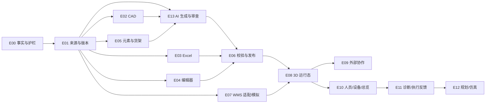

# CP6 3D Space Epic 与子 Spec 拆分

版本：v1.2 AI 生成需求对齐基线  
基线日期：2026-07-25  
文档类型：Explanation / Executable Backlog

## 1. 拆分原则

本计划以用户结果为主线，而不是按前端、后端和数据库分别建大任务。每个子 Spec 尽量控制在 1～3 个工程师日，并且必须可以独立验收。估算只用于排序和暴露风险，不作为交付承诺；CAD 技术试验完成后必须重新估算。

实施时遵守以下约束：

1. 保留当前 `Site/Floor/Zone/Aisle/Rack/Location` 和已验证的发布服务，不推倒重做。
2. 导入、编辑和模板生成必须写入同一种统一空间模型。
3. 生产发布以仓库版本为单位；楼层允许独立编辑。
4. CP6 WMS 是第一个真实适配器，同时提供 WMS 模拟器和标准适配契约。
5. 真实、模拟和未接入数据必须显式标识。
6. 所有新能力先满足多租户和后端授权，再开放外部用户入口。

## 2. Epic 地图

| Epic | 名称 | 目标阶段 | 主要产物 | 前置 |
|---|---|---|---|---|
| E00 | 当前事实与迁移护栏 | MVP | 现状基线、兼容策略、开关和指标 | 无 |
| E01 | 模型来源与仓库版本底座 | MVP | 版本、来源、任务、问题和血缘 | E00 |
| E02 | CAD 转换与语义解析 | MVP | DWG/DXF→统一草稿 | E01 |
| E03 | Excel 业务映射 | MVP | Excel→货架/逐层规格/库位映射 | E01 |
| E04 | 底图与地图编辑器增强 | MVP | 标定、校正、批量编辑 | E01 |
| E05 | 通用元素、资产与逐层货架 | MVP | 完整仓库静态模型 | E01 |
| E13 | AI 仓库生成与人工审查 | MVP | CAD IR→可审查完整仓库提案→原子 Draft | E01、E02、E05 |
| E06 | 校验、版本预览、发布和回退 | MVP | 仓库级可恢复发布 Saga | E02～E05、E13 |
| E07 | WMS 模拟器与标准适配 | MVP | 无真实仓数据也可验收 | E01 |
| E08 | 3D 库存与任务运行态 | MVP | 可解释的库存/任务叠加 | E05～E07 |
| E09 | 多租户外部协作 | MVP | 客户/供应商/3PL 受限查看 | E00、E08 |
| E10 | 人员、设备与仓库总览 | P2 | 实时事件和运营快照 | MVP |
| E11 | 诊断、建议与执行反馈 | P3 | 优化业务闭环 | E10 |
| E12 | 规划方案与历史仿真 | P4 | 方案比较和设计反馈 | E11 |

## 3. MVP 子 Spec

### E00 当前事实与迁移护栏

| 子 Spec | 工作包 | 验收摘要 | 估算 | 依赖 |
|---|---|---|---:|---|
| E00-S01 | 现有 Space API、表、页面和测试清单固化 | 文档与自动扫描结果可重复生成；当前全部 Space 端点均有归属 | 1d | 无 |
| E00-S02 | 建模能力开关与版本兼容策略 | 新版本模型可按租户开启；旧场景继续读取 | 2d | E00-S01 |
| E00-S03 | 数据来源统一枚举和前端标识 | 真实/模拟/未接入三类在 API 和页面一致 | 2d | E00-S02 |
| E00-S04 | Space 可观测性基线 | 请求、后台任务、发布记录使用统一 CorrelationId | 2d | E00-S02 |

### E01 模型来源与仓库版本底座

| 子 Spec | 工作包 | 验收摘要 | 估算 | 依赖 |
|---|---|---|---:|---|
| E01-S01 | 模型版本和状态机迁移 | 创建 Draft；非法状态转换被拒绝 | 3d | E00-S02 |
| E01-S02 | 模型来源和文件血缘迁移 | 文件哈希、格式、单位、解析器版本可查询 | 2d | E01-S01 |
| E01-S03 | 解析任务和问题模型 | 后台进度、阻断/警告/提示问题可持久化 | 3d | E01-S01 |
| E01-S04 | 基于生产版克隆仓库草稿 | 楼层可分别编辑，生产版不被修改 | 3d | E01-S01 |
| E01-S05 | 版本列表、详情和来源 API | 租户隔离、分页和并发版本号测试通过 | 2d | E01-S01～S03 |
| E01-S06 | 文件安全与保留策略 | 类型、大小、恶意文件校验；删除遵循版本引用 | 2d | E01-S02 |

### E02 CAD 转换与语义解析

| 子 Spec | 工作包 | 验收摘要 | 估算 | 依赖 |
|---|---|---|---:|---|
| E02-S01 | DWG/DXF 技术选型试验 | 用标准样本比较授权、实体覆盖、精度、性能和部署方式，形成 ADR | 3d | E01-S02 |
| E02-S02 | CAD 转换器适配接口 | DWG 和 DXF 都输出同一中间表示；实现可替换 | 3d | E02-S01 |
| E02-S03 | 单位、原点、旋转和楼层归属 | 解析前必须确认单位；输出坐标可重复 | 3d | E02-S02 |
| E02-S04 | 图层与块清单 | 图层、对象数、块、属性和范围可查询 | 2d | E02-S02 |
| E02-S05 | 图层映射方案 | 平台/租户方案隔离；相同 CAD 可复用映射 | 3d | E02-S04 |
| E02-S06 | 基础语义解析器 | 标准墙、柱、门、月台、区域、巷道、货架进入统一草稿 | 3d | E02-S05、E05-S01 |
| E02-S07 | 置信度和异常定位 | 每个自动元素有来源、规则、置信度；问题可定位 | 2d | E02-S06 |
| E02-S08 | CAD 解析幂等、取消和重试 | 同一幂等键不重复写；任务可安全重试 | 2d | E01-S03、E02-S06 |

### E03 Excel 业务映射

| 子 Spec | 工作包 | 验收摘要 | 估算 | 依赖 |
|---|---|---|---:|---|
| E03-S01 | 标准建模 Excel 模板 | 包含货架、逐层规格、库位和映射说明 | 2d | E05-S02 |
| E03-S02 | Excel 字段映射方案 | 自定义表头可预览并保存租户方案 | 3d | E01-S02 |
| E03-S03 | 类型、必填、重复和引用预检 | 错误带工作表、行、列和修复提示 | 2d | E03-S02 |
| E03-S04 | Excel 与 CAD/编辑器元素匹配 | 通过图元键或货架码关联；未匹配单列展示 | 3d | E02-S07、E03-S03 |
| E03-S05 | Excel 导入确认与幂等 | 预览确认后才写草稿；重复确认不生成重复对象 | 2d | E03-S04 |

### E04 底图与地图编辑器增强

| 子 Spec | 工作包 | 验收摘要 | 估算 | 依赖 |
|---|---|---|---:|---|
| E04-S01 | PDF/PNG/JPG 底图上传和渲染 | 当前 `underlay` 图层真正显示，支持显隐/透明/锁定 | 3d | E01-S02 |
| E04-S02 | 两点标定和坐标确认 | 标定后测距误差满足样本阈值；记录标定来源 | 2d | E04-S01 |
| E04-S03 | 通用元素选择与属性面板 | 墙柱门等可选中、编辑和删除草稿 | 3d | E05-S01 |
| E04-S04 | 多选、对齐、分布和阵列统一命令 | 货架和通用元素共享撤销/重做 | 3d | E04-S03 |
| E04-S05 | CAD 问题列表与画布定位 | 点击问题高亮来源对象；修复后状态更新 | 3d | E02-S07 |
| E04-S06 | 2D/3D 同源预览 | 保存后 2D/3D 对象数量、标识和尺寸一致 | 2d | E04-S03、E05-S03 |

### E05 通用元素、资产与逐层货架

| 子 Spec | 工作包 | 验收摘要 | 估算 | 依赖 |
|---|---|---|---:|---|
| E05-S01 | 通用空间元素和属性表 | 墙、柱、门、月台、托盘、设备可持久化且租户隔离 | 3d | E01-S01 |
| E05-S02 | 逐层货架规格 | 每层高度、格口、深度、尺寸、承重可不同 | 3d | E01-S01 |
| E05-S03 | 统一场景 DTO 扩展 | 设计 Revision 是建模权威；旧 Rack/Location 是 Published 运行态物化，通用元素不复制库位事实 | 3d | E05-S01、S02 |
| E05-S04 | 平台公共与租户资产库 | 公共只读、租户私有；不允许跨租户引用 | 3d | E05-S01 |
| E05-S05 | 参数化 3D 生成器扩展 | 逐层货架和通用元素可渲染 | 3d | E05-S02～S04 |

### E13 AI 仓库生成与人工审查

E13 是在 E00～E12 已编号后追加的 MVP Epic，为避免破坏历史追踪不重新编号。详细需求和接口见 [AI 自动生成完整仓库 Spec](./05-ai-warehouse-generation-spec.md)。

| 子 Spec | 工作包 | 验收摘要 | 估算 | 依赖 |
|---|---|---|---:|---|
| E13-S01 | Provider SPI、租户策略与功能开关 | Provider 可替换；既有租户默认 Disabled | 3d | E00、E01 |
| E13-S02 | Run、Proposal、Decision、Usage 数据模型 | 全部租户隔离、版本固定、可审计 | 3d | E01-S02 |
| E13-S03 | Import/BuildScene Worker 处理器 | 两类 Job 可恢复执行，不再进入默认未处理分支 | 3d | E01-S03 |
| E13-S04 | CAD IR 特征最小化与脱敏 | 外部 Provider 请求不含原始文件和禁用字段 | 2d | E02-S03 |
| E13-S05 | Mock/本地 Provider 与首个外部适配器 | 同一端口通过契约测试，故障可降级 | 3d | E13-S01、S04 |
| E13-S06 | 输出 Schema 与不可信输入校验 | 非法引用、枚举、范围和超量对象全部拒绝 | 2d | E13-S05 |
| E13-S07 | 规则/AI 融合与确定性生成 | `HumanLocked > Rule > AI > Default`，几何和编码由代码生成 | 3d | E02-S06、E05-S01 |
| E13-S08 | 提案分页、差异和审查工作台 | 逐项/批量审查，可定位来源和证据 | 3d | E13-S02、S07 |
| E13-S09 | 决策和人工锁定修正 | 重跑保留锁定值，决策历史不可覆盖 | 3d | E13-S08 |
| E13-S10 | Staging 与原子 Apply | Revision 冲突返回 409；成功只增加一个 ContentRevision | 3d | E13-S09、E05-S03 |
| E13-S11 | 取消、重试、降级和 Stale 恢复 | 失败不产生部分 Draft，不影响 Published | 2d | E13-S03、S10 |
| E13-S12 | 并发、预算、用量与费用 | 单租户三并发，日/月预算和费用审计 | 2d | E13-S01、S03 |
| E13-S13 | 外部用户拒绝与数据外发门禁 | 客户/供应商/3PL 的 AI 端点全部拒绝 | 3d | E13-S04、S12 |
| E13-S14 | 黄金数据、离线评估和阈值校准 | ≥20 份/5 类布局，三项质量指标达标 | 3d | E13-S06、S07 |
| E13-S15 | 性能、影子运行、试点和回滚 | 50MB P95≤15 分钟，关闭 AI 后确定性路径可用 | 3d | E13-S10～S14 |
| E13-S16 | 租户策略、预算和用量管理 UI | 租户管理员只能选择获批 Provider 别名，不能提交密钥/URL | 3d | E13-S01、S12 |
| E13-S17 | 迁移、前向修复和保留清理 | 新表/索引可部署，失败用前向迁移修复，审计数据不破坏性回滚 | 3d | E13-S02、S10、S12 |
| E13-S18 | 指标、告警、运行手册和槽回收 | Provider/费用/Apply/安全告警和租约回收演练通过 | 2d | E13-S11、S12、S15 |
| E13-S19 | 独立标注、安全评审和发布证据 | 留出集、抽检、安全和试点签字证据齐全 | 3d | E13-S13～S15 |

### E06 校验、版本预览、发布和回退

| 子 Spec | 工作包 | 验收摘要 | 估算 | 依赖 |
|---|---|---|---:|---|
| E06-S01 | 仓库版本校验引擎 | 编码、几何、层级、绑定、AI 提案来源和模型问题统一输出 | 3d | E02～E05、E13 |
| E06-S02 | 版本差异和影响预览 API | 显示元素/库位新增、修改、停用及 WMS 影响 | 3d | E06-S01 |
| E06-S03 | 仓库级发布编排 | WMS 成功并回读验证后激活运行态；部分/不确定结果进入可恢复对账 | 3d | E06-S02、E07-S02 |
| E06-S04 | 发布队列、重试和审计 | WMS 超时保留生产版；人工重试可追踪 | 3d | E06-S03 |
| E06-S05 | 历史版本重新发布回退 | 旧版可作为新发布动作恢复；历史记录不删除 | 2d | E06-S03 |
| E06-S06 | 发布管理 UI | 预检、差异、审批、进度、失败原因和回退入口完整 | 3d | E06-S02～S05 |

### E07 WMS 模拟器与标准适配

| 子 Spec | 工作包 | 验收摘要 | 估算 | 依赖 |
|---|---|---|---:|---|
| E07-S01 | WMS 适配能力契约 | 定义位置、库存、任务、健康检查和能力协商 | 3d | E00-S01 |
| E07-S02 | CP6 WMS 适配器封装 | 保留现有事务、幂等、库存和停用规则 | 3d | E07-S01 |
| E07-S03 | 标准 WMS 模拟器 | 支持位置发布、库存查询、拣货任务和故障注入 | 3d | E07-S01 |
| E07-S04 | 标准通用货架仓数据包 | 500 货架、10,000 库位、库存、任务和异常可重建 | 3d | E07-S03 |
| E07-S05 | 存量 WMS 采纳与绑定 | 拉取、放置、绑定、未绑定和差异对账闭环 | 3d | E07-S02、E04-S04 |

### E08 3D 库存与任务运行态

| 子 Spec | 工作包 | 验收摘要 | 估算 | 依赖 |
|---|---|---|---:|---|
| E08-S01 | 统一运行态数据源接口 | CP6 WMS 和模拟器返回同构库存/任务 DTO | 2d | E07-S01～S03 |
| E08-S02 | 库存来源、时间和延迟展示 | 用户始终能判断数据是否真实和新鲜 | 2d | E00-S03、E08-S01 |
| E08-S03 | 物料/批次/容器定位验收 | 多结果、空结果和跨层结果可解释 | 2d | E08-S01 |
| E08-S04 | 拣货任务与路径验收 | 实际顺序、优化顺序、跨区/跨层和工作量可见 | 3d | E08-S01 |
| E08-S05 | 10,000 库位性能基线 | 场景交互、标签和批量查询满足锁定后的门槛 | 3d | E05-S05、E07-S04 |

### E09 多租户外部协作

| 子 Spec | 工作包 | 验收摘要 | 估算 | 依赖 |
|---|---|---|---:|---|
| E09-S01 | 外部组织与成员模型 | 客户、供应商、3PL 可关联用户和租户 | 3d | E00-S02 |
| E09-S02 | 仓库/区域/货主/对象授权 | 后端组合数据范围生效，歧义时拒绝 | 3d | E09-S01 |
| E09-S03 | 字段范围与只读门户 | 外部用户默认只读且隐藏未授权字段 | 3d | E09-S02 |
| E09-S04 | 跨租户越权自动化测试 | 猜测 ID、同码仓库/库位和缓存均不能串租户 | 3d | E09-S02、E08 |
| E09-S05 | 外部访问审计和有效期 | 登录、查看、导出和授权变化可追踪 | 2d | E09-S03 |

#### E09 最低合同

数据模型：

| 实体 | 必要字段 |
|---|---|
| `Space_ExternalOrganization` | TenantId、Type(Customer/Supplier/ThirdPartyLogistics)、BusinessPartnerType/Id、Name、Status |
| `Space_ExternalMembership` | TenantId、OrganizationId、UserId、Role、ValidFrom/ValidTo、Status |
| `Space_ExternalGrant` | TenantId、OrganizationId、SiteId、Floor/Zone 范围、Owner 范围、BusinessObjectType/Ids、FieldPolicyId、ValidFrom/ValidTo |
| `Space_FieldPolicy` | TenantId、Name、允许字段、禁止字段、导出权限 |

授权算法固定为：

`当前用户租户匹配 ∩ 有效成员关系 ∩ 有效 Grant ∩ Site/区域范围 ∩ 货主/业务对象范围 ∩ 字段策略`

任一维度缺失或无法解释时返回空/404；不同 Grant 可以合并扩大可见集合，但禁止来自不同外部组织的 Grant 相互拼接。平台支持人员的临时授权走独立审计，不伪装成外部成员。

最低 API：

| Method | Route | 用途 |
|---|---|---|
| POST/GET | `/api/space/external-organization` | 管理租户内外部组织 |
| POST/GET | `/api/space/external-organization/{id}/membership` | 管理成员与有效期 |
| POST/GET | `/api/space/external-organization/{id}/grant` | 管理组合数据范围 |
| GET | `/api/space/portal/site` | 返回当前外部用户可见仓库 |
| GET | `/api/space/portal/site/{siteId}/published-scene` | 返回裁剪后的 Published 场景 |
| GET | `/api/space/portal/site/{siteId}/stock` | 返回字段脱敏后的库存 |
| GET | `/api/space/portal/site/{siteId}/task` | 返回授权业务对象的任务进度 |

E09 通过标准：

1. 外部用户默认只读，不能访问 Draft、来源文件、映射、问题、发布或重试接口。
2. 客户、供应商、3PL 使用同一码值时仍按组织和 Grant 隔离。
3. URL 猜测、分页游标、缓存键、导出和 3D 场景 DTO 都执行相同后端范围裁剪。
4. Grant 到期后现有会话下一次请求立即失效。
5. 产品 GA 由产品负责人、QA 负责人、WMS 负责人和安全负责人共同签字；任何跨租户测试失败都阻断发布。

## 4. 后续阶段子 Spec

### E10 P2：人员、设备、货主分析和总览

| 子 Spec | 结果 |
|---|---|
| E10-S01 | PDA/定位人员事件契约、状态与时间语义 |
| E10-S02 | 人员实时位置和授权轨迹 |
| E10-S03 | WCS/IoT 设备事件契约与设备主数据映射 |
| E10-S04 | AGV/输送设备位置、状态和告警叠加 |
| E10-S05 | 货主、SKU、批次和容器空间筛选 |
| E10-S06 | 仓库 KPI 快照、利用率与 ABC 口径 |

### E11 P3：诊断、建议与执行反馈

| 子 Spec | 结果 |
|---|---|
| E11-S01 | 路径距离、折返、拥堵、停留和容量诊断口径 |
| E11-S02 | 上架/库位推荐候选生成和解释 |
| E11-S03 | 人员/任务调度建议与约束 |
| E11-S04 | 建议审批和 WMS/WCS/PDA 任务适配 |
| E11-S05 | 执行状态、幂等回执和异常补偿 |
| E11-S06 | 优化前后效果评估和收益看板 |

### E12 P4：规划方案与历史仿真

| 子 Spec | 结果 |
|---|---|
| E12-S01 | 与生产版本隔离的方案分支 |
| E12-S02 | 脱敏历史任务数据集和回放时钟 |
| E12-S03 | 距离、拥堵、容量、吞吐和成本仿真 |
| E12-S04 | 多方案对比与决策记录 |
| E12-S05 | 标准交换格式导出 |
| E12-S06 | DWG 回写技术试验与授权评估 |

## 5. 推荐实施顺序

### 5.1 MVP 粗估

| 范围 | 粗估 |
|---|---:|
| E00 事实与护栏 | 7 工程师日 |
| E01～E08 建模、发布、WMS 与 3D 运行态 | 123 工程师日 |
| E13 AI 生成、审查、安全与评估 | 52 工程师日 |
| E09 外部协作 | 14 工程师日 |
| **MVP 合计** | **约 196 工程师日** |

这是工作量而不是日历周期，允许前后端、测试、CAD 技术试验、AI 评估和 WMS 模拟器并行。E02-S01 和 E13-S05 完成后必须重新估算；未包含生产运维环境采购、商业 CAD 授权/AI Provider 采购和客户现场数据清洗。

### 5.2 顺序

第一条开发链路应以“可在标准样本上跑通”为目标：

1. E00-S01～S04：固定当前事实并加兼容护栏。
2. E01-S01～S06：先有版本、来源、任务和问题，再做解析。
3. E05-S01～S03：统一元素和逐层货架是 CAD、Excel、编辑器共同依赖。
4. E02-S01：尽早做 CAD 技术试验；它是最大技术和授权风险。
5. E07-S01～S04：并行建立 WMS 模拟器和标准验收仓。
6. E02、E03、E04、E05 分别形成可独立验收的导入/编辑能力。
7. E13 在稳定 CAD IR 和统一元素之上形成 AI 提案、人工审查和原子 Draft Apply；不允许 Provider 直接写版本。
8. E06 把确定性和 AI 辅助路径收敛到同一个仓库版本校验与发布事务。
9. E08 完成库存、任务和性能验收。
10. E09 最后开放外部入口；在其完成前只允许内部租户用户使用。

最早可演示的垂直切片不是完整 CAD，而是：

`底图标定 → 放置参数化货架 → 逐层规格 → 编码 → 模拟 WMS 发布 → 3D 库存`

随后用 CAD、AI 提案审查和 Excel 替换人工放置步骤，证明规则、AI 和地图编辑路径会聚到同一模型。

## 6. 发布关卡

本节与 [MVP Scope Baseline v1.0 §11](./06-mvp-scope-freeze-baseline-v1.0.md#11-统一发布关卡) 使用同一口径；冻结基线是跨文档冲突时的权威版本。

### MVP Alpha

- 标准底图路径可完成 500 货架和 10,000 库位建模。
- 模拟 WMS 位置发布、库存和拣货任务闭环通过。
- 新模型按租户开关启用，旧 Space 功能不回归。
- E02-S01 已形成 CAD 技术/授权 ADR；未完成授权和部署批准前不得承诺 DWG Beta 日期。

### MVP Beta

- 标准 DXF 和可转换 DWG 通过 CAD 解析。
- 标准 Excel、字段映射和错误报告通过。
- CAD+Excel 和地图编辑器对同一验收仓产出一致。
- AI 生成使用至少 20 份/5 类布局黄金数据，覆盖率≥80%、整体准确率≥90%、高置信度精确率≥95%。
- 50MB 标准 CAD 到可审查提案 P95≤15 分钟，人工操作量相对纯人工下降≥70%。
- 高置信度提案仍须人工确认；AI Apply 只写 Draft，故障和 Revision 冲突零部分写入。
- 仓库版本在 WMS 成功并验证后才激活；失败可重试，部分状态可对账，历史版本可重新发布。

### MVP GA

- CP6 WMS 真实适配器通过。
- 外部客户、供应商、3PL 权限与越权测试通过。
- 10,000 库位场景性能门槛通过。
- 安全、审计、备份恢复和运维手册完成。
- 发布证据记录精确的 Chrome/Edge 版本、数据库迁移版本、验收数据包版本和应用提交 SHA。
- 产品、架构、QA、WMS 和安全负责人共同签字。

## 7. Definition of Done

每个子 Spec 完成必须同时满足：

1. 需求 ID、接口、数据迁移和权限规则可追踪。
2. 后端租户过滤和前端隐藏同时实现；不能只靠前端。
3. 正常、空数据、重复请求、越权、超时和并发场景有测试。
4. 新表和索引有迁移、回滚或前向修复说明。
5. 新后台任务可观测、可安全重试、不会重复写。
6. 真/模拟/未接入数据在接口和 UI 中一致标识。
7. 保持当前发布停用、库存检查和编码稳定规则。
8. 用户文档说明当前行为，不提前宣称后续阶段能力。
9. AI 子任务证明 Provider 不接收原始文件，人工锁定值优先，Apply 不自动校验或发布。

## 8. 主要风险

| 风险 | 影响 | 处理 |
|---|---|---|
| DWG 解析库的授权、精度或部署方式不适合 | CAD 主路径延迟 | E02-S01 在大规模开发前做技术与授权 ADR |
| CAD 图纸差异过大 | 自动识别目标失真 | 目标限定标准层/映射方案；异常显式交给人工 |
| AI 错误语义被批量接受 | 仓库草稿大范围错误 | 黄金集校准、高置信度实测精确率、人工确认和确定性约束 |
| 原始图纸或敏感字段发送外部 AI | 多租户数据泄露 | 默认 Disabled、最小化 IR、策略快照和外发契约测试 |
| AI Provider 故障或费用失控 | 建模中断或成本不可控 | Provider 中立、规则降级、三并发、日/月预算和用量审计 |
| 版本模型与现有表双写 | 数据事实冲突 | 设计 Revision 为建模权威，现有表为 Published 运行态物化；按 Site 切换且禁止长期双写 |
| 仓库级事务跨 WMS 无法使用数据库事务 | 出现部分成功 | 适配器幂等、预检、发布日志、补偿和生产版延迟切换 |
| 10,000 库位一次加载导致页面卡顿 | 无法验收 | InstancedMesh、批量查询、视野标签和性能基线 |
| 外部账号授权组合复杂 | 数据泄漏 | 后端统一策略、拒绝优先、越权测试和有效期 |
| 模拟数据被当成真实数据 | 错误业务决策 | 数据源强标识、生产仓禁静默混用、可清理命名空间 |

## 9. 详细 Spec 入口

第一核心 Epic 的表、接口、状态机、UI、异常和验收标准见：

[04-low-cost-3d-modeling-spec.md](./04-low-cost-3d-modeling-spec.md)

AI 生成 Epic 的用户流程、接口、数据模型、质量门禁和子任务见：

[05-ai-warehouse-generation-spec.md](./05-ai-warehouse-generation-spec.md)

对应详细设计：

[06-ai-generation-review-provenance.md](../design/06-ai-generation-review-provenance.md)

范围、实现状态、ADR 和 Development Ready 签字见：

[06-mvp-scope-freeze-baseline-v1.0.md](./06-mvp-scope-freeze-baseline-v1.0.md)
