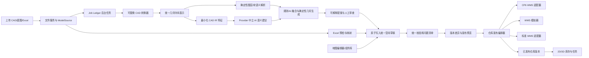
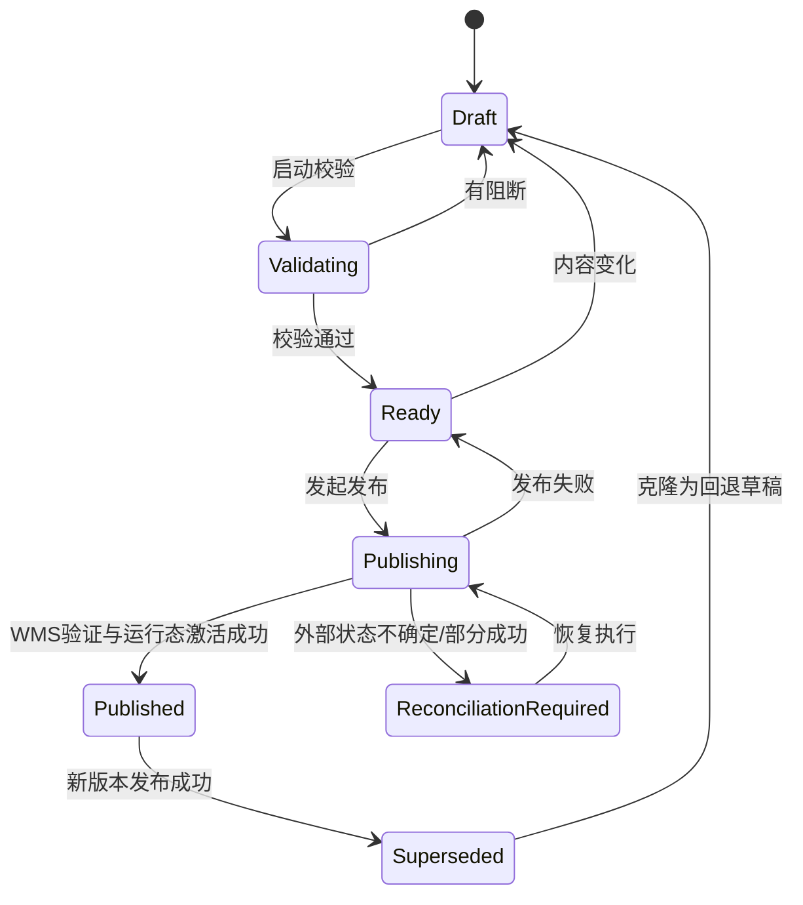
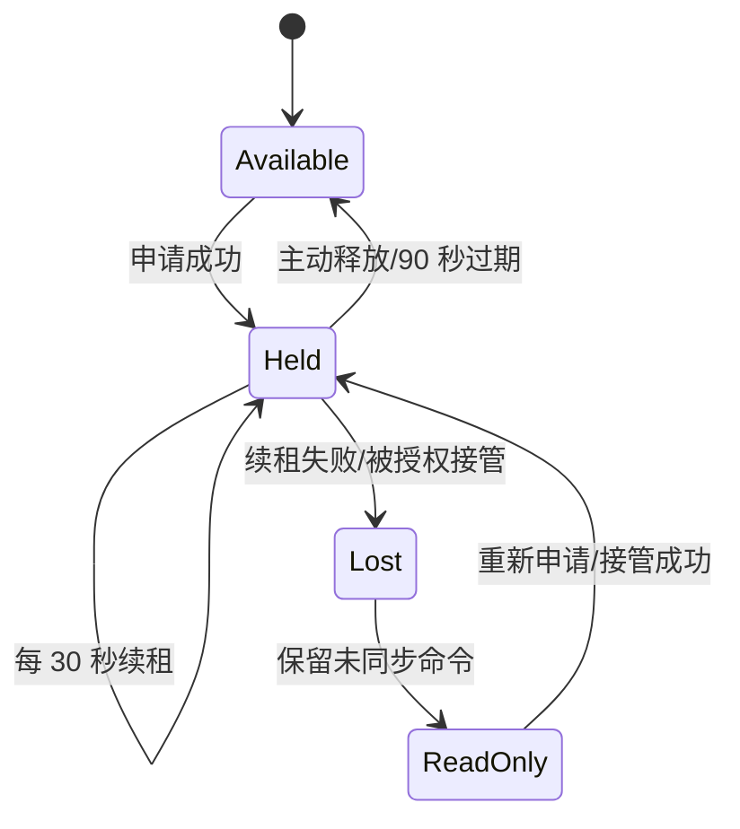

# CP6 低成本 3D 建模详细 Spec

版本：v1.2 AI 生成详细设计对齐基线
基线日期：2026-07-25
对应 Epic：E01～E08、E13 的低成本建模与运行验收部分
产品优先级：MVP 最高
状态：产品与架构评审通过，D1～D15、T1～T3 已锁定，可进入详细设计实施

v1.3 修订状态：2026-08-12 冻结；在上述 v1.2 基线上增量优化。核心 GA 仍须通过自动化、真实 CAD、两仓 Pilot 和生产签字门禁。

> **文档合并原则**：v1.3 不替代或删减 v1.2 的详细正文。本版完整保留 v1.2 的背景、领域模型、状态机、失败恢复、权限、API、测试和验收定义，并把 Space Studio、编辑租约、解析变更集、GA 分层及新质量门槛逐节合入。若旧口径与 v1.3 的明确修订冲突，以 v1.3 为准；未被修订的 v1.2 细节继续有效。范围变化见 [Scope Change RFC-003](./09-scope-change-rfc-space-studio-v1.3.md)。

本文件定义产品行为和验收口径。表结构、接口、状态恢复和安全实现以六卷详细设计为准：

1. [版本、逻辑身份、数据模型与迁移](../design/01-version-identity-data-migration.md)
2. [CAD/Excel、文件安全与后台任务](../design/02-modeling-import-files-jobs.md)
3. [编辑器、通用元素与 2D/3D 同源](../design/03-editor-elements-rendering.md)
4. [校验、发布、WMS 适配与恢复](../design/04-validation-publish-wms-recovery.md)
5. [外部组织、授权、审计与质量门禁](../design/05-access-audit-testing-performance.md)
6. [AI 生成、审查与来源追踪](../design/06-ai-generation-review-provenance.md)

v1.3 保留卷六及 E13 的全部设计，但把外部 AI Provider 的发布资格调整为独立 Beta；规则路径、提案审查和来源追踪继续有效。

## 0. v1.3 冻结修订摘要

| 主题 | v1.3 结论 | 对 v1.2 的处理 |
|---|---|---|
| 产品入口 | 三条建模路径产出同一份 Draft | 保留原路径，明确 DWG/DXF 先走确定性解析，外部 AI 不是核心依赖 |
| 编辑器 | `DesignUnderlayView` 收敛为唯一 Space Studio 权威 | 保留旧 `FloorEditor` 成熟交互，但不发展第二套设计权威 |
| CAD 审核 | Job 成功后自动加载待审变更集，确认后才合入 | 补齐新增/修改/删除/冲突/低置信度审查和 stale 保护 |
| 并发 | 同 Floor 编辑租约 + Floor Revision + CommandBatch 幂等 | 将 v1.2 的原则落成 90 秒租约、30 秒续租和稳定错误码 |
| 生产边界 | 工作台使用本地 Draft 场景；生产 Viewer 只消费 Published | Draft 3D 不查询实时库存、人员或设备 |
| GA 分层 | 核心 GA、独立 GA、Beta、Preview 分开门禁 | 规划/仿真不阻塞核心 GA；外部 AI 独立 Beta；人员/设备保持 Preview |
| 质量门槛 | 真实 DWG/DXF、20 份黄金 CAD、Iris Xe Viewer、两仓 Pilot | 收紧性能与证据要求，不以合成数据代替生产验收 |
| 外部角色 | 客户/3PL Published-only；Supplier 只做自动化越权矩阵 | Supplier 不参加现场业务 UAT |

## 1. 目标

让普通仓库业务人员不依赖 Blender、3ds Max 或专业 3D 开发人员，通过以下任一入口建立同一种可编辑、可发布的仓库模型：

v1.2 原始入口定义：

1. `DWG/DXF → 规则解析 + AI 提案审查 + Excel`
2. `PDF/PNG/JPG 底图 + 地图编辑器`
3. `空白画布 + 参数化组件/模板`

v1.3 不删除这三条入口，而是将其产品操作顺序细化为：

1. `DWG/DXF → 确定性解析 → 人工复核 → Draft`
2. `CAD + Excel → 几何与业务属性匹配 → Draft`
3. `PDF/PNG/JPG 底图或空白画布 → 构件库与批量编辑 → Draft`

模型必须完成：

`来源留痕 → 规则解析/AI 提案/批量生成 → 人工审查与校正 → Draft 校验 → 仓库版本 → WMS 库位 → 3D 库存和任务`

v1.3 在该主链内补强 `发布预览 → CP6 WMS → Published → 生产 Viewer` 的显式阶段，并把外部 AI 调整为可选 Beta；这不是新增第二条发布链。

低成本不是“任何 CAD 零配置全自动识别”，而是把工作量集中在图层映射、异常处理和业务确认，避免重复绘制已经能可靠识别的对象。

v1.3 进一步明确不承诺“5 分钟完成数字孪生”；外部 AI Provider 禁用或不可用时，确定性规则解析、Excel、底图和手工编辑仍必须完成同一核心链路。

## 2. 成功指标

| ID | 指标 | MVP 门槛 |
|---|---|---|
| KPI-01 | 标准 CAD+Excel 首个可编辑 3D 场景 | 上传后 60 分钟内完成 |
| KPI-02 | 标准图层自动识别覆盖率 | 已配置映射的目标元素不低于 80% |
| KPI-03 | 标准验收规模 | 500 货架、10,000 库位 |
| KPI-04 | 2D/3D 同源一致性 | 对象数量、标识、尺寸、编码 100% 一致 |
| KPI-05 | Space/WMS 发布一致性 | 库位编码、状态和数量 100% 一致 |
| KPI-06 | 重复发布 | 不产生重复 WMS 库位 |
| KPI-07 | 失败保护 | 任一解析/发布失败不破坏当前生产版本 |
| KPI-08 | 多租户隔离 | 同码仓库、库位、版本、模板和文件无串租户 |
| KPI-09 | AI 提案时效 | 50MB 标准 CAD 到可审查提案 P95≤15 分钟 |
| KPI-10 | AI 整体语义准确率 | 黄金数据集≥90% |
| KPI-11 | AI 高置信度精确率 | 黄金数据集实测≥95% |
| KPI-12 | AI 人工操作量下降 | 相对纯人工地图建模≥70% |
| KPI-13 | Release Holdout 完整性 | 不允许出现未报告的 Blocking 级遗漏 |
| KPI-14 | Viewer 交互性能 | Iris Xe/WebGL2 下首次可交互≤3 秒、P95 帧时间≤20ms |
| KPI-15 | 发布故障恢复 | 自动判定≤15 分钟；需要人工对账≤4 小时；旧 Published 始终可用 |
| KPI-16 | 确定性 CAD 草稿时效 | 50MB 标准 CAD 到可审查草稿/变更集 P95≤15 分钟，不依赖外部 AI |

KPI-02 的分母是规范图层或已经保存映射方案的目标元素。非标准 CAD 必须显示未识别和低置信度对象，不得通过隐藏失败来提高数字。

v1.3 不删除或改号 KPI-01～12：KPI-01～08 继续作为核心 GA 门槛；KPI-09～12 改由外部 AI Beta 单独签字，不阻塞核心 GA；KPI-13～16 是在原指标之后新增的核心 GA 门槛。

### 2.1 指标计算口径

| 指标 | 固定口径 |
|---|---|
| 60 分钟建模 | 使用标准验收仓，由接受不超过 2 小时产品培训的仓库主数据人员操作；从文件上传成功开始，到版本第一次进入 `Ready` 为止，按连续墙钟时间计时，包含解析、映射和人工校正 |
| 自动识别覆盖率 | `正确自动生成的目标元素数 ÷ 标准答案中的目标元素总数 × 100%`；人工新画元素不计入分子 |
| 自动识别准确率 | `正确自动生成的目标元素数 ÷ 自动生成的目标元素总数 × 100%`，MVP 发布门槛暂定不低于 90% |
| 高置信度精确率 | `高置信度分组中正确提案数 ÷ 该分组全部提案数 × 100%`；分桶阈值默认 0.90，但阈值本身不能替代实测精确率 |
| 人工操作量下降 | 同一标准仓在纯地图编辑器基线和 AI 辅助路径中的创建、修改、删除操作数对比；下降比例不低于 70% |
| 元素匹配 | 类型和楼层相同；货架中心偏差≤100mm、角度偏差≤2°、长宽偏差≤`max(50mm, 2%)`；墙/巷道中心线的最大点到线偏差≤100mm |
| 2D/3D 一致 | 编辑器导出规范对象清单；Viewer 测试模式从实际 InstancedMesh/对象树导出逻辑 ID、变换矩阵和尺寸清单；两者规范化为整数毫米、RotationZ 和逐层规格后计算 SHA-256，哈希必须相同 |
| v1.3 一致性补强 | 在原有 2D/3D 哈希口径上追加业务编码字段，并与机器可读对象清单做三方比较；不建立第二份场景数据 |
| Space/WMS 一致 | 逐项比较逻辑库位 ID、库位编码、启停状态和外部绑定；数量及逐项比较必须全部通过 |
| 10,000 库位交互 | 在 §18.1 指定验收终端上测量冷启动、可交互时间、平移/缩放帧率和拾取延迟 |
| 底图标定 | 两点完成标定后，用未参与标定的第三控制点测量；误差≤`max(50mm, 实际距离×0.2%)` |

标准答案由 E07-S04 数据包提供，必须包含机器可读清单、预期对象数量、几何、业务编码和文件 SHA-256。修改验收资产时必须提升数据包版本，不能直接覆盖旧答案。

v1.3 在原数据包机制上追加真实黄金 CAD，固定按 `Calibration/Validation/Holdout = 10/5/5` 划分；调整规则或阈值只能使用 Calibration，发布结论必须分别报告 Validation 和从未参与调参的 Holdout。

## 3. 用户与核心用例

| 用户 | 核心用例 |
|---|---|
| 空间建模人员 | 上传 CAD/底图/Excel，完成映射、校正和参数化编辑 |
| 仓库主数据管理员 | 确认层级、编码、库位与 WMS 映射 |
| 发布管理员 | 查看问题和差异，批准发布或回退 |
| 集成管理员 | 配置 CP6 WMS、模拟器或标准适配器，处理失败重试 |
| 仓库主管 | 在 3D 中查看已发布布局、库存和拣货任务 |
| 外部只读用户 | 在授权范围内查看模型和运行态业务，不参与建模发布 |

## 4. 当前代码事实

以下内容是当前实现，不是目标蓝图：

该 v1.2 代码事实表在 v1.3 中完整保留，用于解释为什么选择增量收敛，而不是重建领域层。

| 当前能力 | 代码证据 | 判断 |
|---|---|---|
| Space 已有独立领域目录和 Site/Floor/Zone/Aisle/Rack/Location 层级 | [`CP6.Entity/DomainModels/Space`](../../../CP6.Entity/DomainModels/Space) | 保留 |
| 货架只有统一 `Cols/Levels/DepthCount/CellW/CellH/CellD` | [`Space_Rack.cs`](../../../CP6.Entity/DomainModels/Space/Space_Rack.cs) | 缺逐层规格 |
| Floor 已有底图地址、比例、偏移和原点字段 | [`Space_Floor.cs`](../../../CP6.Entity/DomainModels/Space/Space_Floor.cs) | 可复用 |
| 编辑器声明了 underlay 图层，但渲染过程没有绘制它 | [`SceneStage.ts`](../../../cp6.web/src/space-editor/SceneStage.ts) | 底图链未闭环 |
| 当前导入/导出只是 CP6 场景 JSON | [`FloorEditor.vue`](../../../cp6.web/src/views/space/editor/FloorEditor.vue) | 不是 CAD/Excel 导入 |
| 模板面板和生成器按统一行×层×深度生成 | [`TemplatePanel.vue`](../../../cp6.web/src/views/space/editor/panels/TemplatePanel.vue)、[`genRack.ts`](../../../cp6.web/src/space-editor/generate/genRack.ts) | 可扩展，不推倒 |
| 当前统一场景只有楼层、区域、巷道、货架、库位和标记 | [`scene.ts`](../../../cp6.web/src/types/space/scene.ts) | 缺通用元素 |
| 库位发布已有预检、事务、幂等基础、状态和版本 | [`LocationPublishService.cs`](../../../CP6.Core/Services/Space/LocationPublishService.cs) | 必须保留并提升到仓库版本 |
| 停用会检查真实 WMS 库存和引用 | [`WmsStockQuery.cs`](../../../CP6.Core/Services/Wms/WmsStockQuery.cs) | 必须保留 |
| 3D Viewer 已查询库存、定位、路径和工作量 | [`FloorViewer.vue`](../../../cp6.web/src/views/space/viewer/FloorViewer.vue) | MVP 可复用 |
| 设备查询当前返回空，页面也说明非实时 | [`WmsDeviceQuery.cs`](../../../CP6.Core/Services/Wms/WmsDeviceQuery.cs) | 不属于本 Spec |

v1.3 合并时的新增代码事实：

| 当前能力 | 代码证据 | 判断 |
|---|---|---|
| Design V1 的版本、CAD、Excel、命令批、校验、发布与恢复主链已存在 | [`CP6.WebApi/Controllers/Space`](../../../CP6.WebApi/Controllers/Space)、[`design-v1.openapi.json`](../contracts/design-v1.openapi.json) | 继续复用，不重建领域层 |
| Space Studio 已收敛在 `DesignUnderlayView` | [`DesignUnderlayView.vue`](../../../cp6.web/src/views/space/editor/DesignUnderlayView.vue) | 作为唯一工作台入口持续演进 |
| Floor 编辑租约和接管审计已落库 | [`SpaceEditLease.cs`](../../../CP6.Space.Domain/SpaceEditLease.cs)、[`SpaceEditLeaseController.cs`](../../../CP6.WebApi/Controllers/Space/SpaceEditLeaseController.cs) | 仍需完整契约、并发与 UX 证据 |
| CAD Job 产物具备自动加载工作台审核空间的主链接口 | [`SpaceCadParseController.cs`](../../../CP6.WebApi/Controllers/Space/SpaceCadParseController.cs)、[`designCadParse.ts`](../../../cp6.web/src/api/space/designCadParse.ts) | 不再要求手工下载并重新上传 JSON |

上述“已存在”只代表代码能力，不等于真实 CAD、Pilot、性能或生产签字已经通过。

实施前必须再次用实际路径确认上述文件位置；如果目录重构，按类型和符号追踪，不根据文档路径盲改。

## 5. 范围

### 5.1 本 Spec 包含

- 仓库模型版本、来源、解析任务、问题和血缘。
- DWG/DXF 上传、转换和标准实体解析。
- PDF/PNG/JPG 底图渲染和两点标定。
- CAD 图层语义映射、置信度、异常定位和人工校正。
- Excel 标准模板、字段映射、预检、导入确认和错误报告。
- 墙、柱、门、月台、区域、巷道、货架、托盘、常见设备静态元素。
- 逐层货架规格、平台公共资产和租户私有资产。
- 同源 2D/3D 预览。
- 仓库级校验、差异、可恢复发布 Saga、失败重试和历史版重新发布。
- Space 新建库位和存量 WMS 采纳两条路径。
- WMS 驱动的容量、ABC、库存诊断和上架推荐；本期只给建议，不自动执行上架。
- 客户与 3PL 的 Published-only 门户，以及与建模工作台分离的生产 Viewer。

### 5.2 本 Spec 不包含

- 人员实时位置、轨迹和停留。
- WCS/AGV/IoT 实时控制和告警。
- 上架推荐、调度建议和执行反馈。
- 园区道路、车辆和室外交通仿真。
- 高精度物理仿真。
- 第三方 WMS 通用兼容承诺；第三方适配器必须逐个认证。
- 任意非标准 CAD 的完全自动识别承诺。
- DWG 方案回写；仅在 P4 技术试验。
- “5 分钟完成数字孪生”等营销承诺。

v1.3 对上述排除项的边界补充如下：

- 容量、ABC、库存诊断和只读上架推荐属于核心 GA，但不包含自动执行上架、调度或反馈闭环。
- “人员调度和设备告警保持 Preview”只表示独立预览能力，不把人员实时轨迹或 WCS/IoT 控制纳入本 Spec。
- 规划与仿真作为独立 GA，不阻塞核心 GA；高精度物理仿真仍不包含。
- 园区道路范围进一步明确包含门岗、停车和室外交通。
- 真实 PDA 控制与真实 WCS/IoT 控制同样不包含。

独立门禁：外部 AI Provider 为独立 Beta，不阻塞确定性规则解析。授权 Demo 模式可以展示模拟人员/设备，但必须默认关闭并持续显示 `Simulated` 标记。

### 5.3 与 E09 外部协作的关系

本文件详细到 E01～E08 和 E13；E09 的组织成员、组合数据范围、字段脱敏和门户由 [Epic 拆分](./03-epic-and-spec-backlog.md) 管理。内部租户用户完成 E01～E08 和 E13 后可以进入 Beta，但产品不能标记 MVP GA，直到 E09-S01～S05 和跨租户越权测试全部通过。外部用户只消费 Published 版本的只读 DTO，不直接读取 Draft、来源文件、解析日志、AI 提案或发布重试信息。

v1.3 进一步明确：客户和 3PL 沿用 Published-only；外部主体还必须被拒绝 Lease。Supplier 只参加自动化权限/越权矩阵，不参加现场业务 UAT；跨租户猜测和越权测试仍是核心 GA 硬门禁。

## 6. 总体架构



关键边界：

1. CAD SDK/服务必须包在 `ICadConverter` 后面，避免授权或格式能力变化侵入领域逻辑。
2. CAD、Excel、模板和手工编辑只负责生成草稿命令，不直接写生产模型。
3. `Rack/Location` 仍是货架和库位业务事实；`Space_Element` 表达通用元素，并可引用 Rack，但不能复制一套 Location。
4. WMS 只通过 `ISpaceWmsAdapter` 访问；Space 不直接修改库存数量和业务单据。
5. AI Provider 只接收租户策略允许的最小化 CAD IR 特征，不接收原始文件，也不拥有最终几何、编码、LogicalId 或发布决定。
6. AI 高置信度结果仍是提案；人工确认后通过单事务 Apply 写 Draft，不能直接进入校验或发布。
7. 页面实施以 `DesignUnderlayView` 和 `/api/space/design/v1` 为主链；旧 `FloorEditor` 只迁移成熟交互，不继续形成第二套设计权威。
8. Space Studio 的同页 3D 只渲染当前本地 Draft 场景并保留选择和视角；生产 Viewer 只消费 Published 与 Runtime Overlay，两者不共享“实时状态”语义。
9. 核心 GA 的 CAD 转换必须有一个主 Provider 和一个满足同一契约、授权、安全与审批标准的备用 Provider；真实 DWG 与 DXF 都是硬门槛。

图中的 `VIEW` 即生产 Viewer；v1.3 只是明确其 Published-only 消费边界，不新增第二个 Viewer 数据源。

### 6.1 坐标与几何约定

- 持久化坐标和尺寸统一使用整数毫米。
- 每个 Floor 使用独立右手坐标系，Z 轴向上；Floor 保存相对 Site 的标高。
- `RotationZ` 使用角度值，正值按数学约定从 +X 朝 +Y 逆时针旋转。
- Rack 的 X/Y 是未旋转占地矩形的原点角，旋转支点也是该角；与现有 00 章公式保持一致。
- Three.js 的 Y-up 转换只发生在 Viewer 适配层，数据库和编辑器不保存第二套坐标。
- CAD 导入必须保存原单位、转换比例和仿射变换；解析后所有领域几何已换算为上述坐标。
- 几何比较先规范化整数毫米、顶点方向和起始点，再计算哈希或差异。

### 6.2 MVP 文件边界

| 类型 | 租户默认/平台硬上限 | 额外规则 |
|---|---:|---|
| DWG/DXF | 100MB/200MB 每文件 | 外部参照 XRef 不自动联网解析；缺失参照产生 Blocking；单图≤1,000,000 图元 |
| PDF/PNG/JPG | 100MB/文件 | PDF 最多 200 页；用户必须选择目标楼层页 |
| Excel | 50MB/文件 | 解压后总量≤1GB，压缩比≤20:1 |

租户上限可下调；DWG/DXF 上调不能超过 200MB 平台硬上限。任何上调必须先完成同规模内存、耗时、AI 费用和恶意文件测试。加密文件、宏、嵌入可执行对象和解析器不支持的压缩格式默认拒绝。

v1.3 对外产品规则是在该平台边界内收紧：核心 GA 上传入口固定为 100MB，50MB 为标准性能验收档；200MB 继续作为平台防御性硬边界和未来扩容上限，不表示当前产品接受大于 100MB 的文件。未来提高对外上限必须提交独立 Scope Change 和产品批准。

### 6.3 MVP 部署拓扑

- CP6 Web/API：身份、版本、编辑、校验、发布编排和查询入口。
- Space Worker：持久队列消费者，执行 Excel、校验、快照和发布恢复。
- CAD Converter Worker：独立进程/容器，使用低权限临时目录；崩溃和恶意图纸不能拖垮 Web/API。
- AI Generation Worker：消费 `BuildScene` 任务，执行输入最小化、Provider 调用、输出校验、确定性融合和提案持久化；与 Web/API 进程隔离。
- SQL Server：领域版本、逻辑身份、任务、问题、外部绑定和 Outbox。
- 文件/对象存储：原始来源、转换中间产物、错误报告和验收资产；数据库只保存引用与哈希。
- WMS Adapter：CP6 WMS 在进程内适配；模拟器和未来外部 WMS 均遵循相同能力契约。

Web/API 可以横向扩展。解析和发布任务不能依赖单机内存锁；同仓发布槽、任务租约和幂等记录必须持久化。

## 7. 状态机

### 7.1 模型版本



规则：

- CAD/Excel 解析由 Source/Job 状态表达，版本仍保持 Draft。
- Draft 有任何业务内容变化后，旧校验结果失效。
- `Publishing` 期间禁止编辑同一版本。
- 同一仓库同一时刻只允许一个发布任务。
- `Published` 和 `Superseded` 都不可原地修改。
- `ReconciliationRequired` 阻断同 Site 的后续发布，直到对账闭合。

### 7.2 解析任务

`Queued → Running → Succeeded/Failed/Cancelled`

- 用户取消只在安全检查点生效。
- `Failed` 可用相同幂等键重试；已提交的同批草稿变更必须能够识别并跳过。
- 进度值只能前进，不能因任务重启从 UI 上倒退；重试作为新的 attempt 展示。

解析任务与 Draft 解耦：任务运行时当前 Draft 继续可编辑；任务成功不直接改写 Draft，而是生成绑定 `BaseContentRevision` 的待审变更集。变更集至少区分新增、修改、删除、冲突、低置信度和未识别对象，用户确认 Apply 后才以单事务写入。若当前内容版本已变化，Apply 返回 `SPACE_PARSE_CHANGESET_STALE`，零写入并要求重新计算或重放。

### 7.3 Floor 编辑租约



规则：

- 租约唯一槽是 `(TenantId, ModelVersionId, FloorLogicalId)`；默认有效期 90 秒，客户端每 30 秒续租。
- 普通编辑者只能在租约过期后重新申请；强制接管要求 `space:model:lease:takeover` 和非空原因，并产生不可变审计。
- 租约被占用时以只读模式打开，显示持有人和过期时间，可等待或申请有权限的接管。
- 租约丢失后立即停止本地写入，保留未同步命令并允许导出恢复草稿；不得用旧 leaseId 覆盖远端内容。
- CommandBatch 必须同时携带有效 `leaseId` 和 `expectedFloorRevision`；服务端按租户、权限、租约、Floor Revision、命令和幂等键的顺序验证，任一步失败均零写入。

## 8. 数据模型

字段命名遵循当前 CP6 实体基类和审计规范；以下是逻辑模型，实施时不得重复基类已有字段。

### 8.0 `Space_Model`

每个租户内的每个 Site 对应一个模型聚合头，保存：

- `SiteId`
- `Mode`（Legacy/DesignV1）
- `ActiveDraftVersionId`
- `CurrentPublishedVersionId`
- `LastMaterializedHash`
- `RowVersion`

现有 `Space_Site` 不增加多版本行；它继续属于运行态。`Space_Model` 是设计工作区与运行态 Site 之间的一对一桥梁。

### 8.1 `Space_ModelVersion`

| 字段 | 类型/约束 | 说明 |
|---|---|---|
| Id | GUID PK | 稳定身份 |
| TenantId | GUID, indexed | 租户隔离 |
| ModelId | GUID, indexed | 所属 `Space_Model` |
| VersionNo | string | 租户+Site 内唯一 |
| Name | string | 用户可读名称 |
| Status | enum | Draft/Validating/Ready/Publishing/Published/Superseded/ReconciliationRequired |
| BasedOnVersionId | GUID? | 来源生产版或历史版 |
| ChangeSummary | string? | 发布说明 |
| PublishedAt/PublishedBy | nullable | 发布审计 |
| RowVersion | concurrency token | 乐观并发 |

唯一约束：

- `(TenantId, ModelId, VersionNo)`
- 活动草稿和当前生产版由 `Space_Model` 指针唯一管理；状态转换由聚合 RowVersion 和事务锁共同保证。

### 8.2 `Space_ModelSource`

| 字段 | 说明 |
|---|---|
| ModelVersionId | 所属草稿版本 |
| SourceType | Dwg/Dxf/Pdf/Png/Jpg/Excel/Editor/Template |
| FileId | 文件服务引用 |
| OriginalName | 原文件名，不用作存储路径 |
| Sha256 | 内容哈希 |
| Format/SizeBytes | 格式和大小 |
| Unit/Scale | 单位和比例 |
| OriginX/OriginY/RotationZ | 坐标变换 |
| ParserVersion | 解析器或映射实现版本 |
| MetadataJson | 受控扩展，不放密钥 |

同一来源文件可以被多个版本引用；只有引用计数归零且符合保留策略时才能清理物理文件。

### 8.3 `Space_Job`

| 字段 | 说明 |
|---|---|
| SubjectType/SubjectId | ModelVersion、ModelSource 或 PublishAttempt 上下文 |
| JobType | CadConvert/CadParse/ExcelPreview/ExcelImport/Validate/Publish |
| Status/Progress | 状态和 0～100 进度 |
| BusinessKey | 服务端生成的租户内业务幂等键 |
| AttemptCount/MaxAttempts | 尝试次数 |
| LockedBy/LockExpiresAtUtc | Worker 租约 |
| RequestedBy/RequestedAt | 请求审计 |
| StartedAt/FinishedAt | 执行时间 |
| CorrelationId | 全链路日志 |
| ResultSummaryJson | 数量与错误摘要 |

数据库 Job Ledger 是任务权威，消息队列只作唤醒。Attempt、Step 和 Artifact 分表保存；活跃任务按 `(TenantId, JobType, BusinessKey)` 唯一，完整设计见详细设计卷二。

E13 在此模型上新增 `SpaceGenerationRun`、`SpaceGenerationProposal`、`SpaceProposalDecision`、`SpaceAiProviderConfig`、`SpaceAiUsageRecord` 和内部 staging。Run 固定 `SourceHash`、`BaseContentRevision`、映射方案、规则、Provider 和 Schema 版本；完整字段、索引和状态机见 [详细设计卷六](../design/06-ai-generation-review-provenance.md)。

### 8.4 `Space_ModelIssue`

| 字段 | 说明 |
|---|---|
| ModelVersionId/SourceId/JobId | 所属版本、来源和任务 |
| Severity | Info/Warning/Blocking |
| Code | 稳定机器码 |
| SourceRef | CAD 图层/Handle/Block 或 Excel Sheet/Row/Column |
| Layer | 可空图层 |
| ElementKind/ElementId | 目标对象 |
| Message | 用户可读说明 |
| SuggestedAction | 建议修复 |
| Status | Open/Resolved/Ignored |
| ResolvedBy/ResolvedAt | 处理记录 |
| ResolutionNote | 忽略 Warning 时必填 |

Blocking 不允许忽略；Warning 可由有权限用户确认。Publish Preview 必须返回绑定
ValidationRun 与完整 Warning Issue 集的确认哈希；存在 Warning 时，发布请求必须携带
该哈希。未确认返回稳定 422，Warning 集或 ValidationRun 已变化时返回 409 并要求刷新
发布预览，不能用通用风险勾选或历史重发自动确认代替。

### 8.5 映射方案

`Space_LayerMappingProfile`：

- 作用域：System/Tenant。
- 名称、版本、适用来源、启用状态。
- 映射项：图层匹配方式、块名匹配、目标元素类型、几何规则、默认高度/厚度、置信度权重。

`Space_ExcelMappingProfile`：

- 作用域：System/Tenant。
- 工作表匹配、标题行、字段路径、数据类型、默认值、转换规则和业务键。

系统方案不可被租户修改；租户复制后形成自己的方案。第一版不允许引用其他租户方案。

### 8.6 `Space_ElementRevision` 与属性

| 字段 | 说明 |
|---|---|
| ModelVersionId/LogicalId | 所属完整快照和跨版本稳定身份 |
| FloorLogicalId | 所属楼层 |
| ParentLogicalId | 可选父元素 |
| ElementType | Wall/Column/Door/Dock/Pallet/Device/Annotation 等 |
| SourceId/SourceRef | 来源血缘 |
| GeometryJson | 版本化几何结构 |
| ModelAssetId | 可选 3D 资产 |
| X/Y/Z/RotationZ | 快速变换 |
| Width/Height/Depth | 包围尺寸 |
| BusinessCode | 可选业务编码 |
| LinkedEntityType/LinkedLogicalId | 可引用同版本 Rack 等逻辑实体 |

`Space_ElementAttribute`：

- ElementRevisionId、Namespace、Key、ValueType、Value、Unit。
- `(TenantId, ElementRevisionId, Namespace, Key)` 唯一。
- 保留货主、批次、容器和制造属性键命名空间，但不把运行态库存复制到元素属性。

几何 JSON 必须有 `schemaVersion`，解析未知版本时拒绝写入而不是静默降级。

### 8.7 `Space_RackLevelRevision`

| 字段 | 说明 |
|---|---|
| ModelVersionId/RackLogicalId | 所属完整快照和货架稳定身份 |
| LevelNo | 1 开始，货架内唯一 |
| BottomZ | 本层格口底面相对 Rack.Z 的标高，整数 mm |
| ClearHeight | 本层可用净高，整数 mm |
| BinCount | 格口数 |
| DepthCount | 单/双深等 |
| CellWidth/CellDepth | 本层单元宽度和深度；高度使用 `ClearHeight` |
| MaxLoad | 可选承重 |

迁移策略：

- 旧 Rack 首次进入 Bootstrap 版本时，根据现有统一参数生成逐层 Revision。
- 未启用新版模型的 Site 继续按原字段读取。
- 发布物化时为旧运行态 Rack 计算兼容摘要；出现非均匀层时，旧字段只用于 Legacy 展示，设计态逐层 Revision 才是建模权威。

### 8.8 版本权威、逻辑身份与迁移

目标采用“独立设计态版本表 + 现有运行态物化表”，不在现有 Floor、Zone、Aisle、Rack、Location 表复制多版本行：

| 层 | 权威与用途 |
|---|---|
| 设计态 | `Space_ModelVersion` 和 Floor/Zone/Aisle/Rack/RackLevel/Location/Element Revision；保存 Draft、历史和完整快照 |
| 运行态 | 现有 `Space_*` 表；保存当前 Published 的物化结果，继续服务旧 API、Viewer 和 WMS 关联 |

规则：

1. Revision 行 `Id` 只在单个版本内有效；`LogicalId` 是跨版本稳定身份。
2. 运行态对象物化时使用 `Runtime.Id = LogicalId`，不把 Revision.Id 暴露给 WMS。
3. `Space_LocationRevision.LogicalId = Space_Location.Id = T_WmsBin.Id`，保持当前稳定 GUID 关联；LocationCode 是业务契约。
4. 首次迁移按 Site 建立 `V1-bootstrap` Published 版本，所有既有对象 `LogicalId = 当前运行态 Id`。
5. 从生产版创建完整快照草稿时沿用 LogicalId；新对象由服务端分配 LogicalId。
6. 每个 Site 一个 `Space_Model`，保存 `ActiveDraftVersionId` 和 `CurrentPublishedVersionId`。
7. Draft 只写设计态 Revision；发布成功后单向物化到现有运行态。禁止长期双写或从运行态自动反向覆盖 Draft。
8. 已发布 Location 停用仍保留 LogicalId；同码恢复必须恢复历史身份，不能新建身份绕开 WMS 引用检查。
9. WMS 库存、批次、容器和任务仍是 WMS 权威，不复制进设计 Revision。
10. Site 启用 DesignV1 后，旧写 API 返回 `SPACE_LEGACY_WRITE_DISABLED`；旧读 API 继续读取运行态。

并发编辑规则：

- 每仓只允许一个活动发布草稿，不同 Floor 可以并行编辑。
- 同 Floor 使用短租约和 `FloorRevision` 乐观并发；保存必须带期望 revision。
- 冲突返回 409，不做自动几何合并；客户端拉取差异后人工重放命令。
- 校验绑定 `ModelVersionId + ContentHash + RuleSetVersion + WmsCapabilityHash`；任一输入变化使 Ready 失效。

### 8.9 `Space_EditLease` 与接管审计

`Space_EditLease` 至少保存：

| 字段 | 说明 |
|---|---|
| TenantId/ModelVersionId/FloorLogicalId | 唯一编辑槽与租户边界 |
| LeaseId | 客户端每次命令批必须提交的随机 GUID |
| HolderUserId/HolderDisplayName | 当前持有人和只读提示信息 |
| ClientInstanceId | 区分同一用户的不同浏览器实例 |
| AcquiredAtUtc/RenewedAtUtc/ExpiresAtUtc | 获取、续租和过期判断 |
| RowVersion | 获取、续租、释放和接管的并发令牌 |

`Space_EditLeaseTakeoverAudit` 保存原租约、新租约、接管人、原因、时间、CorrelationId 和请求来源。审计记录不可因租约释放或过期而删除。租约过期判断使用数据库/服务端 UTC，不信任客户端时钟；获取、续租、释放和接管均须在数据库唯一约束和并发令牌下完成。

## 9. 功能需求

### 9.1 项目和来源

| ID | 必须行为 |
|---|---|
| LM-FR-001 | 用户可以从空白、已发布版、平台模板或租户模板创建仓库草稿 |
| LM-FR-002 | 每个草稿显示来源、创建者、更新时间、状态和阻断数 |
| LM-FR-003 | 上传前验证扩展名、MIME、大小、病毒/恶意内容和压缩炸弹 |
| LM-FR-004 | 上传成功保存内容哈希；同一版本重复文件提示复用 |
| LM-FR-005 | 删除来源前检查草稿、任务、元素和审计引用 |

### 9.2 CAD

| ID | 必须行为 |
|---|---|
| LM-FR-010 | 用户侧接受 DWG/DXF；DWG 可内部转换为统一表示 |
| LM-FR-011 | 解析前展示自动建议单位、图纸范围和异常比例，用户必须确认 |
| LM-FR-012 | 展示图层、块、对象数、颜色/线型和可见性 |
| LM-FR-013 | 用户可应用公共/私有映射方案并逐层覆盖 |
| LM-FR-014 | 目标语义至少覆盖墙、柱、门、月台、区域、巷道和货架 |
| LM-FR-015 | 自动元素必须保存来源引用、命中规则和置信度 |
| LM-FR-016 | 未映射、歧义、越界、零尺寸、重叠和无法闭合对象进入问题清单 |
| LM-FR-017 | 用户可在画布上改类型、删除、合并、拆分或重画异常对象 |
| LM-FR-018 | 重新解析前显示它会替换哪些自动生成对象，不覆盖用户锁定的人工校正 |
| LM-FR-019 | CAD Job 成功后工作台自动加载审核空间；用户不需要下载并重新上传 JSON 工件 |
| LM-FR-019A | 解析结果以待审变更集展示新增、修改、删除、冲突、低置信度和未识别对象，确认后才写 Draft |

### 9.2.1 AI 生成与审查

| ID | 必须行为 |
|---|---|
| LM-AI-001 | 既有租户 AI 策略默认 `Disabled`；试点租户显式选择 `MetadataOnly` 或 `StructuredFeatures` |
| LM-AI-002 | 外部 Provider 不接收 DWG/DXF 二进制、对象存储地址、预签名 URL、Excel 或用户密钥 |
| LM-AI-003 | AI 只建议语义、属性和关系；单位、坐标、几何、拓扑、碰撞、层和编码由确定性引擎生成 |
| LM-AI-004 | 每项提案保存 SourceHash、来源图层/块/Handle、证据、置信度、规则、Provider 和模型版本 |
| LM-AI-005 | 高、中、低置信度均须人工确认；Blocking 或低置信度不得批量自动接受 |
| LM-AI-006 | 用户可接受、拒绝、修改和锁定字段；重新运行不得覆盖锁定值 |
| LM-AI-007 | Apply 比较 BaseContentRevision，在 staging 校验后以单事务写 Draft，只增加一次 ContentRevision |
| LM-AI-008 | Provider 超时、限流、非法输出或费用超限时退回规则解析和地图编辑器 |
| LM-AI-009 | AI 权限不包含发布权限；Apply 成功后仍需显式校验和发布 |
| LM-AI-010 | 客户、供应商和 3PL 无法访问 Run、提案、决策、Prompt、费用和来源文件 |

### 9.3 底图和编辑器

| ID | 必须行为 |
|---|---|
| LM-FR-020 | PDF/PNG/JPG 可作为楼层底图显示、隐藏、调透明度和锁定 |
| LM-FR-021 | 用户通过两点真实距离完成比例标定，并可设置原点和旋转 |
| LM-FR-022 | 用户可从组件库放置墙、柱、门、月台、区域、巷道、货架、托盘和设备 |
| LM-FR-023 | 多选对象支持对齐、等距分布、复制、旋转和阵列 |
| LM-FR-024 | 批量操作和导入校正进入统一撤销/重做命令栈 |
| LM-FR-025 | 2D 保存后无需第二次建模即可生成 3D 预览 |
| LM-FR-026 | 同页 3D 使用当前本地场景，切换 2D/3D 保留选中对象与视角，未保存修改持续标记 |
| LM-FR-027 | 首次进入显示可折叠四步清单：导入来源、复核识别、补齐编码、校验发布 |
| LM-FR-028 | 右侧问题可按 Blocking/Warning/Info 筛选，点击后直接定位并选中画布对象 |
| LM-FR-029 | 低于 1280px 自动进入只读，只保留 3D、版本和问题查看，不通过横向滚动伪装完整编辑 |

MVP “常见设备”固定为：输送线、AGV、叉车、工作台、电子秤和充电桩。它们在本期只提供静态几何、业务编码和自定义属性，不承诺实时状态或运动。

v1.3 延续该静态设备范围，不把 Preview 中的人员/设备模拟解释为实时运行能力。

Space Studio 使用独立编辑器子主题，不套普通 CP6 业务页的卡片布局。其固定结构为：44px 标题栏、60px 命令栏、52px 模式栏、244px 单一上下文面板、自适应主画布、324px 检查器和 30px 状态栏。左侧来源/构件/图层/历史/设置一次只展开一个；右侧固定属性/批量/问题三个工作域。1440×900 是设计基准，1280×720 是最低完整编辑尺寸。

工作台作用域使用独立 `--space-studio-*` token；正文和问题说明不低于 16px，字段标签和元数据 13～14px，对比度不低于 4.5:1。工具视觉尺寸可以是 30～34px，但点击和焦点热区至少 44×44px。所有操作可通过 Tab 到达并显示清晰焦点环；GA 快捷键覆盖撤销、重做、全选、删除、Esc、选择、平移、测量、保存、问题定位和快捷键帮助，发布不提供一键快捷键。

### 9.3.1 工作台异常与恢复状态

| 状态 | 必须行为 |
|---|---|
| 后台解析 | 当前 Draft 继续可用；持续显示阶段、进度、耗时、取消和失败原因 |
| 解析失败 | 当前 Draft 不变；支持重试或更换来源 |
| 保存中/成功 | 显示保存中、已保存时间和未保存命令数量 |
| 租约被占用 | 只读打开；显示持有人和过期时间；允许等待或申请接管 |
| 租约丢失 | 立即只读；保留未同步命令；支持导出恢复草稿 |
| Revision 冲突 | 禁止覆盖；展示差异并要求刷新、重放或放弃本地命令 |
| 校验失败 | 展示 Blocking/Warning/Info；Blocking 前后端都阻止发布 |
| 发布中/失败 | 旧 Published 继续服务；显示失败步骤、重试和对账入口 |

### 9.4 Excel

| ID | 必须行为 |
|---|---|
| LM-FR-030 | 平台下载标准 Excel，包含说明、货架、逐层规格、库位和业务映射 |
| LM-FR-031 | 自定义表格可选择标题行和建立字段映射，并保存为租户方案 |
| LM-FR-032 | 导入前预检必填、类型、重复、编码、范围和引用关系 |
| LM-FR-033 | 错误报告定位到工作表/行/列并提供稳定错误码 |
| LM-FR-034 | 预览显示新增、更新、跳过、未匹配和错误数量 |
| LM-FR-035 | 用户确认后才写入草稿；相同幂等键重复确认不重复写 |

### 9.5 校验、发布和回退

| ID | 必须行为 |
|---|---|
| LM-FR-040 | 任意内容变化使旧校验失效 |
| LM-FR-041 | 校验至少覆盖层级、编码唯一、几何范围、碰撞、逐层规格、来源、WMS 绑定和权限 |
| LM-FR-042 | Blocking 未解决时，前端禁用发布且后端直接拒绝 |
| LM-FR-043 | 发布预览显示元素和库位增删改、停用、WMS 影响和警告确认 |
| LM-FR-044 | 发布是仓库级；不允许只把一层新版本和其他层旧草稿混成生产版 |
| LM-FR-045 | 绿地模式把 Space 库位发布给 WMS；存量模式保持 WMS 既有码并绑定几何 |
| LM-FR-046 | WMS 失败时生产版本不切换，任务进入可重试状态 |
| LM-FR-047 | 重试同一发布不产生重复位置和重复事件 |
| LM-FR-048 | 回退通过重新发布历史版完成，原发布、失败和回退审计全部保留 |
| LM-FR-049 | 已发布且被库存/任务引用的库位不能物理删除，只能按现有规则停用 |

### 9.6 编辑并发与租约

| ID | 必须行为 |
|---|---|
| LM-FR-050 | 完整编辑前必须获取当前 Floor 的有效租约；租约被占用或屏幕过窄时以只读模式进入 |
| LM-FR-051 | 客户端每 30 秒续租；租约失效后立即阻止新的保存请求 |
| LM-FR-052 | `ApplySpaceElementCommandBatchRequest` 必填 `leaseId`、`expectedFloorRevision` 和幂等身份 |
| LM-FR-053 | Revision 冲突返回远端当前 revision 和恢复动作，禁止 last-write-wins |
| LM-FR-054 | 强制接管要求独立权限和原因，原持有人下一次续租或保存必须得到租约丢失错误 |
| LM-FR-055 | 未同步命令可导出为恢复草稿，但导入恢复草稿仍需新租约并重新校验 revision |

## 10. 建议 API

以下均为**已经冻结的目标契约**，不代表当前已经实现。新客户端契约固定在 `/api/space/design/v1`，通过 OpenAPI 生成 TypeScript/C# SDK；现有 `/api/space/...` 继续作为 Legacy 运行态 API。逐项实现状态见 [MVP Scope Baseline v1.0 §9](./06-mvp-scope-freeze-baseline-v1.0.md#9-当前实现状态)。

### 10.1 版本和来源

| Method | Route | 用途 |
|---|---|---|
| POST | `/api/space/design/v1/sites/{siteId}/versions` | 创建草稿 |
| GET | `/api/space/design/v1/sites/{siteId}/versions` | 版本列表 |
| GET | `/api/space/design/v1/versions/{versionId}` | 版本详情 |
| POST | `/api/space/design/v1/versions/{versionId}/upload-sessions` | 创建安全上传会话 |
| POST | `/api/space/design/v1/versions/{versionId}/sources` | 关联已扫描来源 |
| GET | `/api/space/design/v1/versions/{versionId}/sources` | 来源列表 |

创建草稿示例：

```json
{
  "name": "WH-A 2026-Q3 改造",
  "basedOnVersionId": "published-version-id",
  "createMode": "PublishedVersion"
}
```

响应：

```json
{
  "id": "draft-version-id",
  "siteId": "warehouse-site-id",
  "versionNo": "V2026.07.001",
  "status": "Draft",
  "rowVersion": "AAAAAAAAB9E="
}
```

### 10.2 解析与映射

| Method | Route | 用途 |
|---|---|---|
| POST | `/api/space/design/v1/sources/{sourceId}/parse` | 启动 CAD/Excel 任务 |
| GET | `/api/space/design/v1/jobs/{jobId}` | 查询进度 |
| POST | `/api/space/design/v1/jobs/{jobId}/cancel` | 请求取消 |
| POST | `/api/space/design/v1/jobs/{jobId}/retry` | 安全重试 |
| GET | `/api/space/design/v1/versions/{versionId}/issues` | 问题列表 |
| GET | `/api/space/design/v1/sources/{sourceId}/preview` | 分页预览 |
| POST | `/api/space/design/v1/sources/{sourceId}/preview/confirm` | 确认写入草稿 |
| GET/POST | `/api/space/design/v1/mapping-profiles/cad` | CAD 映射方案 |
| GET/POST | `/api/space/design/v1/mapping-profiles/excel` | Excel 映射方案 |

AI 生成与审查使用独立资源：

| Method | Route | 用途 |
|---|---|---|
| POST | `/api/space/design/v1/versions/{versionId}/generation-runs` | 创建 AI/规则融合 Run |
| GET | `/api/space/design/v1/generation-runs/{runId}` | 状态、进度、计数和费用摘要 |
| GET | `/api/space/design/v1/generation-runs/{runId}/proposals` | 分页提案 |
| GET | `/api/space/design/v1/generation-runs/{runId}/issues` | 分页问题 |
| POST | `/api/space/design/v1/generation-runs/{runId}/decisions` | 单项决策 |
| POST | `/api/space/design/v1/generation-runs/{runId}/decisions:batch` | 批量接受/拒绝 |
| POST | `/api/space/design/v1/generation-runs/{runId}/apply` | 原子应用已审提案到 Draft |
| POST | `/api/space/design/v1/generation-runs/{runId}/cancel` | 安全取消 |
| POST | `/api/space/design/v1/generation-runs/{runId}/retry` | 可恢复重试 |

请求、响应、并发头、分页、审查 ETag 和错误见 [详细设计卷六](../design/06-ai-generation-review-provenance.md)。

CAD Design V1 的实际主链采用版本、来源和 Job 复合上下文：

| Method | Route | 用途 |
|---|---|---|
| POST | `/api/space/design/v1/versions/{versionId}/cad-sources` | 上传 DWG/DXF 并创建 Job |
| POST | `/api/space/design/v1/versions/{versionId}/sources/{sourceId}/cad-parses` | 按幂等键启动解析 |
| GET | `/api/space/design/v1/versions/{versionId}/sources/{sourceId}/cad-parses/{jobId}` | 查询阶段、进度、耗时和结果 |
| GET | `/api/space/design/v1/versions/{versionId}/sources/{sourceId}/cad-parses/{jobId}/review-workspace` | 自动加载可审查 Job 产物 |
| POST | `/api/space/design/v1/versions/{versionId}/sources/{sourceId}/cad-parses/{jobId}:cancel` | 安全取消 |
| POST | `/api/space/design/v1/versions/{versionId}/sources/{sourceId}/cad-parses/{jobId}:retry` | 幂等重试 |

旧的通用 `sources/{sourceId}/parse|preview` 表达继续作为产品能力说明；实现和生成 SDK 以 OpenAPI 中上述 Design V1 路由为权威，不得再引入手工 JSON 中转流程。

### 10.2.1 Floor 编辑租约与命令批

| Method | Route | 用途 |
|---|---|---|
| GET | `/api/space/design/v1/versions/{versionId}/floors/{floorLogicalId}/lease` | 查询当前租约或可用状态 |
| POST | `/api/space/design/v1/versions/{versionId}/floors/{floorLogicalId}/lease` | 申请租约 |
| POST | `/api/space/design/v1/versions/{versionId}/floors/{floorLogicalId}/lease/{leaseId}:renew` | 续租 |
| POST | `/api/space/design/v1/versions/{versionId}/floors/{floorLogicalId}/lease/{leaseId}:release` | 主动释放 |
| POST | `/api/space/design/v1/versions/{versionId}/floors/{floorLogicalId}/lease:takeover` | 携原因强制接管 |

命令批请求示例：

```json
{
  "schemaVersion": 1,
  "commandBatchId": "batch-guid",
  "clientInstanceId": "browser-instance-guid",
  "leaseId": "active-floor-lease-guid",
  "expectedFloorRevision": 42,
  "commands": []
}
```

`leaseId` 缺失、过期、已释放或不属于当前租户/版本/Floor/主体时均不得进入命令验证和写事务。

解析请求：

```json
{
  "sourceId": "cad-source-id",
  "jobType": "CadParse",
  "idempotencyKey": "tenant-site-version-source-mapping-v1",
  "options": {
    "unit": "Millimeter",
    "floorId": "floor-id",
    "mappingProfileId": "layer-mapping-profile-id",
    "preserveLockedCorrections": true
  }
}
```

任务响应：

```json
{
  "jobId": "parse-job-id",
  "status": "Queued",
  "progress": 0,
  "correlationId": "space-20260723-000001"
}
```

### 10.3 校验与发布

| Method | Route | 用途 |
|---|---|---|
| POST | `/api/space/design/v1/versions/{versionId}/validations` | 后台校验 |
| GET | `/api/space/design/v1/versions/{versionId}/publish-preview` | 对比生产版和 WMS 影响 |
| POST | `/api/space/design/v1/versions/{versionId}/publish-attempts` | 发起发布 Saga |
| GET | `/api/space/design/v1/publish-attempts/{attemptId}` | 发布状态 |
| POST | `/api/space/design/v1/publish-attempts/{attemptId}/retry` | 安全重试 |
| POST | `/api/space/design/v1/publish-attempts/{attemptId}/reconcile` | 对账 |
| POST | `/api/space/design/v1/versions/{historicalVersionId}/republish` | 历史版重新发布 |

发布请求：

```json
{
  "adapterId": "cp6-wms",
  "mode": "CreateOrUpdateLocations",
  "expectedPublishedVersionId": "published-version-id",
  "validationRunId": "validation-run-id",
  "planHash": "publish-plan-sha256",
  "idempotencyKey": "site-version-cp6-wms-v1",
  "warningAcknowledgements": [
    {
      "issueCode": "GEOMETRY_NEAR_BOUNDARY",
      "note": "仓库主管已确认"
    }
  ]
}
```

并发规则：`expectedPublishedVersionId` 与当前生产版不一致时返回冲突，要求用户重新加载差异，不能覆盖他人发布。

### 10.4 资产和模板

| Method | Route | 用途 |
|---|---|---|
| GET | `/api/space/design/v1/assets` | 按平台/租户作用域查询 |
| POST | `/api/space/design/v1/assets` | 创建租户私有资产 |
| GET | `/api/space/design/v1/templates` | 模板列表 |
| POST | `/api/space/design/v1/templates/{id}/instantiate` | 生成命令预览 |

平台公共资产的写操作只能由平台管理员执行；租户 API 不接受伪造 `scope=System`。

### 10.5 通用响应、分页和错误

- 大列表和 Scene Chunk 使用不透明 cursor；cursor 绑定租户、主体、组织、授权版本和过滤条件。
- 后台任务创建成功返回 HTTP 202；幂等重放返回原任务并带 `idempotentReplay=true`。
- 乐观并发、生产版本已变化或同仓正在发布返回 HTTP 409。
- 已通过对象范围校验但缺操作权限时返回 403；对象不在当前租户/仓库/货主范围或对象不存在时统一返回 404，避免泄露对象是否存在。
- 校验不通过返回 422，正文使用 RFC Problem Details，包含稳定 `code`、`traceId`、`correlationId` 和结构化 `recovery`。
- 外部 WMS 暂时不可用返回任务状态 `RetryableFailure`，不把 HTTP 超时误报为发布成功。

错误包：

```json
{
  "type": "https://cp6.example/problems/space-version-conflict",
  "title": "当前生产版本已变化",
  "status": 409,
  "code": "SPACE_VERSION_CONFLICT",
  "traceId": "00-...",
  "correlationId": "space-correlation-id",
  "recovery": {
    "action": "reload-publish-preview",
    "retryable": false
  }
}
```

首版稳定错误码至少包括：

v1.2 已冻结错误码：

`SPACE_TENANT_SCOPE_DENIED`、`SPACE_VERSION_CONFLICT`、`SPACE_VERSION_STATE_INVALID`、`SPACE_SOURCE_UNSAFE`、`SPACE_PARSE_FAILED`、`SPACE_VALIDATION_BLOCKED`、`SPACE_WMS_CAPABILITY_MISSING`、`SPACE_WMS_RETRYABLE`、`SPACE_LOCATION_IN_USE`。

v1.3 追加错误码：

`SPACE_EDIT_LEASE_HELD`、`SPACE_EDIT_LEASE_LOST`、`SPACE_EDIT_LEASE_TAKEOVER_DENIED`、`SPACE_FLOOR_REVISION_CONFLICT`、`SPACE_PARSE_CHANGESET_STALE`、`SPACE_VALIDATION_BLOCKING`、`SPACE_PUBLISH_WARNING_ACKNOWLEDGEMENT_REQUIRED`、`SPACE_PUBLISH_RECONCILIATION_REQUIRED`。

历史客户端使用的 `SPACE_VALIDATION_BLOCKED` 只能作为兼容别名读取；新 Design V1 响应和自动化断言统一使用 `SPACE_VALIDATION_BLOCKING`。

## 11. CAD 转换技术试验

E02-S01 必须在实现前完成，至少比较：

1. DWG/DXF 支持版本和实体覆盖。
2. 块、块属性、字体、样条、多段线、插入变换和单位精度。
3. 商业授权、服务器部署、并发限制和离线环境。
4. Windows/Linux 容器可用性。
5. 恶意文件隔离和进程崩溃边界。
6. 标准样本耗时、峰值内存和输出精度。
7. 是否可输出稳定 Handle/SourceRef 支持问题定位。
8. 同一 `ICadConverter` 合同下的主 Provider 与备用 Provider 是否都满足授权、审批、安全、审计和部署标准。

决策必须写 ADR。若 DWG 方案不满足授权或部署条件，MVP 可以在产品入口保留 DWG，采用受控转换服务；不得把“用户先手工另存 DXF”当作唯一正式方案。

v1.3 在该原则上补强：真实 DWG 和 DXF 都是核心 GA 硬门槛；主 Provider 不满足授权、部署或运行条件时必须能切换到已通过同标准审批的备用 Provider，且不得用合成 CAD 替代真实文件验收。

## 12. 统一中间表示

CAD 转换层输出的中间表示至少包含：

- 文档单位、范围、坐标系和版本。
- Layer：名称、颜色、线型、可见性。
- Entity：稳定来源引用、类型、Layer、几何、块名、属性、变换。
- 支持的基础实体：Line、Polyline、ClosedPolyline、Circle、Arc、BlockReference。
- 未支持实体清单和数量。

领域语义解析器只能依赖中间表示，不依赖某个 CAD SDK 类型。原始几何保留足够信息供问题定位，但不把完整 CAD 二进制塞进数据库。

## 13. 校验规则

默认量化规则：

- 识别置信度 `≥0.90` 自动接受；`0.70～0.89` 生成 Warning；`<0.70` 只生成候选，不直接写语义元素。必需图层存在低置信候选且未处理时为 Blocking。
- v1.3 人工复核门禁：这里的“自动接受”只表示进入高置信度可批量选择分组，不表示自动写 Draft 或自动发布；所有分组仍须用户显式确认。
- 两个货架有效占地在 X/Y 方向均重叠超过 10mm 时为 Blocking；10mm 以内视为取整容差并生成 Warning。
- 货架越出所属 Zone 的最大距离 `≤50mm` 为 Warning，`>50mm` 为 Blocking。
- 货架与墙、柱的有效占地相交为 Blocking；与标注、装饰或静态展示设备相交默认为 Warning。
- Floor 单边尺寸默认合理范围为 1m～5km；Rack 单边为 100mm～50m；Rack 总高度为 100mm～30m。超出范围必须由平台配置调整后重新校验，不能在单次导入中忽略。

这些阈值是可版本化的租户配置。校验结果必须记录使用的规则集版本，避免发布前后阈值变化导致结果无法复现。

### 13.1 Blocking

- 租户、仓库、楼层上下文不完整或不一致。
- 单位未确认，或整体尺寸超过配置的合理范围。
- 楼层边界、标高或坐标转换无效。
- 库位编码重复、空白或超出 WMS 长度/字符规则。
- Rack/Location 层级断裂。
- 逐层规格为零、负数或无法生成稳定库位。
- 同一业务对象被多个几何对象绑定。
- 存量 WMS 库位未完成绑定却被要求停用。
- 已发布库位被物理删除且存在库存/任务引用。
- WMS 适配器健康检查失败或不支持请求的能力。
- 发布预期生产版本与当前版本不一致。

### 13.2 Warning

- 货架轻微越界或与非阻断元素重叠。
- 自动识别置信度低于租户阈值。
- 存在未映射 CAD 图层，但该层未标记为业务必需。
- Excel 有未匹配可选属性。
- 资产缺高质量 3D 模型，使用参数化占位。
- 本次发布会停用有历史引用但当前无库存/活动任务的库位。

### 13.3 Info

- 忽略的装饰线、文字和尺寸标注数量。
- 使用了哪些默认值。
- 相比生产版的几何轻微变化。

所有规则使用稳定代码，前端文案可本地化；测试断言错误码而不是中文字符串。

## 14. UI 工作流

全部步骤在同一个 Space Studio 中完成，不在 CAD 审核、旧 FloorEditor 和独立 3D 页之间来回搬运工件：

```text
┌─ 44px 标题栏：站点 / 楼层 / 版本 / 保存状态 ────────────────────┐
├─ 60px 命令栏：2D/3D、编辑工具、撤销、校验、发布 ────────────────┤
│ 52px 模式栏 │ 244px 上下文面板 │ 主画布 │ 324px 检查器          │
│ 来源/构件   │ 当前模式内容     │ 2D/3D  │ 属性/批量/问题        │
├───────────────────────────────────────────────────────────────┤
└─ 30px 状态栏：坐标、比例、选择、保存、阻断、性能 ────────────────┘
```

### Step 1：创建项目

- 选择仓库、空白/生产版/模板和项目名称。
- 明确显示当前生产版本。

### Step 2：选择建模路径

- CAD+Excel。
- 底图+编辑器。
- 空白画布+模板。
- 三条路径可以在同一草稿中组合，不创建不同模型类型。

### Step 3：处理来源

- 上传、单位确认、图层/字段映射。
- 显示后台任务进度和解析摘要。
- v1.3 补充显示阶段、耗时、取消和失败原因。
- 页面关闭后可从任务中心恢复。
- Job 成功后自动加载待审变更集；确认前 Draft 不变。

### Step 4：校正和编辑

- 左侧图层/元素/问题树。
- 中间 2D 画布。
- 右侧属性、逐层货架和来源信息。
- 问题点击定位；用户锁定的校正不会被重解析覆盖。
- v1.3 将左侧原有树收敛进来源/构件/图层/历史/设置模式与单一上下文面板；中间增加同源 2D/3D 切换；右侧在保留属性、逐层货架和来源信息的基础上组织为属性/批量/问题三个工作域。
- 顶部始终可见版本、保存状态、撤销/重做、2D/3D、运行校验和“校验并发布”。

### Step 5：3D 预览

- 同一草稿实时生成。
- 可在楼层、全仓和问题对象之间切换。
- 预览不查询或修改生产库存。
- v1.3 补充：3D 使用当前本地场景，保留选中对象和视角，未保存修改显式标记；草稿不显示实时人员或设备，生产 Viewer 只读取 Published。

### Step 6：校验和差异

- 按楼层、元素类型、库位和严重性筛选。
- 展示生产版差异和 WMS 影响。

### Step 7：发布

- 选择 CP6 WMS、模拟器或已配置适配器。
- 显示绿地/存量模式。
- 发布进度、重试和审计入口可见。
- v1.3 补充：核心 GA 只认证 CP6 WMS；模拟器用于自动化和演示，第三方适配器逐个认证后才作为正式选项。
- 发布不设置一键快捷键；用户必须看到最新校验、差异、WMS 影响和警告确认。

已批准设计基线：

- [2D 工作台基线](../designs/low-cost-3d-workbench-v1.3/workbench-review-2d.png)
- [3D 草稿预览基线](../designs/low-cost-3d-workbench-v1.3/workbench-review-3d.png)
- [交互线框](../designs/low-cost-3d-workbench-v1.3/workbench-review.html)

线框冻结结构、密度和交互方向；本 Spec 的字号、对比度和 44×44px 热区规则优先于截图中的临时尺寸。设计评审结果为 6/10 → 10/10，11 项决定已落定，0 个未决设计项。

## 15. WMS 两种接入模式

### 15.1 绿地建仓

1. Space 生成稳定库位 ID 和编码。
2. 发布预检确认 WMS 无冲突。
3. 适配器幂等 upsert。
4. 全部位置成功后切换 Space 生产版本。
5. 发布事件带仓库、版本、适配器和幂等键。

### 15.2 存量采纳

1. 从 WMS 拉取既有库位及状态。
2. 用户把 WMS 库位放置或批量绑定到货架格口。
3. WMS 编码保持不变。
4. 未绑定、重复绑定和缺失几何进入问题清单。
5. 发布只确认几何绑定和允许的状态变化，不重新创造同码库位。

### 15.3 MVP 可恢复发布 Saga

CP6 WMS、模拟器和第三方适配器都实现同一能力契约：

v1.3 不改变该适配器架构，只改变认证范围：核心 GA 只认证 CP6 WMS；模拟器不代表生产认证，第三方 WMS 按适配器逐个认证。

1. `GetCapabilities`：位置长度、字符、停用、批量、幂等、暂存和回读能力。
2. `Preflight`：库存/任务引用、编码冲突和目标能力检查。
3. `ApplyBatch`：按稳定 operation key 和 payload hash 幂等应用。
4. `GetOperationStatus`：超时或重启后判断外部真实状态。
5. `ReadBack`：按 LogicalId 逐项或哈希验证最终状态。
6. `GetBlockingReferences`：查询禁止停用的位置引用。

发布固定顺序：

```text
锁定 Site 发布槽
→ 验证 expectedPublishedVersionId、ValidationRun 和 ContentHash
→ 生成不可变 PublishPlan/PlanHash
→ WMS Preflight
→ ApplyBatch
→ 超时先查 OperationStatus
→ ReadBack 验证全部预期结果
→ 本地事务物化现有 Space 运行态、切换版本、写 Outbox
→ Site 范围通知
```

对外部 WMS 不声称数据库级分布式事务。WMS 未确认成功前，Space 当前 Published 运行态不切换；部分或不确定结果进入 `ReconciliationRequired`，不能显示为成功。

适配器分级：

- `CertifiedAtomic`：支持暂存/激活或等价原子批次，可正式发布。
- `CertifiedIdempotent`：逐项幂等、可靠状态查询和已认证补偿，可由 Saga 正式发布。
- `PreviewOnly`：不能可靠恢复，只允许预览和对账。

若 WMS 已成功而本地物化失败，恢复任务先回读确认外部 PlanHash/逐项结果，再只重试本地物化、版本激活和 Outbox，不重复写 WMS。

恢复目标：能够通过 OperationStatus/ReadBack 自动判定的故障在 15 分钟内恢复；需要人工对账的故障在 4 小时内闭合。任意失败期间旧 Published 始终继续服务；同一 PublishPlan 重试不得产生重复库位、重复事件或重复外部写入。

生产观测链必须通过 `/metrics` 暴露固定低基数的发布恢复数量、最老等待时长、SLO 超时数量和目标秒数。状态标签只允许 `waiting_retry`、`manual_intervention`、`reconciliation_required`，不得包含 Tenant、Site、Version 或 Attempt 等高基数/业务标识。`waiting_retry` 超过 15 分钟以及后两类超过 4 小时必须触发告警；指标持续缺失也必须告警。告警必须链接受控运行手册，并在生产等价 Prometheus/Alertmanager（或等价平台）中完成实际加载、通知路由和恢复演练；仅提交规则文件或 Mock 测试不构成 GA 证据。

## 16. 失败、补偿与恢复

| 场景 | 必须结果 |
|---|---|
| CAD 转换进程崩溃 | 任务 Failed，草稿保持上次一致状态，原文件和日志保留 |
| AI Provider 超时、限流或不可用 | 记录用量和错误；按策略重试后降级为规则解析，草稿和 Published 不变 |
| AI 输出 Schema、枚举、引用或数量非法 | 响应按不可信输入拒绝，不创建可应用提案 |
| 审查期间 Draft 被编辑 | Run 进入 Stale，Apply 返回 409，零写入 |
| CAD 变更集生成后 Draft 被编辑 | Apply 返回 `SPACE_PARSE_CHANGESET_STALE`，零写入；重新计算或人工重放 |
| Floor 租约被其他人持有 | 只读打开，显示持有人和到期时间；服务端返回 `SPACE_EDIT_LEASE_HELD` |
| 编辑期间租约丢失 | 立即只读并保留未同步命令；旧 leaseId 保存返回 `SPACE_EDIT_LEASE_LOST` |
| Floor Revision 冲突 | 禁止覆盖；返回 `SPACE_FLOOR_REVISION_CONFLICT` 和当前 revision/恢复动作 |
| AI Apply 的 staging/校验/写入失败 | 整个数据库事务回滚，不存在部分元素或部分 Revision |
| Excel 中途失败 | 本次确认全部不写或通过批次标识完整补偿 |
| 用户重复点击导入 | 相同幂等键返回原任务/结果 |
| 校验后他人修改草稿 | 校验失效，发布拒绝 |
| WMS 超时但实际已写入 | 重试先按幂等键查询/重放，不创建重复库位 |
| Prepare 阶段部分成功 | 暂存对业务不可见；执行 `AbortPrepared`，Space 生产版不切换 |
| 已认证适配器在 Commit 后报告部分可见 | 生产版不切换，适配器立即隔离为不可发布；按 PublishPlan 对账和补偿，完成事故复盘和重新认证后才能恢复 |
| 发布期间服务重启 | 通过持久任务和步骤日志恢复，不能仅靠内存状态 |
| 回退失败 | 当前生产版继续有效，历史版不被修改 |
| 权限范围无法计算 | 请求拒绝并记录安全日志 |
| 模拟数据清理 | 只清理指定模拟数据源，不能影响真实仓数据 |

## 17. 权限

建议权限码：

| 权限 | 作用 |
|---|---|
| `space:model:read` | 查看草稿和版本 |
| `space:model:edit` | 编辑草稿 |
| `space:model:lease:takeover` | 携原因强制接管 Floor 编辑租约 |
| `space:source:upload` | 上传 CAD/Excel/底图 |
| `space:mapping:manage` | 管理租户映射方案 |
| `space:model:generate-ai` | 创建、取消和重试 AI 生成任务 |
| `space:model:review-ai` | 查询、审查和批量决策 AI 提案 |
| `space:model:validate` | 发起校验 |
| `space:model:publish` | 发布生产版本 |
| `space:model:rollback` | 重新发布历史版本 |
| `space:integration:manage` | 管理 WMS 适配和重试 |
| `space:audit:read` | 查看审计 |

授权条件还必须包含 TenantId 和 SiteId。Apply 同时要求 `space:model:review-ai` 和 `space:model:edit`；AI 权限不能替代 `space:model:publish`。外部组织用户默认只具有受限 `read`，后端强制拒绝 Draft、来源、AI、上传和发布端点，不得只通过菜单隐藏。

v1.3 在原权限模型上追加：外部组织还必须被拒绝 Lease；租约接管必须同时检查 `space:model:edit`、`space:model:lease:takeover`、租户/Site/Floor 数据范围和非空原因，并写不可变审计。

## 18. 性能与可观测性

### 18.1 性能

- CAD/Excel 解析使用持久后台任务。
- AI Run 同样使用持久 Job Ledger；单租户最多 3 个并发任务。
- 解析批量写入，避免逐元素事务。
- 库位和库存查询批量化，禁止 10,000 次 WMS 请求。
- 3D 继续使用 InstancedMesh、视锥裁剪和标签虚拟化。
- API 分页返回问题、图层和元素；场景 DTO 可按楼层/区域分块。

MVP 验收终端：

- Windows 11、4 核 CPU、16GB 内存、集成显卡、1920×1080。
- Chrome 和 Edge 当前稳定版及前一个主版本，必须支持 WebGL2。
- 500 货架/10,000 库位、标准材质、库存着色开启、视野标签虚拟化。

初始门槛：

| 指标 | 门槛 |
|---|---:|
| 冷缓存打开到首个可见场景 | ≤15 秒 |
| 场景可拾取和搜索 | ≤20 秒 |
| 连续平移/缩放中位帧率 | ≥30 FPS |
| 单对象拾取反馈 P95 | ≤150ms |
| 库存批量刷新后着色完成 P95 | ≤3 秒 |
| 50MB 标准 CAD 到 AI 可审查提案 P95 | ≤15 分钟 |
| 1,000 项批量审查提交 P95 | ≤3 秒 |

v1.3 继续使用原验收终端，并把“集成显卡”明确为 Iris Xe 级。以下冻结门槛收紧并取代 v1.2 的前三项初始 Viewer 阈值，同时保留拾取、着色、AI 提案和批量审查门槛；它不改变 500 货架/10,000 库位、WebGL2、InstancedMesh、裁剪和虚拟化方案：

| 指标 | 门槛 |
|---|---:|
| 冷缓存打开到首个可见场景 | 诊断指标，不高于 3 秒首次可交互门槛 |
| 首次可交互（可拾取、搜索、平移/缩放） | ≤3 秒 |
| 连续交互 P95 帧时间 | ≤20ms，等价帧率≥50 FPS |
| 单对象拾取反馈 P95 | ≤150ms |
| 库存批量刷新后着色完成 P95 | ≤3 秒 |
| 50MB 标准 CAD 到可审查草稿/变更集 P95 | ≤15 分钟 |
| 1,000 项批量审查提交 P95 | ≤3 秒 |

E02-S01/E08-S05 可以基于真实测量收紧门槛；任何放宽都必须记录原因、测试终端和产品批准，不能在测试失败后静默修改。

后台任务租约：

- Worker 每 20 秒续租，租约 60 秒；连续两次续租失败后，其他 Worker 才能接管。
- 默认超时：CAD 转换/解析 30 分钟、单次 Provider 5 分钟（最大 15 分钟）、AI BuildScene 30 分钟硬超时、Excel 10 分钟、校验 10 分钟、发布 15 分钟。
- 取消只在文件读取、批次写入、WMS Prepare 前后等安全检查点生效。
- 接管、超时和取消都生成新的 attempt 记录，但继续使用原业务幂等键。

### 18.2 日志和指标

每个任务至少记录：

- CorrelationId、TenantId、SiteId、ModelVersionId。
- SourceId、文件哈希、映射方案和解析器版本。
- 操作者、开始/结束、步骤和 attempt。
- 输入、成功、警告、阻断、跳过和失败数量。
- WMS 适配器、外部请求幂等键、响应分类和耗时。

指标：

- 解析成功率和 P50/P95 耗时。
- 每种问题码数量。
- 人工校正对象比例。
- AI 提案覆盖率、整体准确率、高置信度精确率和人工修改率。
- v1.3 追加规则解析覆盖率与未报告 Blocking 遗漏数。
- Provider 延迟、失败率、输入/输出用量、费用和配额拒绝数。
- 从上传到 Ready/Published 的时间。
- 发布成功率、重试次数和部分成功恢复时间。
- 2D/3D/WMS 一致性检查结果。

日志不得记录完整 CAD/Excel 文件内容、密码、令牌或外部用户敏感字段。

AI 日志还不得记录原始 Provider Prompt/响应、Provider 密钥或未经策略允许的 CAD IR。允许记录 Schema/模型/规则版本、哈希、计数、用量和脱敏错误摘要。

### 18.3 保留、备份与清理

- Published/Superseded 版本、来源哈希、发布计划和审计：至少保留 365 天；租户合同要求更长时从其配置。
- Draft/Failed 版本和解析日志：默认保留 90 天，删除前检查没有发布、申诉或审计保留标记。
- 未引用上传文件：进入 30 天回收期后清理。
- 每日备份必须包含版本表、逻辑身份、外部绑定和发布任务；文件对象按其存储策略备份。
- 恢复演练至少每季度执行一次，验证 `CurrentPublishedVersionId`、版本快照和 WMS 绑定一致。
- 模拟数据按 `DataSourceId` 清理，不允许用仓库码模糊删除。

## 19. 验收场景

所有场景必须在版本化的 E07-S04 标准数据包上运行，并输出：数据包版本与 SHA-256、应用提交 SHA、数据库迁移版本、浏览器/终端、开始结束时间、通过/失败、差异文件和 CorrelationId。只有文字截图而没有机器可读对比结果不算通过。

自动化数据包负责回归和可重复性，但不能代替生产签字证据。核心 GA 还必须使用 20 份经授权的真实黄金 CAD（10/5/5 划分）和两个现场仓运行结果；合成、脱敏或模拟资产不能冒充 Holdout 与 Pilot。

### 19.1 建模

1. 标准 DXF + 标准 Excel 在 60 分钟内形成可编辑 3D 场景。
2. 可转换 DWG 走同一语义解析流程并得到等价对象。
3. PDF/PNG 底图完成两点标定后，测距和对象尺寸一致。
4. 空白画布可用模板和阵列生成 500 个货架。
5. 标准映射 CAD 的目标元素覆盖率不低于 80%。
6. 未知图层完整进入清单，不被静默丢弃。
7. 低置信度元素可从问题列表定位到画布。
8. 用户校正并锁定对象后，重新解析不会覆盖它。
9. 逐层货架可表达不同高度、格口、深度和承重。
10. 墙、柱、门、月台、托盘和静态设备可保存并 3D 预览。
11. 2D 和 3D 的对象数量、标识、尺寸和编码一致。
11A. v1.3 追加与机器可读对象清单的 LogicalId、逐层规格三方 100% 一致性。
11B. 解析运行时 Draft 可继续使用；成功后自动出现待审变更集，确认前 Draft 不变。
11C. 解析失败时 Draft 不变，用户可重试或更换来源；旧 Published 不受影响。

### 19.2 Excel 与编码

12. 自定义表头可保存映射并在第二个同类文件中复用。
13. 缺列、错误类型、重复码和无效引用定位到行列。
14. 导入预览和确认结果数量一致。
15. 重复确认同一 Excel 不产生重复货架、层或库位。
16. 编码冲突为 Blocking，前后端都拒绝发布。

### 19.3 版本与 WMS

17. 两层仓可分别编辑，但发布产生一个仓库快照。
18. 绿地模式把 10,000 个库位幂等发布到 WMS 模拟器。
19. 存量模式保持原 WMS 编码并完成几何绑定。
20. WMS 超时或故障注入时生产版保持不变。
21. 重试部分成功的发布不产生重复库位。
22. 历史版可重新发布，审计链包含原版、新版和回退动作。
23. 有库存或活动引用的已发布库位不能物理删除。

### 19.4 运行态、租户和安全

24. 发布后 3D 可显示真实或模拟库存，并明确来源和数据时间。
25. 可按物料、批次和容器定位。
26. 可加载拣货任务并显示顺序、路径和工作量。
27. 两个租户使用相同仓库码、库位码和模板名互不影响。
28. 外部用户猜测另一个组织/仓库/货主 ID 返回拒绝。
29. 恶意/超限 CAD 或 Excel 在进入解析器前被隔离或拒绝。
30. 所有导入、校正、发布、失败、重试和回退能追踪到真实操作者。

### 19.5 AI 生成与审查

31. 至少 20 份、覆盖 5 类仓库布局的脱敏黄金 CAD 纳入版本化验收。
31A. v1.3 要求其中用于正式签字的黄金 CAD 经真实授权，并固定按 Calibration/Validation/Holdout = 10/5/5 划分。
32. 50MB 标准 CAD 到可审查提案 P95 不超过 15 分钟。
33. 目标元素覆盖率不低于 80%，整体语义准确率不低于 90%。
34. 高置信度分组实测精确率不低于 95%；置信度阈值不能替代该指标。
35. 相对纯地图编辑器基线，人工创建、修改和删除操作数下降不低于 70%。
36. 高置信度提案也须用户确认，不存在自动批准或自动发布路径。
37. 用户锁定的人工修正在新 Run 中保持不变。
38. Provider 超时、限流、非法输出、任务取消和 Draft Revision 冲突均不产生部分草稿。
39. Apply 成功只增加一次模型 `ContentRevision`，仍需显式校验和发布。
40. 外部客户、供应商和 3PL 的 AI、Draft、来源、Prompt 和费用请求全部拒绝。
41. AI Disabled 或 Provider 不可用时，规则解析、Excel、底图和地图编辑器仍能完成建模。
42. 平台硬拒绝超过 200MB 的文件和超过 100 万图元的 CAD；单租户第 4 个并发 AI 任务被拒绝。
42A. v1.3 在平台硬边界内把核心 GA 产品入口收紧为 100MB。

### 19.6 Space Studio、租约与可达性

43. 1440×900 显示完整四栏工作台；1280×720 保持完整编辑；低于 1280px 自动只读。
44. 首次进入显示四步任务清单，折叠后可以重新打开，完成状态可恢复。
45. 来源、构件、图层、历史、设置一次只展开一个；属性、批量、问题始终在右侧工作域切换。
46. 2D/3D 切换使用同一 Draft 场景并保留选择与视角；未保存修改持续可见。
47. 草稿 3D 不显示实时库存、人员或设备；生产 Viewer 只消费 Published。
48. 授权 Demo 模式默认关闭；开启后人员/设备模拟持续显示 `Simulated`。
49. 两个编辑者打开同 Floor，只有租约持有人可保存；另一方看到持有人和过期时间。
50. 90 秒过期、30 秒续租、续租失败、主动释放和授权接管均有真实数据库并发测试。
51. 租约丢失立即只读并可导出未同步命令；旧 leaseId 的命令批零写入。
52. Revision 冲突禁止覆盖并支持刷新、重放或放弃本地命令。
53. 所有操作可通过 Tab 到达，焦点环可见，热区≥44×44px；正文/问题≥16px，对比度≥4.5:1。
54. 撤销、重做、全选、删除、Esc、选择、平移、测量、保存、问题定位和快捷键帮助可用；发布无一键快捷键。

### 19.7 现场 Pilot 与 GA 签字

55. 一个绿地仓和一个存量改造仓各连续运行 14 天。
56. Pilot 期间零 S1/S2；S3 有可用绕行方案，并在签字前全部关闭。
57. 每仓记录真实建模时长、人工修改量、WMS 一致性、发布恢复、开放问题和业务结果。
58. 产品、QA、WMS、架构、安全五个内部角色签署核心 GA。
59. 客户仓库代表与实施负责人确认两仓运行、业务结果和开放问题附录，但不是 GA 审批人。
60. Supplier 不参加现场业务 UAT，只提供自动化权限/越权矩阵证据。
61. 按 Site 灰度迁移、试点优先，不长期双写；生产 Viewer 在切换前后始终只消费 Published。
62. 远端 `main` 同时包含代码、测试、状态文档和真实证据后才可声明完成。
62A. 发布恢复指标不得暴露租户或 Attempt 标识；15 分钟/4 小时 SLO 告警、指标缺失告警和运行手册须在生产等价观测链中实际触发、送达并完成关闭演练。

## 20. 测试策略

### 20.1 单元测试

- 版本状态机和非法转换。
- Floor 编辑租约的获取、过期、续租、释放、接管与非法状态。
- CAD 中间实体到语义元素规则。
- 单位/坐标变换。
- 图层和 Excel 映射。
- 逐层货架到库位生成。
- 校验规则和错误码。
- 幂等键和版本并发。
- 命令批按租户、权限、租约、Floor Revision、命令、幂等键验证并保证失败零写入。
- AI Run/Proposal 状态机、置信度分桶、输出 Schema、融合优先级、配额和人工锁定。

### 20.2 集成测试

- 数据库唯一约束、租户过滤和并发令牌。
- 租约唯一槽、数据库时间过期、续租/接管竞争和不可变接管审计。
- 文件服务、后台任务和失败恢复。
- CP6 WMS 适配器保持现有发布/停用规则。
- 模拟器故障注入：超时、部分成功、重复响应。
- 发布 Saga 的激活边界、部分状态恢复和历史版重新发布。
- CAD IR→规则/AI→提案→决策→staging→原子 Apply。
- Apply 每个阶段的故障注入、全事务回滚和 Stale 冲突。
- CAD Job 产物自动加载、变更集 Stale 冲突和确认 Apply 原子性。
- Provider 超时、限流、非法输出、Worker 接管和确定性降级。

### 20.3 API/权限测试

- 每个写接口无权限、跨租户、跨仓库和过期授权。
- Lease 五个端点、接管原因/权限/审计、命令批 leaseId 必填和 409 recovery。
- 外部组织的仓库/区域/货主/字段组合范围。
- 后台任务状态不能通过猜测 ID 读取。
- 公共模板不可被租户修改。
- 外部用户对 9 个 AI 端点全部拒绝；跨租户 Run/Proposal ID 猜测拒绝。
- v1.3 在该矩阵上追加 Draft、Source、Lease、Upload、Validate、Publish 和跨租户 Lease ID 猜测拒绝。
- `MetadataOnly/StructuredFeatures` 外发快照不包含原文件、密钥和禁用字段。

### 20.4 端到端测试

- CAD+Excel 完整路径。
- 底图+编辑器完整路径。
- v1.3 追加 DWG+Excel、DXF+Excel 和空白画布三条独立证据，不改变原两条端到端路径。
- 两条路径统一结果比较。
- 绿地 WMS 发布和存量 WMS 采纳。
- 发布失败、重试、回退。
- 10,000 库位 3D 库存和任务。
- AI 提案审查、人工锁定、原子 Apply 和后续校验。
- AI Disabled、Provider 故障和 Revision 冲突降级路径。
- 四栏布局、模式切换、后台解析、待审变更集、租约占用/丢失/接管、问题定位、发布阻断、窄屏只读、键盘和焦点顺序。
- 一个绿地仓和一个存量改造仓的 14 天 Pilot 证据包校验。

固定测试资产必须包含规范样本、非标准样本、损坏文件和带业务错误的 Excel，且不含真实客户数据。AI 评估包至少包含 20 份 CAD、5 类布局、允许外发的最小化 IR、机器可读标准答案和版本化阈值报告。

v1.3 追加生产签字证据包：真实黄金 CAD 必须获得授权、隔离并记录访问审计，固定按 10/5/5 划分；这与不含真实客户数据的 CI 固定资产并行存在，不能互相冒充。

### 20.5 E07-S04 标准数据包契约

目标目录：`CP6.Tests/TestData/Space/Acceptance/{semanticVersion}/`。

| 文件/目录 | 内容 |
|---|---|
| `manifest.json` | 数据包版本、生成时间、维护人角色、各文件 SHA-256、预期数量和兼容 Spec 版本 |
| `warehouse-standard.dxf` | 可直接解析的规范图纸 |
| `warehouse-standard.dwg` | 与 DXF 等价的用户侧 DWG 输入 |
| `floor-1.png`、`floor-2.png` | 带三个控制点的底图 |
| `space-master.xlsx` | 货架、逐层规格、库位和业务属性 |
| `expected-elements.jsonl` | 每行一个逻辑元素、来源引用、规范几何和匹配容差 |
| `expected-locations.csv` | 10,000 库位的逻辑 ID、编码、层级、坐标和状态 |
| `wms-seed.json` | SKU、库存、批次、容器和拣货任务 |
| `fault-cases/` | 未知图层、重复编码、越界、缺列、损坏文件和 WMS 故障脚本 |

`manifest.json` 必填：

```json
{
  "schemaVersion": 1,
  "datasetVersion": "1.0.0",
  "compatibleSpecVersion": "1.0",
  "counts": {
    "floors": 2,
    "racks": 500,
    "locations": 10000,
    "skus": 100,
    "stockRecords": 5000,
    "pickTasks": 20
  },
  "files": [
    {
      "path": "warehouse-standard.dxf",
      "sha256": "fixture-file-sha256"
    }
  ]
}
```

Space 产品负责人定义业务答案，QA 负责人维护机器可读资产和生成器。已经用于发布验收的版本不可覆盖；任何内容变化都提升语义版本并保留旧目录。CI 首先校验 manifest、哈希和计数，再运行端到端测试。

## 21. 实施工作包与估算

| 工作包 | 估算 |
|---|---:|
| 版本、来源、任务、问题和文件安全 | 15d |
| CAD 技术试验、转换、映射、解析和异常 | 21d |
| AI Provider、提案审查、原子 Apply、安全、迁移、运维和评估 | 52d |
| Excel 模板、映射、预检和导入 | 12d |
| 底图、校正和编辑器增强 | 16d |
| 通用元素、资产、逐层货架和 3D 生成 | 15d |
| 校验、差异、发布、重试和回退 | 17d |
| 适配契约、模拟器和标准样本 | 15d |
| 集成、安全、性能和端到端验收 | 12d |

合计为约 175 工程师日的粗估工作量，覆盖 E01～E08 和 E13 的低成本建模、AI 提案审查、发布和运行验收主体，不包含 E00 的现状护栏与 E09 的外部协作门户。完整 MVP 粗估约 196 工程师日，见 [Epic 拆分](./03-epic-and-spec-backlog.md)。工作量支持前后端、测试、CAD 技术试验和 AI 评估并行，不代表 175 个日历日。E02-S01 和 E13-S05 完成后必须按 CAD/Provider 方案、已有代码复用率和团队配置重新估算。不能用最初的 40～50 日假设掩盖文件安全、版本治理、AI 安全与评估、外部 WMS 和验收资产的工作。

> **v1.3 估算说明**：以上为 v1.2 的历史全量粗估，保留用于追溯，不能作为当前剩余工作或承诺日期。v1.3 的实际剩余项必须根据现有实现、真实 CAD、自动化缺口、两仓 Pilot 和五方签字重新拆分；外部 AI Beta、规划/仿真 GA 与 Preview 能力单独估算，不与核心 GA 混报。

参考排期假设为 2 名后端、2 名前端/3D、1 名测试，以及共享的 AI/架构/DevOps 支持；考虑依赖、评审和稳定期后，预计 15～20 个日历周。商业 CAD 授权、AI Provider 采购、客户现场图纸清洗和第三方 WMS 定制不计入该周期。

## 22. 决策记录

产品范围已锁定：

1. 第一仓型为通用货架仓，预留货主、批次、容器和制造属性。
2. CAD+Excel、底图+编辑器、空白模板同时属于 MVP。
3. DWG/DXF 为用户侧格式，内部转换方案由 ADR 决定。
4. 绿地发布和存量 WMS 采纳同时支持。
5. 公共模板+租户私有模板，首版不做跨租户市场。

D1～D15 架构裁决已锁定：

1. D1：独立版本化设计工作区；现有 Space 表保留为 Published 运行态物化模型。
2. D2：强类型 Revision + 通用元素 + 完整版本快照。
3. D3：发布 Saga；WMS 成功并验证后才激活 Space 运行态，部分状态进入对账。
4. D4：每仓一个活动发布草稿；楼层并行，同层租约+乐观 revision。
5. D5：所有 WMS 可寻址 Location 使用稳定 LogicalId；坐标为派生缓存。
6. D6：保留 Legacy 运行态 API，新增 `/api/space/design/v1`，按 Site 开关迁移。
7. D7：契约优先、生成 SDK、HTTP 权威、SignalR 辅助，并考虑桌面/移动客户端。
8. D8：Contracts/Domain/Application/Infrastructure 模块化单体。
9. D9：按 Site 短冻结、Bootstrap、验证、切换；不长期双写。
10. D10：新 API 使用 RFC Problem Details 和稳定错误码；Legacy 保持旧 Envelope。
11. D11：功能 RBAC + Space 数据范围 Evaluator；外部组织多维 Grant，Published-only。
12. D12：文件隔离扫描；CAD/PDF/Excel 在独立 Worker 解析。
13. D13：数据库 Job Ledger 为权威，租约 Worker，消息队列可选唤醒。
14. D14：Scene Manifest + Chunk；语义源、渲染 Artifact 和 Runtime Overlay 分离。
15. D15：确定性标准仓、真实 SQL、适配器契约、故障注入、安全/性能门禁。

T1～T7 AI 裁决已锁定：

1. T1：混合、Provider 中立架构；本地、外部和 Mock 使用统一端口，规则路径可独立工作。
2. T2：AI 只产可审查提案；人工确认后原子写 Draft，永不自动发布。
3. T3：父级需求、独立 AI Spec 和详细设计卷六分别维护，并由 E13 追踪。
4. T4：MVP 只处理结构化 DWG/DXF CAD IR；PDF/图片视觉识别和自然语言生成后置。

v1.3 不删除 T1～T7，只把其中依赖外部 Provider 的发布资格归入独立 AI Beta；规则解析、审查、来源追踪和禁用降级仍属于核心能力。
5. T5：外部 Provider 不接收原始文件，只接收最小化结构特征。
6. T6：确定性引擎负责单位、坐标、几何、拓扑、碰撞和编码。
7. T7：既有租户默认 `Disabled`，试点租户由管理员显式启用。

v1.3 新增产品裁决已锁定：

1. V13-01：v1.3 是 v1.2 详细正文的增量修订，不是摘要替代；未修改细节继续有效。
2. V13-02：`DesignUnderlayView` 是 Space Studio 单一页面权威；旧 `FloorEditor` 只迁移成熟交互。
3. V13-03：编辑命令批必须携带 Floor 租约；租约 90 秒、30 秒续租，授权接管必须审计。
4. V13-04：CAD Job 自动加载待审变更集；确认前不改 Draft，stale 时零写入。
5. V13-05：工作台 Draft 3D 与生产 Viewer 分离；生产 Viewer 只消费 Published。
6. V13-06：真实 DWG/DXF、主/备用 Provider、20 份黄金 CAD 和两仓 Pilot 是核心 GA 硬门槛。
7. V13-07：外部 AI 是独立 Beta；规划/仿真是独立 GA；人员/设备为 Preview。
8. V13-08：核心 GA 只认证 CP6 WMS；第三方 WMS 按适配器逐个认证。
9. V13-09：客户/3PL Published-only；Supplier 只做自动化权限矩阵，不参加现场 UAT。
10. V13-10：Viewer 按 Iris Xe/WebGL2、500 货架/10,000 库位执行 3 秒/20ms/150ms/3 秒门槛。

Proposal 的“原子 Apply”只表示在单数据库事务中把已审提案一次写入 Draft。Publish Saga 是另一个动作：未确认 WMS 成功前不切换 Space Published；跨外部系统无法用数据库事务消除的部分状态必须可恢复、可对账、可人工介入，不得伪装为全成全败。

以下实现选择由技术试验和 ADR 裁决，但产品范围与验收门槛已经冻结：

- DWG/DXF 主 SDK 或受控转换服务，见 [ADR-0001](../adr/0001-cad-conversion-selection.md)。
- 各 CAD 版本/实体的 `Supported / Flattened / Issue / Rejected` 实测矩阵。
- 标准样本是否满足已经冻结的解析耗时、内存和几何误差门槛。
- 10,000 库位的参考终端、浏览器版本、测量方法和证据格式；指标值见 [ADR-0004](../adr/0004-performance-acceptance-environment.md)，不得由试验自行放宽。

## 23. 追踪入口

- 产品主需求：[01-product-requirements.md](./01-product-requirements.md)
- 菜鸟功能与 CP6 差距：[02-cainiao-feature-catalog-and-gap.md](./02-cainiao-feature-catalog-and-gap.md)
- Epic 与子 Spec：[03-epic-and-spec-backlog.md](./03-epic-and-spec-backlog.md)
- AI 自动生成完整仓库 Spec：[05-ai-warehouse-generation-spec.md](./05-ai-warehouse-generation-spec.md)
- MVP 范围冻结：[06-mvp-scope-freeze-baseline-v1.0.md](./06-mvp-scope-freeze-baseline-v1.0.md)
- v1.3 范围变更：[Scope Change RFC-003](./09-scope-change-rfc-space-studio-v1.3.md)
- 技术 ADR：[../adr/README.md](../adr/README.md)
- 验收资产：[../acceptance/README.md](../acceptance/README.md)
- 现有 Space 设计索引：[../README.md](../README.md)
- 详细设计卷一：[版本、逻辑身份、数据模型与迁移](../design/01-version-identity-data-migration.md)
- 详细设计卷二：[CAD/Excel、文件安全与后台任务](../design/02-modeling-import-files-jobs.md)
- 详细设计卷三：[编辑器、通用元素与 2D/3D 同源](../design/03-editor-elements-rendering.md)
- 详细设计卷四：[校验、发布、WMS 适配与恢复](../design/04-validation-publish-wms-recovery.md)
- 详细设计卷五：[外部组织、授权、审计与质量门禁](../design/05-access-audit-testing-performance.md)
- 详细设计卷六：[AI 生成、审查与来源追踪](../design/06-ai-generation-review-provenance.md)
