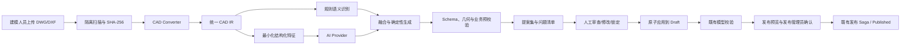
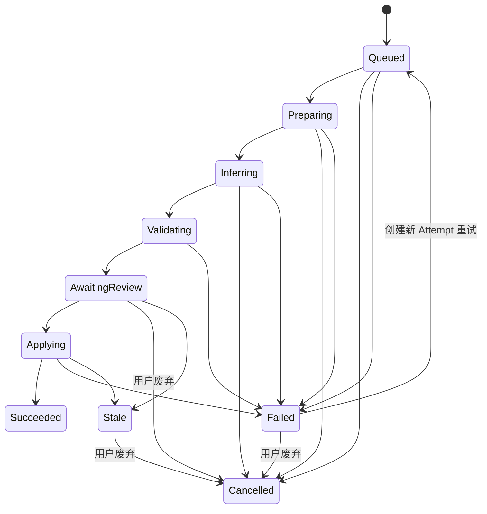
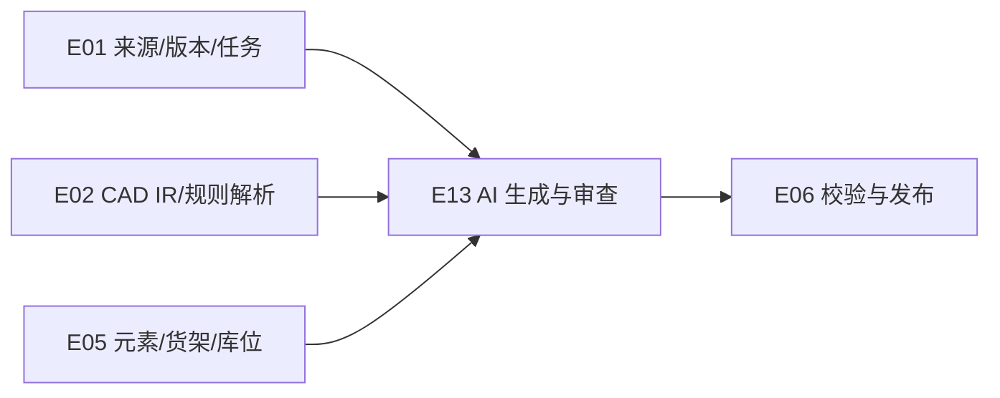

# CP6 Space AI 自动生成完整仓库 Spec

版本：v1.0  
基线日期：2026-07-25  
适用范围：CP6 Space Design V1、文件/CAD Worker、AI Provider、空间编辑器  
产品状态：T1～T3 已确认，可进入 E13 实施拆分  

配套文档：

- [产品需求说明书](./01-product-requirements.md)
- [Epic 与子 Spec](./03-epic-and-spec-backlog.md)
- [低成本 3D 建模详细 Spec](./04-low-cost-3d-modeling-spec.md)
- [详细设计卷六：AI 生成、审查与来源追踪](../design/06-ai-generation-review-provenance.md)
- [Provider 输入 JSON Schema v1](../contracts/ai/v1/warehouse-generation-input.schema.json)
- [Provider 输出 JSON Schema v1](../contracts/ai/v1/warehouse-generation-output.schema.json)
- [提案修改白名单 v1](../contracts/ai/v1/proposal-patch-policy.md)

## 1. 目标

让租户内部的空间建模人员把结构化 DWG/DXF 转换成一个包含楼层、区域、巷道、货架、墙柱门、月台和库位建议的完整仓库草稿。AI 用于语义识别和建议，确定性引擎负责可验证的几何与业务规则，用户只处理不确定项和异常项。

AI 生成的结果永远是提案，不是生产事实：

1. AI 不直接写入 Published。
2. AI 不自动发布。
3. 人工完成审查后，服务端才把已接受提案一次性写入 Draft。
4. Draft 仍须经过既有校验、发布预览和发布 Saga。
5. AI 失败时，规则解析、Excel 和地图编辑器仍可完成建模。

## 2. 为什么现在做

现有低成本建模蓝图已经包含 CAD 图层映射、规则识别、异常清单和人工校正，但仅靠固定图层规则无法覆盖客户图纸中大量非标准命名、块名称和缺失属性。用户仍会在“理解图纸语义”上投入大量人工时间。

AI 自动生成完整仓库的产品价值是缩短第一次可编辑草稿的时间，而不是替代业务确认。对租户而言，它降低新仓建模成本；对平台而言，它减少为每个客户编写专用图层规则的复制成本；对工程团队而言，它必须通过 Provider 中立、来源追踪和人工审查控制不确定性。

## 3. 已确认决策

| 编号 | 结论 |
|---|---|
| T1 | 采用混合、Provider 中立架构。规则引擎和本地 Provider 可独立工作，外部 Provider 通过统一端口接入。 |
| T2 | AI 生成提案集；人工审查后原子写入 Draft；永不自动发布。 |
| T3 | 采用父级总需求、独立 AI Spec、独立详细设计卷，E13 单独追踪。 |
| T4 | MVP 只对结构化 DWG/DXF 的 CAD IR 做 AI 语义补全；PDF/图片视觉识别和自然语言生成完整仓库后置。 |
| T5 | 原始 CAD 文件默认不发送外部 AI；外部 Provider 只接收最小化结构化特征。 |
| T6 | 几何、坐标、拓扑、碰撞、货架层和库位编码由确定性引擎负责。 |
| T7 | 既有租户 AI 策略默认 `Disabled`；试点租户由管理员显式启用。 |

## 4. 用户与权限

| 用户 | MVP 行为 |
|---|---|
| 租户管理员 | 配置 AI 策略、Provider、预算、并发和允许的仓库范围 |
| 空间建模人员 | 启动生成任务、查看提案、逐项或批量审查、应用到 Draft |
| 仓库主数据管理员 | 审查区域、货架、库位和编码建议 |
| 发布管理员 | 查看 AI 来源和人工确认记录，按既有流程校验和发布 |
| 平台支持人员 | 仅在取得临时租户授权后查看脱敏运行诊断 |
| 客户、供应商、3PL | 只读 Published 业务视图；不能访问 Draft、源文件、AI 提案、Prompt、费用或运行日志 |

新增权限：

| 权限码 | 作用 |
|---|---|
| `space:model:generate-ai` | 创建、取消、重试 AI 生成任务 |
| `space:model:review-ai` | 查看和审查 AI 提案 |
| `space:source:upload` | 上传 CAD 来源 |
| `space:model:edit` | 把已审查提案应用到 Draft |
| `space:model:validate` | 发起既有模型校验 |
| `space:model:publish` | 发布生产版本；AI 权限不能替代此权限 |

授权同时校验 `TenantId`、`SiteId` 和模型版本数据范围。无法确定数据范围时默认拒绝。

## 5. MVP 范围

### 5.1 包含

- DWG/DXF 经安全扫描和 CAD Converter 进入统一 CAD IR。
- 规则解析结果和 AI 语义识别结果融合。
- 楼层、区域、巷道、墙、柱、门、月台、货架、货架层、库位参数和常见静态设备建议。
- 每项提案的类型、属性、置信度、证据、来源图层/块/Handle 和规则版本。
- 高、中、低置信度分组以及 Blocking/Warning/Info 问题。
- 逐项审查、批量接受、拒绝、修改和锁定人工修正。
- 服务端原子应用到 Draft。
- 任务取消、重试、幂等、配额、费用记录、降级和审计。
- 20 份以上脱敏黄金 CAD 的离线评估和回归门禁。

### 5.2 不包含

- PDF、PNG、JPG 的计算机视觉自动识别；MVP 仍作为底图人工标定。
- 通过自然语言从空白自动设计完整仓库。
- AI 自动决定 WMS 编码、库存、任务或发布。
- AI 自动批准低置信度结果。
- 使用客户数据训练公共模型。
- CAD 设计优化、库位推荐、历史实单仿真和 DWG 回写。

后续能力必须复用相同的 `SpaceGenerationRun`、提案审查和来源追踪协议，不另建一套不可审计的写入通道。

## 6. 当前实现事实

核对日期：2026-07-25。

| 组件 | 已有 | 缺口 |
|---|---|---|
| Space Design V1 | 已有模型、完整版本 Revision、命令批次、校验和发布骨架 | 尚未合入主工作区；需要在实现分支继续扩展 |
| 任务枚举 | `SpaceJobType` 已声明 `BuildScene` 和 `Import` | `SpaceJobRunner` 未分派这两类任务，当前会进入 “no processor” |
| Floor Revision | 已有 `UnderlaySourceId` 和标定字段 | 没有对应的模型来源、文件和 Artifact 实体 |
| Job Ledger | 已有 Job、Attempt、Step、租约、进度和重试字段 | 没有 AI Run、提案、决策、费用和 Provider 追踪 |
| Design API | 已有版本、编辑、校验和发布端点 | 没有 generation-runs、proposals、decisions 和 apply 端点 |
| 通用附件服务 | 现有实现默认约 20MB、整文件读内存、MD5、扩展名白名单 | 不满足 100/200MB CAD、恶意文件扫描、对象存储和 SHA-256 要求，不得直接复用 |
| AI 基础设施 | 未发现统一 AI Provider 端口 | 需要新增 Provider SPI、租户策略、输出校验和降级链 |

需要保留且不得重写的部分：

- Space Design V1 的版本、逻辑身份、完整快照和乐观并发。
- 已有校验、发布 Saga、WMS 适配和 Published 运行态物化边界。
- 地图编辑器和 Three.js 的统一空间模型。
- 外部用户 Published-only 的只读约束。

## 7. 端到端业务流程

### 7.1 创建任务

1. 用户必须对目标 `ModelVersionId` 同时具有来源上传和 AI 生成权限。
2. 目标版本必须是可编辑 Draft。
3. 服务记录 `BaseContentRevision`、`SourceHash`、映射方案版本、货架生成方案版本、规则版本和 AI 策略快照。
4. 幂等键为 `TenantId + ModelVersionId + SourceHash + MappingProfileVersionId + RuleVersion + ProviderConfigVersion`。
5. 同租户最多同时运行 3 个生成任务；超出返回配额错误。

### 7.2 推理和融合

1. CAD Converter 先完成单位、坐标和实体解析。
2. 规则引擎先输出确定性识别结果。
3. AI 只接收允许字段构成的结构化特征，不接收文件二进制、任意附件文本或用户密钥。
4. AI 只建议语义类型、映射、属性和关系，不创建最终几何。
5. 融合器优先保留人工锁定值，其次采用确定性规则，最后考虑 AI 建议。
6. AI 输出通过 Schema、枚举、范围、引用和数量上限校验后才进入提案。

货架层和库位不是 Provider 输出。确定性生成器依据已接受的 Rack、显式选择的 `RackGenerationProfileVersionId`、Excel 逐层规格和既有编码服务生成：

- 参数优先级：人工锁定方案 > Excel 映射 > 用户显式选择的平台/租户货架方案。
- 不使用未确认的隐式尺寸默认值；缺货架方案时产生 `RACK_PROFILE_REQUIRED` Blocking。
- 新 RackLogicalId 由模型身份命名空间、SourceHash 和 SourceKey 确定生成；RackLevel/LocationLogicalId 由 RackLogicalId+层/列/深度稳定生成。
- 审查 UI 按货架显示将生成的层/库位数量和编码预览，不要求逐个审查 10,000 个派生库位。

### 7.3 人工审查

- 每项提案显示来源对象、建议类型、建议属性、置信度、证据、命中规则和预览差异。
- 高置信度可批量接受，但仍需要用户执行批量确认。
- 中置信度默认待审查。
- 低置信度和违反确定性规则的结果不得批量自动接受。
- 用户修改后的字段标记 `HumanLocked`；同一来源重新运行时不得覆盖。
- 所有接受、拒绝和修改都记录操作者、时间、前后值和理由。
- 几何、尺寸、Rotation、货架层/格口和库位编码不允许通过 AI Proposal Patch 修改。此类 Blocking 提案必须拒绝，Apply 其他提案后使用既有地图编辑器/Excel 命令人工创建或修复。

### 7.4 原子应用

1. `apply` 再次校验目标版本仍为 Draft，并比较 `BaseContentRevision`。
2. 版本已变化时，Run 进入 `Stale`，返回 `409 SPACE_AI_RUN_STALE`。
3. 服务把已接受提案写入隔离 staging，在数据库事务内执行引用、几何、拓扑、编码预检。
4. 全部通过后批量写入 Revision 表，每个受影响 Floor 只增加一次 Floor Revision，模型版本只增加一次 `ContentRevision`。
5. 任一写入或验证失败必须回滚整个事务，不允许部分对象可见。
6. Apply 成功后提案进入 `Applied`，Run 进入 `Succeeded`；随后由用户显式发起既有模型校验。

## 8. 状态机

### 8.1 Generation Run

状态只能通过领域服务转换。重试保留同一个 Run 和业务幂等键，但创建新的 Job Attempt。进度只能前进。

### 8.2 Proposal

`Proposed → Accepted / Rejected / Modified → Applied / Obsolete`

- `Modified` 表示用户修改后接受，必须保存 AI 原值和人工最终值。
- 新一轮 Run 不删除旧提案；旧提案进入 `Obsolete`。
- 已 `Applied` 的提案不可再次应用。

## 9. 功能需求

| ID | 需求 |
|---|---|
| AI-FR-001 | 租户管理员可以按租户配置 AI 策略、Provider、预算、并发和允许 Site。 |
| AI-FR-002 | 既有租户默认 `Disabled`；未启用时创建任务返回 `SPACE_AI_DISABLED`。 |
| AI-FR-003 | AI Provider 只能收到策略允许的最小化 CAD IR 特征。 |
| AI-FR-004 | 同一业务幂等键只产生一个有效 Run；重复请求返回现有 Run。 |
| AI-FR-005 | 每个提案必须带来源、证据、Provider/模型/规则版本和置信度。 |
| AI-FR-006 | AI 输出在持久化前必须通过结构化输出校验。 |
| AI-FR-007 | 用户可逐项和批量接受、拒绝或修改提案。 |
| AI-FR-008 | 用户修改字段可锁定，重跑不得覆盖。 |
| AI-FR-009 | 未完成必要审查时 Apply 返回 `SPACE_AI_REVIEW_INCOMPLETE`。 |
| AI-FR-010 | Apply 校验基础 Revision 并以单事务更新 Draft。 |
| AI-FR-011 | AI 任务或 Apply 失败不得改变 Published。 |
| AI-FR-012 | Provider 不可用时生成规则解析结果和人工映射入口。 |
| AI-FR-013 | 费用、Token/计算量、延迟和错误按租户记录。 |
| AI-FR-014 | 外部用户不得访问 AI 管理、运行、提案和审计端点。 |
| AI-FR-015 | 重新运行支持复用已确认映射和人工锁定修正。 |
| AI-FR-016 | 运行支持取消、超时、限流和安全重试。 |

## 10. API 契约

本节端点、权限、状态和错误码是**冻结目标契约**，不表示当前主工作树已经实现。实现状态和变更保护规则见 [MVP Scope Baseline v1.0](./06-mvp-scope-freeze-baseline-v1.0.md)。

| 方法 | 路径 | 权限 |
|---|---|---|
| POST | `/api/space/design/v1/versions/{versionId}/generation-runs` | `space:model:generate-ai` |
| GET | `/api/space/design/v1/generation-runs/{runId}` | `space:model:review-ai` |
| GET | `/api/space/design/v1/generation-runs/{runId}/proposals` | `space:model:review-ai` |
| GET | `/api/space/design/v1/generation-runs/{runId}/issues` | `space:model:review-ai` |
| POST | `/api/space/design/v1/generation-runs/{runId}/decisions` | `space:model:review-ai` |
| POST | `/api/space/design/v1/generation-runs/{runId}/decisions:batch` | `space:model:review-ai` |
| POST | `/api/space/design/v1/generation-runs/{runId}/apply` | `space:model:review-ai` + `space:model:edit` |
| POST | `/api/space/design/v1/generation-runs/{runId}/cancel` | `space:model:generate-ai` |
| POST | `/api/space/design/v1/generation-runs/{runId}/retry` | `space:model:generate-ai` |
| POST | `/api/space/design/v1/generation-runs/{runId}/discard` | `space:model:generate-ai` |
| GET/PUT | `/api/space/design/v1/ai-policy` | 租户管理员 |
| GET | `/api/space/design/v1/ai-usage` | 租户管理员 |

所有写请求要求 `Idempotency-Key`；审查和 Apply 要求 `If-Match` 或正文中的 `expectedRevision`。列表使用游标或稳定分页，并支持状态、类型、置信度和问题级别过滤。

Stale 恢复不原地 Rebase。用户重新调用创建 Run 接口，传入 `basedOnRunId` 和新的 `expectedContentRevision`；服务复用可确定匹配的人工锁定事实，并把旧 Run/提案置为非当前/Obsolete。

AI Disabled 不等于 CAD 不可用：

- `generation-runs` 的 `AiAssisted` 模式在 Disabled 租户返回 `SPACE_AI_DISABLED`。
- 规则路径始终使用 `/sources/{sourceId}/parse` → `/sources/{sourceId}/preview` → `/sources/{sourceId}/preview/confirm`，不调用 Provider，也不要求 AI 权限。
- 已开始的 AiAssisted Run 遇到 Provider 故障时可显式标记为规则降级提案；它与租户主动选择 RuleOnly 是两种不同状态。

稳定错误码：

- `SPACE_AI_DISABLED`
- `SPACE_AI_QUOTA_EXCEEDED`
- `SPACE_AI_PROVIDER_UNAVAILABLE`
- `SPACE_AI_OUTPUT_INVALID`
- `SPACE_AI_RUN_STALE`
- `SPACE_AI_REVIEW_INCOMPLETE`
- `SPACE_AI_RUN_STATE_INVALID`
- `SPACE_AI_SOURCE_POLICY_DENIED`
- `SPACE_AI_PATCH_PATH_DENIED`
- `SPACE_IDEMPOTENCY_KEY_REUSED`
- `SPACE_RACK_PROFILE_REQUIRED`

错误使用 Design API v1 既有 RFC Problem Details，包含 `code`、`traceId`、`correlationId` 和可执行 `recovery`。

## 11. 安全、隐私与成本

租户 AI 策略：

| 策略 | 行为 |
|---|---|
| `Disabled` | 不调用任何 AI Provider，只保留规则解析和编辑器 |
| `MetadataOnly` | Provider 只接收图层名、块名、统计和已脱敏标签，不接收几何坐标 |
| `StructuredFeatures` | Provider 可接收量化/归一化几何特征和关系，不接收原始文件 |

强制规则：

1. 原始 DWG/DXF、预览图、Excel 和附件不得发送外部 Provider。
2. 租户数据不得用于训练公共或跨租户模型。
3. Provider 凭据进入密钥存储，不写数据库明文或日志。
4. Prompt、请求和响应默认只保存哈希、Schema 版本、统计和脱敏诊断；完整内容仅在租户明确允许且满足保留策略时保存。
5. Provider 响应视为不可信输入，必须防止超量对象、非法引用和 Prompt 注入内容进入领域命令。
6. 租户可配置每日/月度预算、单 Run 上限和 Provider 允许列表。
7. 达到预算时拒绝新 AI 推理，但规则解析和人工编辑保持可用。

## 12. 容量与性能

| 项目 | 门槛 |
|---|---:|
| 平台单文件硬上限 | 200MB |
| 租户默认单文件上限 | 100MB |
| 单图 CAD 原始图元 | ≤1,000,000 |
| 单租户并发 Generation Run | ≤3 |
| 50MB 标准 CAD 到可审查提案 P95 | ≤15 分钟 |
| 上传到版本首次 Ready | ≤60 分钟 |
| 提案列表首屏 P95 | ≤2 秒 |
| 1,000 项批量决策提交 P95 | ≤3 秒，不含异步 Apply |

租户上限只能下调或在平台硬上限内上调。上调前必须完成同规模内存、费用和超时测试。

## 13. 质量指标

| 指标 | 门槛 | 计算口径 |
|---|---:|---|
| 目标元素覆盖率 | ≥80% | 标准答案中目标元素被生成正确类型提案的数量/目标元素总数 |
| 整体语义准确率 | ≥90% | 匹配提案中类型及关键属性正确的数量/全部匹配提案 |
| 高置信度精确率 | ≥95% | 高置信度分组中正确提案/该分组全部提案 |
| 人工操作量下降 | ≥70% | 相同仓库相对纯地图编辑器基线的创建、修改和删除操作数下降 |

默认高置信度分桶阈值为 `score >= 0.90`，但阈值不是精确率。只有在黄金数据集上实测达到 95% 精确率才满足门禁；未达到时必须校准阈值或降级为中置信度。

## 14. 黄金数据集

建立至少 20 份不含客户信息的版本化 CAD，覆盖至少 5 类布局：

1. 规则矩形货架仓。
2. 多楼层货架仓。
3. 斜放/非正交货架仓。
4. 含墙柱门、月台和设备的综合仓。
5. 图层命名非标准、块属性缺失和噪声图元仓。

每份资产包含：

- 原始 DWG/DXF 和 SHA-256。
- 允许外发的最小化 IR 样本。
- 机器可读标准对象、几何、关系和关键属性。
- 期望问题清单和允许误差。
- 规则版本、映射方案版本和数据集语义版本。

已用于发布门禁的资产不可原地覆盖；任何答案变化必须提升版本。

## 15. 验收标准

1. 具备权限的内部建模人员可从 DWG/DXF 创建 Generation Run。
2. AI 未启用的既有租户收到 `SPACE_AI_DISABLED`，规则解析仍可运行。
3. 原始 CAD 二进制不会出现在外部 Provider 请求、日志或审计正文。
4. 相同幂等键不会重复收费或创建第二个有效 Run。
5. 50MB 标准 CAD 到可审查提案的 P95 不超过 15 分钟。
6. 标准流程从上传到首次 Ready 不超过 60 分钟。
7. 黄金集目标元素覆盖率不低于 80%。
8. 黄金集整体语义准确率不低于 90%。
9. 高置信度分组实测精确率不低于 95%。
10. 人工操作量相对纯人工建模下降至少 70%。
11. 每个提案可追踪到来源图层/块/Handle、SourceHash、Provider、模型和规则版本。
12. 高置信度提案也必须经过用户批量确认，不存在自动批准路径。
13. 人工锁定修正在重新运行后保持不变。
14. Provider 超时、限流、非法 JSON、越界值和超量对象均不产生部分草稿。
15. Apply 时版本已变化返回 409，Run 进入 Stale，Draft 不发生变化。
16. Apply 中任一 staging 或校验错误会回滚全部变更。
17. Apply 成功只增加一次模型 `ContentRevision`，并保存完整决策审计。
18. AI Run 成功或失败均不会修改当前 Published。
19. 外部客户、供应商和 3PL 调用 AI 端点得到 403 或范围拒绝。
20. 关闭 AI 功能开关后，CAD 规则解析、Excel、底图和地图编辑器仍可用。
21. 单租户第 4 个并发任务被配额拒绝，前三个任务不受影响。
22. 100 万图元和 200MB 边界测试不会拖垮 Web/API 进程。

## 16. 测试计划

| 层级 | 内容 | 最低新增数量 |
|---|---|---:|
| 单元 | Run/Proposal 状态机、融合优先级、置信度分桶、Schema、配额、锁定修正 | 30 |
| 领域集成 | CAD IR→规则/AI→提案、决策、原子 Apply、Stale 冲突 | 16 |
| API/权限 | 9 个端点、幂等、Problem Details、内部/外部角色和跨租户 | 20 |
| Worker/故障注入 | Provider 超时、限流、崩溃、取消、接管、重试和降级 | 12 |
| 安全 | 文件策略、Prompt 注入、敏感字段、凭据和日志脱敏 | 10 |
| E2E | 建模人员完整路径、发布管理员后续路径、外部用户拒绝路径 | 6 |
| 性能/评估 | 20 份黄金数据、50MB P95、100 万图元、三并发 | 8 个场景 |

## 17. E13 子任务

每个子任务应控制在 1～3 个工程师日：

| ID | 子 Spec | 估算 | 前置 |
|---|---|---:|---|
| E13-S01 | Provider SPI、租户 AI 策略与功能开关 | 3d | E00、E01 |
| E13-S02 | Generation Run、Proposal、Decision、Usage 数据模型 | 3d | E01-S02 |
| E13-S03 | `BuildScene/Import` Worker 处理器与 Job Ledger 接线 | 3d | E01-S03 |
| E13-S04 | CAD IR 特征最小化、脱敏和策略执行 | 2d | E02-S03 |
| E13-S05 | Mock/本地 Provider 与首个外部 Provider 适配器 | 3d | E13-S01、S04 |
| E13-S06 | AI 输出 Schema、限制和不可信输入校验 | 2d | E13-S05 |
| E13-S07 | 规则/AI 融合与确定性仓库生成器 | 3d | E02-S06、E05-S01 |
| E13-S08 | 提案分页、差异预览和审查工作台 | 3d | E13-S02、S07 |
| E13-S09 | 决策、批量决策和人工锁定修正 | 3d | E13-S08 |
| E13-S10 | Staging、Revision 检查和原子 Apply | 3d | E13-S09、E05-S03 |
| E13-S11 | 取消、重试、Provider 降级和 Stale 恢复 | 2d | E13-S03、S10 |
| E13-S12 | 租户并发、预算、用量和费用审计 | 2d | E13-S01、S03 |
| E13-S13 | 外部用户拒绝、数据外发和安全门禁 | 3d | E13-S04、S12 |
| E13-S14 | 20 份黄金数据、离线评估和阈值校准 | 3d | E13-S06、S07 |
| E13-S15 | 性能、影子运行、试点租户和回滚演练 | 3d | E13-S10～S14 |
| E13-S16 | 租户 AI 策略、预算和用量管理 UI | 3d | E13-S01、S12 |
| E13-S17 | 数据库迁移、前向修复和保留清理任务 | 3d | E13-S02、S10、S12 |
| E13-S18 | 指标、告警、运行手册和并发槽回收 | 2d | E13-S11、S12、S15 |
| E13-S19 | 独立标注复核、安全评审和发布证据 | 3d | E13-S13～S15 |

粗估合计 52 工程师日。它包含 E13 自身的迁移、审查 UI、测试资产、性能、安全和运维工作；不重复计算 E01/E02 的上传、扫描、CAD Converter/IR 基础和 E05 的元素模型，也不包含商业 Provider 采购谈判和客户现场图纸清洗。

依赖关系：

## 18. 发布与回滚

发布分四步：

1. 本地 Mock Provider 和黄金数据离线通过。
2. 影子运行至少 7 天且≥50 个 Run：生成提案但不开放 Apply；Provider 失败率≤5%、零原文件外发、零部分写入证据。
3. 至少 2 个显式同意的试点租户运行≥14 天且每租户≥20 个成功 Run；质量门禁、人工下降、Apply 失败率≤2%和安全测试全部通过。
4. 每批最多增加已启用租户的 25%，观察至少 7 天后再扩批，不做全平台默认开启。

Space 产品负责人、安全负责人和平台 SRE 负责人分别批准质量/用户结果、外发策略、容量/告警/回滚证据。回滚时由平台 SRE 关闭租户或平台 AI 功能开关，停止新推理并取消未发送任务；已发送 Provider 请求等待记账。已完成的提案和审计保留，但不再允许 Apply；已应用 Draft 可继续由用户编辑、校验或删除。Published 和确定性 CAD/编辑器路径不受影响。

## 19. 主要风险

| 风险 | 影响 | 处理 |
|---|---|---|
| AI 把错误语义包装成高置信度 | 批量确认扩大错误 | 黄金集校准、实测高置信度精确率、确定性约束和人工确认 |
| 外部 Provider 泄露租户图纸 | 合同与安全事故 | 默认 Disabled、最小化 IR、禁止原文件外发、租户显式启用 |
| AI 输出对象过多或引用非法 | 内存、费用或数据完整性问题 | Schema、数量上限、引用校验、Worker 隔离和 staging |
| Draft 在审查期间被编辑 | 错误覆盖用户工作 | 固定 BaseContentRevision，Apply 冲突进入 Stale |
| Provider 锁定或价格变化 | 成本失控、不可替换 | Provider SPI、用量审计、预算和确定性降级 |
| 黄金集不代表客户图纸 | 线上精度下降 | 按布局族扩充脱敏数据，按租户/映射方案监测漂移 |

## 20. Definition of Done

E13 只有在以下条件全部满足时才完成：

1. 数据、状态机、API、权限和错误码与详细设计卷六一致。
2. `BuildScene/Import` 已有可恢复 Worker 处理器，不再进入默认 “no processor”。
3. 20 份黄金数据全部纳入版本化回归。
4. 覆盖率、整体准确率、高置信度精确率、人工操作量和性能达到门槛。
5. Provider 故障、版本冲突和事务故障证明不会部分写 Draft 或影响 Published。
6. 外部用户和跨租户安全测试全部通过。
7. AI 关闭后的规则解析与地图编辑器降级路径通过 E2E。
8. 试点、监控、预算、回滚和审计手册完成并演练。

技术选择按 [ADR-0002](../adr/0002-ai-provider-selection.md) 执行；黄金数据、五类 Seed 和验收计算按 [Space 验收资产](../acceptance/README.md) 执行。
