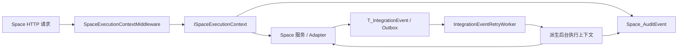

# Space E00-S04 可观测性、执行上下文与审计账本设计

> 状态：设计已确认
> 日期：2026-07-25
> 范围：Space E00-S04
> 前置：E00-S02 兼容闸门
> 实施工作树：`D:\CP6\tmp\worktrees\space-e00-inventory`

## 1. 背景

Space 当前已经具备租户上下文、Bridge Hook、`T_IntegrationEvent`、后台重试 Worker 和普通操作日志，但这些能力尚未形成一条可靠、可查询且不泄露敏感数据的证据链：

- `/api/space/**` 在 JWT 缺少合法 `tenant_id` 时可能继续使用默认租户。
- HTTP 请求没有统一的 `CorrelationId` 契约。
- `LocationPublishService` 和 IntegrationEvent 重试路径会重新生成关联编号。
- 后台 Worker 没有统一的 Actor、`JobId` 和 `RunId`。
- `Sys_OperLog` 会记录请求参数，不适合作为 Space 的脱敏审计账本。
- 现有发布事件查询会暴露原始 `LastError`。

E00-S04 要建立一个独立于业务模型的横切基础设施，使 HTTP、Job、Adapter、Outbox 和 Audit 能通过同一 `CorrelationId` 串联，并保证租户、Actor、权限和敏感信息边界失败关闭。

## 2. 已确认决策

| 编号 | 决策 |
|---|---|
| D1 | 采用 Space 专用执行上下文与审计账本，不扩展 `Sys_OperLog` 为统一审计表。 |
| D2 | 允许在现有 `CP6Context` 中新增持久化表 `Space_AuditEvent` 和对应 Migration。 |
| D3 | 所有 `/api/space/**` 请求缺失有效 Tenant 或 Actor 时失败关闭。 |
| D4 | 外部主体不得进入任何 `/api/space/**` 接口。 |
| D5 | 使用 ASP.NET 已有 W3C Trace，不在本任务引入 OpenTelemetry 后端或新的遥测平台。 |
| D6 | 高风险写操作必须先成功写入审计 `Started` 事件；否则业务动作不得开始。 |
| D7 | 审计记录只追加，不更新、不删除；应用回滚时保留全部审计事件。 |
| D8 | 审计读取使用精确权限 `space:audit:read`，且返回结果必须脱敏。 |

## 3. 目标与非目标

### 3.1 目标

- 统一传播 `CorrelationId`、`TraceId`、`TenantId`、Actor、`JobId`、`RunId` 和 `PublishAttemptId`。
- 让一次 Space 业务链路可从 HTTP 一直追踪到 Adapter、IntegrationEvent、后台重试和审计事件。
- 为 Space 建立租户隔离、只追加、字段白名单化的审计账本。
- 为审计查询提供精确权限、外部主体拒绝和安全 DTO。
- 保留现有 API envelope 和现有 Bridge Hook 兼容性。

### 3.2 非目标

- 不建设全平台 OpenTelemetry、Collector、Exporter 或外部观测平台。
- 不把所有 CP6 模块迁移到新的执行上下文。
- 不替代 `Sys_OperLog`、`Sys_FieldAuditLog` 或 `T_IntegrationEvent` 的既有职责。
- 不提前创建 E01 的 `SpaceContext`、`Space_Model` 或 `Space_ModelVersion`。
- 不在审计账本中保存请求体、业务 Payload 或原始异常。

## 4. 总体架构



新增组件：

- `ISpaceExecutionContext`：业务代码只读的不可变上下文快照。
- `ISpaceExecutionContextAccessor`：读取当前上下文。
- 内部上下文初始化器/作用域：仅允许 HTTP 和 Worker 边界建立或派生上下文。
- `SpaceExecutionContextMiddleware`：Space HTTP 边界校验、Correlation/Trace 建立和响应头输出。
- `ISpaceAuditWriter`：只追加审计事件，使用独立、短生命周期的 `CP6Context`。
- `ISpaceAuditQueryService`：租户内分页查询和时间线投影。
- `SpaceAuditController`：受 `space:audit:read` 保护的只读 API。

执行上下文对象本身不负责授权，也不从数据库推断租户或 Actor。边界在上下文建立前完成验证，业务代码只能消费已经验证的快照。

## 5. 执行上下文

### 5.1 字段

```text
CorrelationId      Guid，必填，完整业务链路稳定
TraceId            string，必填，当前 W3C Activity TraceId
TenantId           Guid，必填且非空
ActorType          User | System
ActorId            string，必填
ActorName          string?，仅用于显示
JobId              Guid?，持久化后台工作项
RunId              Guid?，后台工作项的一次实际执行
PublishAttemptId   Guid?，一次发布意图及其全部交付重试
```

语义约束：

- `CorrelationId` 跨 HTTP、Adapter、Outbox 和重试保持不变。
- `TraceId` 描述一次技术执行；每次 Worker 执行或重试允许产生新值。
- `JobId` 标识一个可重试的后台工作项。
- `RunId` 标识该工作项的一次运行。
- `PublishAttemptId` 标识一次用户发布意图，不随交付重试变化。
- 子作用域只能补充或替换 `JobId`、`RunId`、`PublishAttemptId` 和 `TraceId`，不得改写 `TenantId`、`CorrelationId` 或当前执行 Actor。
- 从用户请求转入后台 Worker 时，执行 Actor 改为稳定的 System Actor；原用户事件通过同一 `CorrelationId` 关联，不伪装成后台执行者。

### 5.2 HTTP 边界

`SpaceExecutionContextMiddleware` 位于认证和现有租户解析之后、授权与 Space endpoint 之前。它只处理 `/api/space` 及其子路径。

验证顺序：

1. 请求必须已经认证。
2. `tenant_id` 必须是非空 GUID，并与 `ITenantContext.CurrentTenantId` 一致；不得接受默认租户回退作为有效证据。
3. `ClaimTypes.NameIdentifier` 必须存在且能形成稳定 ActorId。
4. 请求不得被判定为外部主体。
5. 读取或生成 `CorrelationId`，建立当前 W3C Trace。
6. 初始化只读 Space 执行上下文，再进入授权和 endpoint。

Correlation 规则：

- Header 名称固定为 `X-Correlation-ID`。
- 缺失时由服务端生成新 GUID。
- 存在时必须只有一个值，且为非空 GUID；否则返回 `400 SPACE_CORRELATION_ID_INVALID`。
- 所有 Space 响应，包括边界拒绝和已处理错误，都回传 `X-Correlation-ID`。
- 在安全情况下同时回传 `X-Trace-ID`。

HTTP 请求复用 `Activity.Current.TraceId`。后台任务显式创建并释放 W3C `Activity`，不依赖外部监听器才能取得 TraceId。

### 5.3 Actor 与外部主体

内部用户兼容规则：

- 当前正式 JWT 具有合法用户 ID 和租户，且没有外部身份标记时，视为内部用户。
- `ActorId` 使用 `ClaimTypes.NameIdentifier` 的稳定值。
- `ActorName` 可以来自 `ClaimTypes.Name`，但其缺失不影响 ActorId 的有效性。

外部主体拒绝规则：

- `subject_type=external` 时明确判定为外部主体。
- 携带非空 `organization_context_id`、但没有明确内部主体声明时，也按外部主体处理。
- 外部主体即使携带同名权限声明，也不得进入 `/api/space/**`。

后台 Actor 使用稳定名称，例如：

- `space-worker:integration-event-retry`
- `space-worker:bin-reconciliation`

## 6. 审计账本

### 6.1 数据模型

新增 `Space_AuditEvent : BaseTenantEntity`，映射到 `Space_AuditEvent`。继承的 `Id` 即对外 `EventId`。

| 字段 | 类型/约束 | 说明 |
|---|---|---|
| `Id` | Guid，PK | 审计事件编号 |
| `TenantId` | Guid，必填 | 全局查询过滤和写入盖章 |
| `OccurredAtUtc` | DateTime，必填 | 只允许 UTC |
| `ActorType` | nvarchar(16)，必填 | `User` 或 `System` |
| `ActorId` | nvarchar(100)，必填 | 稳定主体标识 |
| `ActorName` | nvarchar(100)，可空 | 显示名称 |
| `OrganizationContextId` | nvarchar(100)，可空 | 仅保存已批准的脱敏组织上下文 |
| `Action` | nvarchar(100)，必填 | 稳定行为代码 |
| `ResourceType` | nvarchar(64)，必填 | 资源类型 |
| `ResourceId` | nvarchar(128)，可空 | 资源标识 |
| `SiteId` | Guid，可空 | Space 范围 |
| `VersionId` | Guid，可空 | Space 范围 |
| `FloorId` | Guid，可空 | Space 范围 |
| `Outcome` | nvarchar(16)，必填 | `Started/Succeeded/Failed/Denied` |
| `ReasonCode` | nvarchar(100)，可空 | 稳定原因码 |
| `AuthorizationEvidenceJson` | nvarchar(max)，可空 | 白名单证据，写入前限制为 8 KiB |
| `BeforeHash` | char(64)，可空 | SHA-256 十六进制 |
| `AfterHash` | char(64)，可空 | SHA-256 十六进制 |
| `CorrelationId` | Guid，必填 | 业务链路 |
| `TraceId` | varchar(64)，必填 | W3C TraceId |
| `JobId` | Guid，可空 | 后台工作项 |
| `RunId` | Guid，可空 | 单次运行 |
| `PublishAttemptId` | Guid，可空 | 发布意图 |
| `AttemptNo` | int，可空 | 交付尝试次数 |
| `ClientType` | nvarchar(32)，可空 | Web、Worker 等 |
| `IpAddress` | nvarchar(64)，可空 | 规范化后的客户端地址 |
| `UserAgent` | nvarchar(256)，可空 | 截断后的客户端标识 |

索引：

- `(TenantId, OccurredAtUtc)`
- `(TenantId, CorrelationId, OccurredAtUtc)`
- `(TenantId, PublishAttemptId, OccurredAtUtc)`
- `(TenantId, JobId, RunId)`

约束：

- `TenantId`、`CorrelationId` 不得为空 GUID。
- `OccurredAtUtc` 必须以 UTC 写入。
- `Outcome`、`ActorType` 只接受定义值。
- 应用层拒绝对 `Space_AuditEvent` 的 `Modified` 或 `Deleted` 状态执行 `SaveChanges`。
- 不提供更新或删除 Repository/API，不配置级联删除。

### 6.2 IntegrationEvent 链路字段

为 `T_IntegrationEvent` 增加两个可空字段：

- `JobId Guid?`
- `PublishAttemptId Guid?`

现有非 Space 事件保持 `null`，不改变其行为。Space 发布事件在首次持久化时写入这两个字段，后台重试直接从事件行恢复，不依赖重新生成或从原始异常中推断。

新增租户前缀查询索引：

- `(TenantId, CorrelationId)`
- `(TenantId, JobId)`
- `(TenantId, PublishAttemptId)`

`RunId` 属于一次实际执行，只写入审计事件，不回写 IntegrationEvent。

### 6.3 只追加写入器

`ISpaceAuditWriter` 接收已经验证的 `ISpaceExecutionContext` 和字段白名单化的事件事实。

写入器使用独立、短生命周期的 `CP6Context`：

- 显式设置审计行的 `TenantId`，不依赖默认租户。
- 不与业务 DbContext 的未提交实体共享 `SaveChanges`。
- 每次调用只追加审计行。
- 失败时只向结构化运维日志写入错误分类、CorrelationId 和异常指纹。

证据白名单允许：

- 权限代码和授权结果
- 资源编号
- 数量、状态和稳定原因码
- 不可逆 SHA-256 哈希

禁止写入：

- HTTP 请求体或响应体
- IntegrationEvent `PayloadJson`
- JWT、Cookie、Authorization Header
- 密码、连接字符串或密钥
- 原始异常消息、堆栈或 `Exception.ToString()`

异常证据仅包含稳定 `ReasonCode`、异常类型名和基于规范化异常类别生成的 SHA-256 指纹。

### 6.4 写入失败语义

所有 Space 非安全 HTTP 方法（POST、PUT、PATCH、DELETE）和发布动作属于高风险写操作：

1. 在 endpoint 业务动作开始前追加 `Started`。
2. `Started` 写入失败时返回 `503 SPACE_AUDIT_UNAVAILABLE`，不得调用业务服务或外部 Adapter。
3. 成功、失败或拒绝均追加一条新的结果事件，不修改 `Started`。
4. 如果外部系统已经产生副作用，但最终结果事件无法写入，则返回 `503 SPACE_OPERATION_OUTCOME_UNKNOWN`，保留 `Started`，并产生脱敏运维告警。

普通 GET/HEAD 读取不因审计写入失败而中断，但身份和权限验证仍然失败关闭。审计查询本身以及敏感拒绝事件采用降级审计：查询结果可以返回，但必须产生脱敏运维告警。

## 7. 链路数据流

### 7.1 HTTP 发布

1. 中间件验证 Tenant、Actor 和主体类型。
2. 中间件读取或生成 `CorrelationId`，建立用户执行上下文。
3. 高风险写边界追加通用 `Started` 事件。
4. 发布服务生成一次 `PublishAttemptId`。
5. `LocationPublishService` 使用当前上下文的 `CorrelationId`，不再调用 `Guid.NewGuid()`。
6. `SpaceBridgeHook` 调用 Adapter，并在持久化 IntegrationEvent 时写入相同 `CorrelationId`、新 `JobId` 和 `PublishAttemptId`。
7. Adapter、IntegrationEvent 和结果审计使用相同结构化日志作用域。
8. 最终追加 `Succeeded`、`Failed` 或 `Denied` 审计事件。

### 7.2 IntegrationEvent 重试

1. Worker 在租户作用域读取到期事件。
2. 从事件行恢复 `TenantId`、`CorrelationId`、`JobId` 和 `PublishAttemptId`。
3. 创建新的 `RunId`、W3C `Activity` 和 `TraceId`。
4. Actor 设置为 `space-worker:integration-event-retry`。
5. `IntegrationEventDispatcher` 将原事件的 `CorrelationId` 传给 `OnLocationPublishedAsync`，禁止重新生成。
6. 每次尝试追加带 `AttemptNo` 的审计事件。
7. Space 事件的 `LastError` 只保存稳定错误码或脱敏分类；不得保存原始异常。

### 7.3 库位巡检

`SpaceBinReconciliationWorker` 每个租户运行时：

- 显式建立 System Actor。
- 为本次租户工作创建新的 `JobId`、`RunId`、`CorrelationId` 和 `TraceId`。
- 结构化日志和审计使用同一上下文。
- 审计仅记录扫描数量、异常数量和结果摘要，不记录库位明细或外部响应体。

## 8. 查询 API 与权限

### 8.1 API

`GET /api/space/audit/events`

- 支持 `fromUtc`、`toUtc`、`action`、`outcome`、`correlationId`、分页参数。
- 默认查询最近 24 小时。
- 最大时间窗口 31 天。
- 单页最多 100 条。
- 所有条件都在当前租户全局过滤内执行。

`GET /api/space/audit/timeline/{correlationId}`

- 返回当前租户同一 CorrelationId 下的审计事件。
- 合并 `SourceModule == "SPACE"` 的 IntegrationEvent 脱敏状态投影。
- 按 UTC 时间排序。
- 不返回 `PayloadJson`、`LastError` 或数据库实体原文。

现有 `GET /api/space/publish/events`：

- 保留路由以兼容现有调用方。
- 增加相同的 `space:audit:read` 权限。
- 改用安全 DTO，返回 CorrelationId、状态、尝试次数、安全错误码和时间，不返回原始 `LastError`。

### 8.2 权限

使用：

```csharp
[RequirePermission("space-audit", "read")]
```

对应权限码 `space:audit:read`。注册菜单动作/权限定义，但不自动授予普通角色；现有超级管理员绕过规则保持不变。外部主体拒绝发生在权限判断之前，因此外部令牌不能通过伪造同名权限获得访问。

## 9. 错误契约

错误响应沿用当前 API envelope，不对全部 CP6 API 做全局格式迁移。

| 场景 | HTTP | 错误码 |
|---|---:|---|
| 未认证 | 401 | `SPACE_AUTHENTICATION_REQUIRED` |
| Actor 缺失或非法 | 403 | `SPACE_ACTOR_CONTEXT_REQUIRED` |
| 租户缺失或非法 | 403 | `SPACE_TENANT_CONTEXT_REQUIRED` |
| 外部主体 | 403 | `SPACE_EXTERNAL_SUBJECT_DENIED` |
| 缺少审计权限 | 403 | `SPACE_AUDIT_READ_FORBIDDEN` |
| CorrelationId 格式非法 | 400 | `SPACE_CORRELATION_ID_INVALID` |
| 前置审计不可用 | 503 | `SPACE_AUDIT_UNAVAILABLE` |
| 外部副作用后的结果无法确认 | 503 | `SPACE_OPERATION_OUTCOME_UNKNOWN` |

所有消息使用固定、安全文案。响应体和日志不得包含请求体、Payload、原始异常消息或堆栈。`X-Correlation-ID` 是定位问题的主要外部凭据。

## 10. 结构化日志

所有 Space HTTP、服务、Adapter 和 Worker 日志作用域统一包含存在的以下字段：

```text
TenantId
ActorType
ActorId
CorrelationId
TraceId
JobId
RunId
PublishAttemptId
AttemptNo
```

日志模板只记录动作代码、资源类型、状态、计数和安全错误码。禁止通过字符串插值输出整个 DTO、请求对象、Payload 或异常 `ToString()`。

## 11. 配置、上线与回滚

建议配置：

```json
{
  "SpaceObservability": {
    "AuditQueryEnabled": true,
    "MetricsEnabled": true
  }
}
```

规则：

- `AuditQueryEnabled=false` 时关闭新的审计查询 API，但不停止审计写入。
- `MetricsEnabled=false` 时停止新增 Space 指标输出。
- 不提供绕过 Tenant、Actor、外部主体校验或高风险前置审计的配置。
- Migration 只新增 `Space_AuditEvent`、两个 IntegrationEvent 可空列和索引。
- 回滚应用版本时允许关闭查询与指标，但不得删除审计表、审计行或为回滚生成审计删除脚本。
- E01 的 `SpaceContext` 和模型 Migration 保持独立。

## 12. 测试策略

采用测试驱动实现，至少覆盖以下自动化测试。

### 12.1 HTTP 边界

- 未认证返回 401。
- 缺失、空或非法 `tenant_id` 返回 403，且不使用默认租户。
- 缺失 ActorId 返回 403。
- `subject_type=external` 返回 403。
- 未批准的 `organization_context_id` 返回 403。
- 缺失 Correlation Header 时生成 GUID。
- 单个合法 GUID 被接受并回传。
- 多值、空 GUID 或非法格式返回 400。
- 所有失败响应均带 `X-Correlation-ID`。

### 12.2 上下文传播

- HTTP 服务、Adapter 和审计读取到相同的 Tenant、Actor、CorrelationId。
- 派生发布上下文只增加 `PublishAttemptId`。
- 后台上下文保持原 CorrelationId、JobId、PublishAttemptId，但具有新 RunId、TraceId 和 System Actor。
- 上下文作用域结束后正确恢复，不污染下一租户或下一请求。

### 12.3 审计账本

- 新记录显式使用当前 TenantId 和 UTC 时间。
- `Modified`、`Deleted` 被拒绝。
- 查询自动按租户过滤。
- Evidence 白名单和 8 KiB 上限生效。
- 请求体、Payload、Token 和原始异常不会进入审计行。
- 前置写入失败时业务委托和 Adapter 均未调用。
- 普通读取审计失败时可继续，并产生安全运维告警。

### 12.4 发布与重试

- `LocationPublishService` 不再生成独立 CorrelationId。
- 首次发布的 Audit、Adapter 和 IntegrationEvent 使用同一 CorrelationId。
- IntegrationEvent 持久化稳定 JobId 和 PublishAttemptId。
- 重试 Dispatcher 使用 `evt.CorrelationId`，不生成新 GUID。
- 重试保持 JobId、PublishAttemptId，并生成新 RunId、TraceId。
- Space 失败事件不保存或返回原始异常。

### 12.5 查询与权限

- `space:audit:read` 属性/策略存在。
- 无权限、外部主体和跨租户查询均被拒绝或不返回数据。
- 时间窗口和页大小上限生效。
- Timeline 只合并 Space IntegrationEvent。
- `/api/space/publish/events` 不再暴露 `LastError` 和 `PayloadJson`。

### 12.6 回归验证

- Space 定向后端测试。
- 完整 .NET 测试。
- Space 定向前端测试和完整前端测试。
- 前端生产构建。
- Space 库存扫描及报告校验。
- 记录并隔离已存在、与 E00-S04 无关的测试或类型检查故障。

## 13. 验收标准映射

| E00-S04 要求 | 设计落点 |
|---|---|
| API、Job、Publish、Audit 执行上下文 | 第 5、7 节 |
| 统一 CorrelationId、TraceId、TenantId、Job/Run/PublishAttempt | 第 5、6.2、7 节 |
| `space:audit:read` | 第 8.2 节 |
| 外部主体拒绝 | 第 5.3、8.2 节 |
| Tenant/Actor 缺失失败关闭 | 第 5.2、9 节 |
| 日志失败不得泄露敏感正文 | 第 6.3、9、10 节 |
| HTTP→Job→Adapter→Outbox→Audit 可关联 | 第 4、7、12.4 节 |
| 回滚不删除审计事件 | 第 6.1、11 节 |

## 14. 实施边界

实施应集中在 Space 专用中间件、执行上下文、审计服务/API、现有 Space 发布链路、IntegrationEvent 的 Space 重试分支和巡检 Worker。除新增可空链路字段外，不改变其他模块的 IntegrationEvent 行为。

本设计没有遗留占位符或待定业务决策。若实施侦察发现现有权限注册或 Migration 机制与本文假设不符，应在实施计划中明确适配点，但不得弱化已确认的安全和审计语义。
