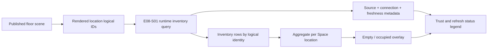

# Space E08-S02 Runtime Source Freshness Design

Date: 2026-08-01
Status: Approved for implementation
Baseline: `bbe77f3e` (`integration/space-v1-20260730`)
Roadmap card: E08-S02 — inventory source, time, and delay display

## 1. Outcome

The 3D Viewer must make the trust state of every inventory snapshot obvious. A user must be able to answer, without opening developer tools:

- Is this inventory real, simulated, or unavailable?
- Which source system and runtime connection produced it?
- When was the source data observed and when did CP6 receive it?
- How old was the snapshot when CP6 received it, and is the source clock ahead?
- When did this Viewer session last succeed?
- Is the latest refresh failing, and when did the most recent failure occur?

The Viewer will consume the E08-S01 unified runtime inventory endpoint. The legacy `/api/space/floor/{floorId}/stock` endpoint will no longer drive the 3D inventory overlay.

## 2. Product and trust rules

1. The E08-S01 runtime source is the only inventory fact source for the Viewer.
2. `Real`, `Simulated`, and `Unavailable` remain separate explicit states. No fallback may relabel simulated or stale data as real.
3. Runtime logical identity is authoritative. Rendering uses `LocationLogicalId`/`SpaceLocationCode`; a differing WMS code remains visible in the response and is not silently treated as the Space code.
4. An available response with no inventory rows for a requested location means empty inventory for that explicitly queried location.
5. A failed refresh keeps the last successfully rendered snapshot but marks the current refresh state as failed. It does not change the snapshot's source or observation time.
6. Floor switches invalidate in-flight refreshes. A slower response from the previous floor cannot replace the new floor's source metadata or overlay.
7. The new runtime contract does not expose capacity, blocking, or picking workflow state. The Viewer must not infer `full`, `locked`, or `picking` from inventory quantities alone.
8. The utilization mode is therefore presented as an occupancy estimate. It is not a capacity percentage.

## 3. Scope

### In scope

- Extend the runtime source DTO with connection and freshness metadata.
- Compute receive time, non-negative delay, and forward clock skew on the server clock.
- Add a typed frontend runtime inventory client.
- Query only the current floor's rendered location logical IDs.
- Aggregate material/lot/container inventory rows into one render item per Space location.
- Show source, connection, observation time, receive time, delay, clock skew, last success, and recent failure in `StockLegend`.
- Preserve the last successful visual snapshot on transport failure.
- Add backend and frontend unit/integration coverage.

### Out of scope

- Durable, cross-process health history. E08-S02 shows refresh history for the active Viewer session.
- Capacity synchronization and authoritative utilization percentages.
- WMS task/path migration (E08-S04).
- Material/lot/container reverse locate migration (E08-S03).
- Changing the legacy stock endpoint or deleting it; other consumers may still depend on it.
- A new database table or migration.

## 4. Backend contract

`SpaceWmsRuntimeSourceDto` is extended as follows:

```text
kind                    Real | Simulated | Unavailable
adapterId               runtime connection identity
dataSourceId            source system identity
observedAtUtc           earliest observation across all query chunks
receivedAtUtc           CP6 server time after the complete snapshot is assembled
delayMilliseconds       max(receivedAtUtc - observedAtUtc, 0)
clockSkewMilliseconds   max(observedAtUtc - receivedAtUtc, 0)
isSimulated             explicit convenience flag
isAvailable             explicit convenience flag
```

`adapterId` and `dataSourceId` have different meanings and both are displayed. `adapterId` identifies the configured runtime connection/adapter; `dataSourceId` identifies the data system exposed by that connection.

The service reads the CP6 clock when producing the response. It validates that the clock is UTC, just as the existing empty-scope path does. Delay and skew are mutually exclusive, non-negative, whole-millisecond values with saturation at `long.MaxValue` for defensive contract safety.

Unavailable responses still carry complete metadata. Transport or contract failures remain RFC 7807 errors and keep their current safe 502/503 behavior.

## 5. Viewer data flow



`SpaceViewer` exposes a read-only copy of the currently rendered location IDs. `StockOverlay.refresh(siteId, locationLogicalIds)` sends them as repeated `locationLogicalId` query parameters. The server's existing 10,000-location limit remains the hard guardrail.

An empty rendered floor is marked `Unavailable / EMPTY_FLOOR_SCOPE` locally and does not issue a request. This prevents an empty query-string from being interpreted as an unbounded full-site runtime query.

For each requested location, aggregation produces:

- quantity: sum of physical quantity;
- allocated quantity: sum of allocated quantity;
- product kinds: distinct non-empty material numbers;
- top material: material number from the row with the largest physical quantity;
- capacity: `null` because it is not part of the unified runtime source;
- status: `0` empty or `1` occupied only.

The frontend does not consume WMS location codes as render keys.

## 6. Refresh history semantics

Refresh history is scoped to the active `FloorViewer` component instance:

- `never`: no failure has occurred in the current session;
- `active`: the latest refresh failed or returned `Unavailable`;
- `recovered`: a later usable snapshot succeeded after a failure.

The tracker keeps:

- last successful receive time;
- last failure client time (or server receive time for an explicit unavailable response);
- safe failure code (`HTTP_<status>`, problem `code`, or a generic runtime code);
- current failure state.

History is deliberately separate from snapshot metadata. A failed poll must not rewrite the last good snapshot's `receivedAtUtc`, delay, or source identity.

## 7. UI behavior

`StockLegend` shows:

- prominent `REAL`, `SIMULATED`, or `UNAVAILABLE` badge;
- source system ID and connection/adapter ID;
- data time and CP6 receive time;
- delay, with a separate clock-ahead warning when skew is non-zero;
- last success for this Viewer session;
- recent failure state, time, and safe code;
- an explanation that utilization is an occupancy estimate when selected.

If the current source is unavailable, coloring is not applied. If a later refresh throws after a successful snapshot, the prior colors remain while the failure line changes to active.

## 8. Compatibility and rollout

- The runtime DTO change is additive at the JSON level.
- The authoritative OpenAPI document and generated C#/TypeScript SDKs are regenerated from the service contract in the same change.
- Existing backend callers compile after updating the single DTO construction site.
- The old `SpaceDataSource` frontend type remains unchanged for non-runtime APIs.
- New Viewer runtime types extend the common source shape, so shared label/availability helpers continue to work.
- No schema migration or feature flag is required.

## 9. Verification

Backend tests cover:

- adapter/source identity propagation;
- receive time and positive delay;
- forward source clock skew;
- earliest observation across chunks with a single final receive time;
- unavailable metadata;
- UTC clock enforcement.

Frontend tests cover:

- repeated query parameter serialization;
- aggregation by logical identity, including explicit empty locations;
- code mismatch not changing the render key;
- session failure transitions (`never` → `active` → `recovered`);
- failed refresh retaining the last successful snapshot;
- source metadata formatting and clock-skew presentation.

The implementation must pass targeted .NET tests, targeted Vitest tests, frontend type-check, and the relevant solution build.
